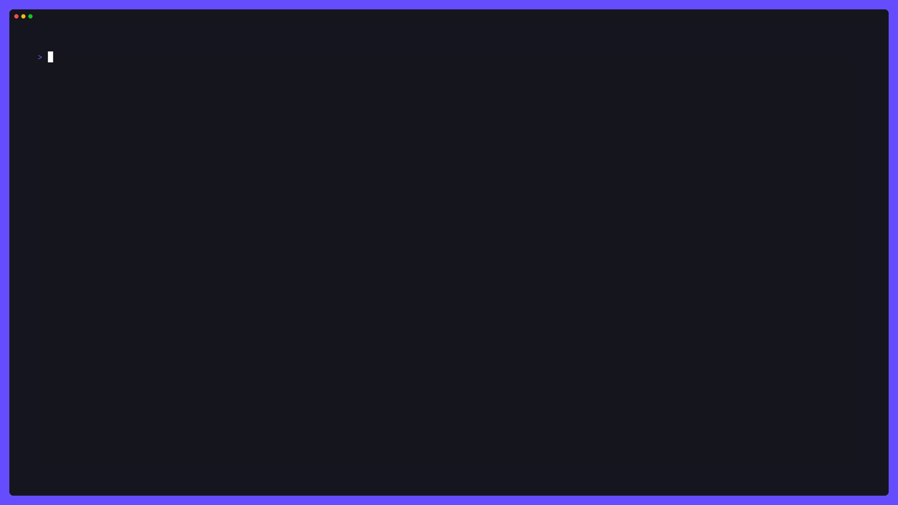

<div align="center">
  <h1>TUIOS - Terminal UI Operating System</h1>

  <a href="https://github.com/Gaurav-Gosain/tuios/releases"></a>
  <a href="https://pkg.go.dev/github.com/Gaurav-Gosain/tuios?tab=doc"></a>
  <a href="https://deepwiki.com/Gaurav-Gosain/tuios"></a>
  <br>
  <a title="This tool is Tool of The Week on Terminal Trove, The $HOME of all things in the terminal" href="https://terminaltrove.com/"></a>
</div>


TUIOS is a terminal-based window manager that provides a modern, efficient interface for managing multiple terminal sessions. Built with Go using the Charm stack (Bubble Tea v2 and Lipgloss v2), TUIOS offers a vim-like modal interface with comprehensive keyboard shortcuts, workspace support, and mouse interaction.

## Documentation

- **[Keybindings Reference](docs/KEYBINDINGS.md)** - Complete keyboard shortcut reference
- **[Configuration Guide](docs/CONFIGURATION.md)** - Customize keybindings and settings
- **[CLI Reference](docs/CLI_REFERENCE.md)** - Command-line options and flags
- **[Architecture Guide](docs/ARCHITECTURE.md)** - Technical architecture and design

<details>

<summary>Table of Contents</summary>

<!--toc:start-->

- [TUIOS - Terminal UI Operating System](#tuios-terminal-ui-operating-system)
  - [Documentation](#documentation)
  - [Installation](#installation)
  - [Features](#features)
  - [Quick Start](#quick-start)
  - [Architecture](#architecture)
  - [Performance](#performance)
  - [Troubleshooting](#troubleshooting)
  - [Roadmap](#roadmap)
  - [Development](#development)
  - [Star History](#star-history)
  - [License](#license)
  - [Acknowledgments](#acknowledgments)
  <!--toc:end-->

</details>

## Installation

### Package Managers

**Homebrew (macOS/Linux):**
```bash
brew install tuios
```

**Arch Linux (AUR):**
```bash
# Using yay
yay -S tuios-bin

# Using paru
paru -S tuios-bin
```

**Nix:**
```bash
# Run directly
nix run github:Gaurav-Gosain/tuios#tuios

# Or add to your configuration
nix-shell -p tuios
```

### Quick Install Script

**Linux/macOS:**
```bash
curl -fsSL https://raw.githubusercontent.com/Gaurav-Gosain/tuios/main/install.sh | bash
```

### Alternative Methods

- **[GitHub Releases](https://github.com/Gaurav-Gosain/tuios/releases)** - Download pre-built binaries
- **Go Install:** `go install github.com/Gaurav-Gosain/tuios/cmd/tuios@latest`
- **Docker:** `docker run -it --rm ghcr.io/gaurav-gosain/tuios:latest`
- **Build from Source:** See [Development](#development) section below

**Requirements:**
- A terminal with true color support (most modern terminals)
- Go 1.24+ (if building from source)

## Features



- **Multiple Terminal Windows**: Create and manage multiple terminal sessions
- **9 Workspaces**: Organize windows across independent workspaces
- **Modal Interface**: Vim-inspired Window Management and Terminal modes
- **Automatic Tiling**: Optional grid-based window layouts
- **Vim-Style Copy Mode**: Navigate scrollback (10,000 lines), search, and select text with vim keybindings
- **Customizable Keybindings**: TOML configuration file with full keybinding customization (Kitty protocol support)
- **Mouse Support**: Click, drag, and resize with full mouse interaction
- **SSH Server Mode**: Remote terminal multiplexing with per-connection isolation
- **Smart Performance**: Style caching, viewport culling, adaptive refresh (60Hz/30Hz)

## Quick Start

**Launch TUIOS:**
```bash
tuios
```

**Essential Keys:**

*Window Management Mode (default):*
- <kbd>n</kbd> - Create new window
- <kbd>i</kbd> or <kbd>Enter</kbd> - Enter Terminal Mode

*Works from any mode:*
- <kbd>Ctrl</kbd> + <kbd>B</kbd> <kbd>c</kbd> - Create new window
- <kbd>Ctrl</kbd> + <kbd>B</kbd> <kbd>?</kbd> - Toggle help overlay
- <kbd>Ctrl</kbd> + <kbd>B</kbd> <kbd>[</kbd> - Enter copy mode (vim-style scrollback)
- <kbd>Ctrl</kbd> + <kbd>B</kbd> <kbd>d</kbd> or <kbd>Esc</kbd> - Return to Window Management Mode
- <kbd>Ctrl</kbd> + <kbd>B</kbd> <kbd>q</kbd> - Quit

*Alternative (<kbd>Ctrl</kbd> + <kbd>B</kbd> <kbd>t</kbd> submenu):*
- <kbd>Ctrl</kbd> + <kbd>B</kbd> <kbd>t</kbd> <kbd>n</kbd> - Create new window
- <kbd>Ctrl</kbd> + <kbd>B</kbd> <kbd>t</kbd> <kbd>x</kbd> - Close window
- <kbd>Ctrl</kbd> + <kbd>B</kbd> <kbd>t</kbd> <kbd>r</kbd> - Rename window

**SSH Server Mode:**
```bash
tuios ssh                            # Start on localhost:2222
tuios ssh --host 0.0.0.0 --port 8022 # Custom host/port
ssh -p 2222 localhost                # Connect
```

**Configuration:**
```bash
tuios config edit                    # Edit keybindings in $EDITOR
tuios config path                    # Print config file location
tuios config reset                   # Reset to defaults
tuios keybinds list                  # View all current keybindings
tuios keybinds list-custom           # View only your customizations
```

**Shell Completions:**
```bash
# Bash
tuios completion bash > /etc/bash_completion.d/tuios

# Zsh
tuios completion zsh > "${fpath[1]}/_tuios"

# Fish
tuios completion fish > ~/.config/fish/completions/tuios.fish

# PowerShell
tuios completion powershell > tuios.ps1
```

For complete keybindings, configuration options, and CLI flags, see the [Documentation](#documentation) section above.

## Architecture

TUIOS is built on the Bubble Tea v2 framework following the Model-View-Update pattern. For detailed architecture diagrams and technical documentation, see [Architecture Guide](docs/ARCHITECTURE.md).

**Key Technologies:**
- **[Bubble Tea v2](https://github.com/charmbracelet/bubbletea)** - Event-driven TUI framework
- **[Lipgloss v2](https://github.com/charmbracelet/lipgloss)** - Terminal styling
- **[go-pty](https://github.com/aymanbagabas/go-pty)** - Cross-platform PTY interface
- **[Wish v2](https://github.com/charmbracelet/wish)** - SSH server
- **Vendored VT** - ANSI/VT100 terminal emulator

**Core Components:**
- **Window Manager** ([`internal/app/os.go`](./internal/app/os.go)) - Central state and workspace orchestration
- **Terminal Emulation** ([`internal/vt/`](./internal/vt/)) - ANSI parser with 10,000 line scrollback
- **Rendering Engine** ([`internal/app/render.go`](./internal/app/render.go)) - Layer composition with viewport culling
- **Input System** ([`internal/input/`](./internal/input/)) - Modal routing and 100+ configurable keybindings
- **Configuration** ([`internal/config/`](./internal/config/)) - TOML-based keybinding customization

## Performance

**Optimization Strategies:**
- Smart caching with sequence-based change detection
- Viewport culling for off-screen windows
- Adaptive refresh rates (60Hz focused, 30Hz background)
- Memory pooling for strings, buffers, and styles
- LRU style cache (40-60% allocation reduction)
- Frame skipping when no changes detected

## Troubleshooting

**Common Issues:**
- **Colors not displaying**: Set `COLORTERM=truecolor` environment variable
- **SSH connection issues**: Use `--host 0.0.0.0` for remote access, check firewall settings
- **Performance with many windows**: Enable tiling mode (<kbd>t</kbd> key)

**Debug Mode:** Press <kbd>Ctrl</kbd> + <kbd>L</kbd> to view system logs.

## Roadmap

**Completed:**
- ✓ Multiple windows with 9 workspaces
- ✓ Automatic tiling and snapping
- ✓ Vim-style copy mode with search
- ✓ SSH server mode
- ✓ Performance optimizations
- ✓ TOML configuration system with custom keybindings

**Planned:**
- [ ] Theme and color customization
- [ ] Session persistence
- [ ] Split panes and tabs
- [ ] Plugin system

## Development

Contributions are welcome! Feel free to open issues or pull requests.

**Build from Source:**
```bash
git clone https://github.com/gaurav-gosain/tuios.git
cd tuios
go build -o tuios ./cmd/tuios
./tuios
```

**Run Tests:**
```bash
go test ./...
```

**Support:** [](https://ko-fi.com/B0B81N8V1R)

## Star History

[](https://star-history.com/#Gaurav-Gosain/tuios&Date)

<p style="display:flex;flex-wrap:wrap;"> 
 
 
 
 
 
 
 
 
 
 
</p>

## License

This project is licensed under the MIT License -
see the [LICENSE](LICENSE) file for details.

## Acknowledgments

- The Charm team for Bubble Tea and Lipgloss libraries
- The Go terminal ecosystem for PTY and VT implementations
- The vim and tmux communities for interface design inspiration
