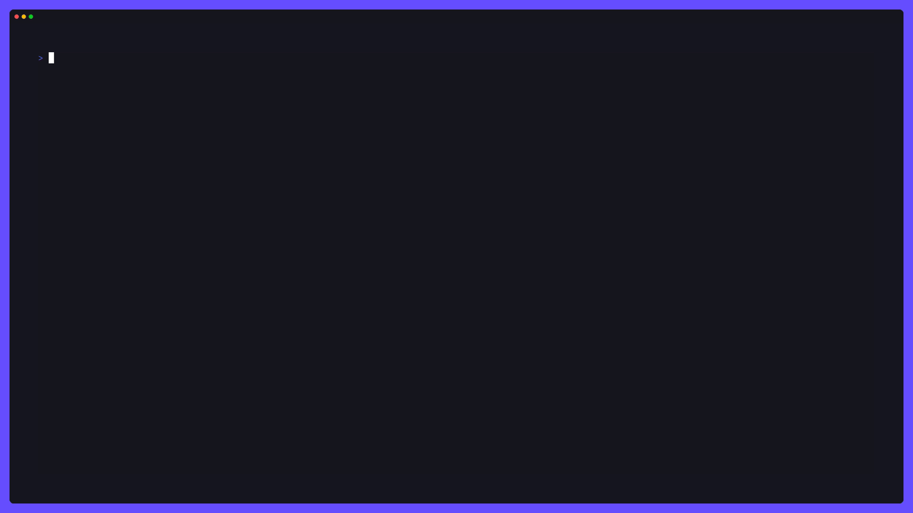

<div align="center">
  <h1>TUIOS - Terminal UI Operating System</h1>

  <a href="https://github.com/Gaurav-Gosain/tuios/releases"></a>
  <a href="https://pkg.go.dev/github.com/Gaurav-Gosain/tuios?tab=doc"></a>
  <a href="https://deepwiki.com/Gaurav-Gosain/tuios"></a>
  <br>
  <a title="This tool is Tool of The Week on Terminal Trove, The $HOME of all things in the terminal" href="https://terminaltrove.com/"></a>
</div>


TUIOS is a modern terminal multiplexer and window manager built with Go. It provides a vim-like modal interface with multiple terminal panes, workspaces, BSP tiling, kitty graphics protocol support, and a command palette - all running inside your existing terminal.

Built on the Charm stack (Bubble Tea v2, Lipgloss v2), TUIOS features event-driven rendering for near-zero idle CPU usage, flicker-free kitty image passthrough, and comprehensive keyboard/mouse interaction.

## Documentation

Full documentation is available at **[tuios-docs](https://tuios-docs.vercel.app)** (hosted) or in the [`docs/`](./docs/) folder.

### Quick Links
- **[Getting Started](docs/KEYBINDINGS.md)** - Keybindings and quick reference
- **[BSP Tiling](docs/BSP_TILING.md)** - Tiling with preselection and split control
- **[Configuration](docs/CONFIGURATION.md)** - Customize keybindings, themes, and behavior
- **[CLI Reference](docs/CLI_REFERENCE.md)** - All command-line options
- **[Tape Scripting](docs/TAPE_SCRIPTING.md)** - Automate workflows
- **[Sessions](docs/SESSIONS.md)** - Daemon mode and session persistence
- **[Architecture](docs/ARCHITECTURE.md)** - Technical design

<details>
<summary>Table of Contents</summary>

<!--toc:start-->
- [Installation](#installation)
- [Features](#features)
- [Quick Start](#quick-start)
- [What's New in v0.7.0](#whats-new-in-v070)
- [Architecture](#architecture)
- [Performance](#performance)
- [Development](#development)
- [License](#license)
<!--toc:end-->

</details>

## Installation

### Package Managers

**Homebrew (macOS/Linux):**
```bash
brew install tuios
```

**Arch Linux (AUR):**
```bash
yay -S tuios-bin
```

**Nix:**
```bash
nix run github:Gaurav-Gosain/tuios#tuios
```

### Other Methods

```bash
# Quick install script (Linux/macOS)
curl -fsSL https://raw.githubusercontent.com/Gaurav-Gosain/tuios/main/install.sh | bash

# Go install
go install github.com/Gaurav-Gosain/tuios/cmd/tuios@latest

# Docker
docker run -it --rm ghcr.io/gaurav-gosain/tuios:latest
```

**[GitHub Releases](https://github.com/Gaurav-Gosain/tuios/releases)** - Pre-built binaries for all platforms.

**Requirements:** A terminal with true color support. Kitty graphics and sixel support recommended (Ghostty, Kitty, WezTerm).

## Features



### Core
- **Multiple Terminal Panes** - Create, resize, drag, and organize terminal sessions
- **9 Workspaces** - Independent workspace isolation with instant switching
- **Modal Interface** - Vim-inspired Window Management and Terminal modes
- **Command Palette** - Fuzzy-searchable action launcher (<kbd>Ctrl</kbd>+<kbd>P</kbd>)
- **Pane Zoom** - Fullscreen any pane with <kbd>z</kbd> (WM mode) or <kbd>Prefix</kbd>+<kbd>z</kbd>. Shared borders hidden when zoomed, dockbar shows **Z** indicator.

### Tiling
- **BSP Tiling** - Binary Space Partitioning with spiral layout
- **Smart Auto-Split** - Aspect-ratio-aware splitting (opt-in)
- **Shared Borders** - tmux-style separator lines between panes (`--shared-borders`)
- **Preselection** - Control where the next pane spawns
- **Equalize Splits** - Reset all splits to balanced ratios

### Scrollback & Copy Mode
- **Vim-Style Copy Mode** - Navigate 10,000-line scrollback with hjkl, search with `/`, yank with `y`
- **Mouse Wheel Scrollback** - Scroll wheel enters copy mode directly (no alt-screen)
- **Interactive Scrollbar** - Click or drag the right border to jump to scroll position
- **Selection Auto-Scroll** - Drag selection above/below pane to scroll
- **Scrollback Browser** - OSC 133-aware command/output block navigation
- **Scroll Position Indicator** - Shows offset/total on the bottom border

### Graphics & Protocols
- **Kitty Graphics Protocol** - Full image rendering with flicker-free video playback. `mpv --vo=kitty` works (both shm and base64), and [ytk](https://github.com/Gaurav-Gosain/ytk) works.
- **Sixel Graphics** - Sixel image passthrough (experimental, no pixel-level clipping yet)
- **Kitty Keyboard Protocol** - Progressive enhancement (CSI u) with push/pop/query support. Fish 4.x compatible; Shift+printable bypasses the protocol and sends text directly.
- **Synchronized Output** - Mode 2026 prevents screen tearing
- **Shared Memory Support** - `t=s` passthrough for mpv `--vo-kitty-use-shm`
- **Terminal Queries** - OSC 4 palette, OSC 10-12 colors, CSI 14/16/18t sizing, DA1/DA2
- **Experimental** - Kitty text sizing protocol (OSC 66) - basic passthrough works but has known issues with scrollback and window repositioning
- **Not Yet Supported** - Kitty animation protocol (a=f, a=a, a=c)

### Session Management
- **Daemon Mode** - Persistent sessions with detach/reattach (like tmux)
- **Session Switcher** - In-app session list (<kbd>Prefix</kbd>+<kbd>S</kbd>)
- **Layout Templates** - Save/load window arrangements with working directories and startup commands
- **Layout CLI** - `tuios layout list`, `tuios layout delete`, `tuios layout export`

### Automation
- **Tape Scripting** - DSL for recording and replaying terminal workflows
- **Tape Recording** - Record live sessions (<kbd>Prefix</kbd>+<kbd>T</kbd> <kbd>r</kbd>)
- **Headless Execution** - Run scripts in CI/CD with `tuios tape run`
- **Layout Export** - Convert layouts to tape scripts for sharing

### More
- **Showkeys Overlay** - Display pressed keys for presentations
- **Customizable Keybindings** - TOML configuration with Kitty protocol support
- **Mouse Support** - Click, drag, resize, scrollbar interaction
- **SSH Server Mode** - Remote terminal multiplexing
- **Web Terminal Mode** - Browser-based access (separate `tuios-web` binary)
- **Themes** - Bundled themes with custom theme support

## Quick Start

```bash
tuios                    # Launch TUIOS
tuios --show-keys        # Launch with key overlay for learning
```

### Essential Keys

| Key | Action |
|-----|--------|
| <kbd>Ctrl</kbd>+<kbd>P</kbd> | **Command palette** - search and run any action |
| <kbd>n</kbd> | New pane (Window Management mode) |
| <kbd>i</kbd> / <kbd>Enter</kbd> | Enter Terminal mode |
| <kbd>Esc</kbd> / <kbd>Prefix</kbd>+<kbd>d</kbd> | Back to Window Management mode |
| <kbd>z</kbd> (WM) or <kbd>Prefix</kbd>+<kbd>z</kbd> | Toggle pane zoom (fullscreen) |
| <kbd>Prefix</kbd>+<kbd>Space</kbd> | Toggle BSP tiling |
| <kbd>Prefix</kbd>+<kbd>[</kbd> | Enter copy mode (vim scrollback) |
| <kbd>Prefix</kbd>+<kbd>S</kbd> | Session switcher |
| <kbd>Prefix</kbd>+<kbd>L</kbd> then <kbd>l</kbd>/<kbd>s</kbd> | Load/Save layout template |
| <kbd>Prefix</kbd>+<kbd>?</kbd> | Help overlay |
| <kbd>Prefix</kbd>+<kbd>q</kbd> | Quit |

The **prefix key** is <kbd>Ctrl</kbd>+<kbd>B</kbd> by default (configurable).

### Daemon Mode

```bash
tuios new mysession          # Create persistent session
tuios attach mysession       # Reattach
tuios ls                     # List sessions
tuios kill-session mysession # Kill session
```

### Layout Templates

```bash
# In-app: Ctrl+B, L, l to load / Ctrl+B, L, s to save
# Or via command palette: Ctrl+P → "Save Layout" / "Load Layout"

# CLI:
tuios layout list            # List saved layouts
tuios layout delete mysetup  # Delete a layout
tuios layout export mysetup  # Export as tape script
```

### Configuration

```bash
tuios config edit            # Edit config in $EDITOR
tuios keybinds list          # View all keybindings
```

See [Configuration Guide](docs/CONFIGURATION.md) for all options including `show_clock`, `show_cpu`, `show_ram`, `shared_borders`, custom themes, and keybinding customization.

## What's New in v0.7.0

### Architecture Overhaul
- **Event-driven rendering** - PTY output signals trigger renders instead of fixed-rate ticking. Near-zero CPU at idle.
- **Graphics batched with render cycle** - Kitty commands flush after text content, preventing tearing.

### Performance
- **Kitty graphics flicker elimination** - Reuses image IDs so frames replace in-place without delete+re-place.
- **Raw passthrough** - File-based kitty transmissions forward the path directly (no read+encode+chunk).
- **Fast render path** - Unfocused panes use the emulator's built-in `Render()` bypassing cell-by-cell iteration.
- **Hot path cleanup** - Removed `defer/recover` from style comparison (~20k calls/frame), fixed string builder leak.
- **Visibility gating** - Minimized/off-workspace panes skip rendering entirely.
- **Synchronized output** - Mode 2026 wrapping for all graphics output.

### New Features
- **Command palette** (<kbd>Ctrl</kbd>+<kbd>P</kbd>) - Fuzzy search across 30+ actions with ranked results.
- **Pane zoom** (<kbd>z</kbd> in WM mode or <kbd>Prefix</kbd>+<kbd>z</kbd>) - Fullscreen toggle for the focused pane. Shared borders hidden when zoomed, dockbar shows Z indicator.
- **Session switcher** (<kbd>Prefix</kbd>+<kbd>S</kbd>) - Browse and switch daemon sessions in-app.
- **Layout templates** - Save/load window arrangements with CWD, startup commands, BSP tree, proportional scaling.
- **Shared borders** (`--shared-borders`) - tmux-style thin separator lines between tiled panes.
- **Smart auto-split** - Aspect-ratio-aware BSP splitting (opt-in via command palette).
- **Interactive scrollbar** - Click/drag the right border to scroll, theme-aware colors.
- **Mouse wheel scrollback** - Scroll wheel enters copy mode directly with full vim/selection support.
- **Selection auto-scroll** - Drag selection above/below pane to scroll during visual mode.
- **Dock stats opt-in** - Clock, CPU, RAM hidden by default (`--show-clock`, `--show-cpu`, `--show-ram`).

### Terminal Protocol Support
- **Kitty keyboard protocol** - Full CSI u support: push (`CSI > u`), pop (`CSI < u`), query (`CSI ? u`), set (`CSI = u`). Keys encoded in CSI u format when the protocol is active.
- **Mode 2026 (synchronized output)** and **mode 2027 (unicode core)** tracked in the VT emulator.
- **OSC 4** palette color query/set, **OSC 52** clipboard operations.
- **DA1** now advertises sixel capability (attribute 4).
- **Sixel passthrough** re-enabled with raw data passthrough and active area clearing on hide (experimental).

### Bug Fixes
- Images follow windows during drag and reposition on resize.
- `ctrl+d` window close no longer requires double-press (race condition fix).
- Visual line mode (`Shift+V`) highlights immediately.
- Off-screen windows don't corrupt ANSI rendering.
- Background windows stay fresh (no stale content on focus switch).
- Tiling toggle immediately shows/hides borders.
- Sixel images hidden during overlays and copy mode scrollback.

### Dependencies
- Bubble Tea v2.0.2, Lipgloss v2.0.2, Wish v2.0.0, Log v2.0.0 (all stable releases).

## Architecture

TUIOS follows the Model-View-Update pattern on Bubble Tea v2. For details, see [Architecture Guide](docs/ARCHITECTURE.md).

**Key design decisions:**
- **Event-driven rendering** - PTY reader goroutines signal bubbletea via a buffered channel. No fixed-rate ticking for terminal content.
- **Kitty graphics passthrough** - Image IDs are reused across frames for flicker-free video. Output is batched with the render cycle and wrapped in mode 2026 sync.
- **BSP tiling** - Binary space partitioning tree with configurable schemes (spiral, smart split). Shared borders mode overlaps window rects and draws separator lines as a separate layer.
- **Copy mode** - Full vim navigation over scrollback with mouse wheel entry, scrollbar interaction, and selection auto-scroll (timer-based continuous drag scrolling).

**Core Components:**
- **Window Manager** ([`internal/app/os.go`](./internal/app/os.go)) - Central state, workspaces, overlays
- **Terminal Emulation** ([`internal/vt/`](./internal/vt/)) - ANSI parser with scrollback, kitty/sixel graphics, kitty keyboard protocol, OSC 133
- **Rendering** ([`internal/app/render.go`](./internal/app/render.go)) - Layer composition, viewport culling, graphics batching
- **Input** ([`internal/input/`](./internal/input/)) - Modal routing, 100+ configurable keybindings, mouse handling
- **Kitty Passthrough** ([`internal/app/kitty_passthrough.go`](./internal/app/kitty_passthrough.go)) - Flicker-free image forwarding with ID reuse and sync output

## Performance

- **Event-driven rendering** - Zero CPU at idle. Renders only when PTY data arrives or interaction occurs.
- **Kitty graphics** - Flicker-free via image ID reuse. Tearing-free via mode 2026 sync + render cycle batching.
- **Fast unfocused render** - Unfocused panes use emulator's built-in `Render()` instead of cell-by-cell.
- **Style caching** - LRU cache with sequence-based change detection (40-60% allocation reduction).
- **Viewport culling** - Off-screen and minimized panes skip rendering.
- **Memory pooling** - Pooled strings, buffers, and styles.

## Development

```bash
git clone https://github.com/gaurav-gosain/tuios.git
cd tuios
go build -o tuios ./cmd/tuios
./tuios
```

```bash
go test ./...              # Run tests
go vet ./...               # Lint
staticcheck ./...          # Static analysis
```

**Support:** [](https://ko-fi.com/B0B81N8V1R)

## Star History

[](https://star-history.com/#Gaurav-Gosain/tuios&Date)

<p style="display:flex;flex-wrap:wrap;">


</p>

## License

MIT License - see [LICENSE](LICENSE) for details.

## Acknowledgments

- The [Charm](https://charm.sh) team for Bubble Tea, Lipgloss, and the Go terminal ecosystem
- The vim, tmux, and i3 communities for interface design inspiration
- [Ghostty](https://ghostty.org), [Kitty](https://sw.kovidgoyal.net/kitty/), and [WezTerm](https://wezfurlong.org/wezterm/) for excellent terminal emulators with graphics support
