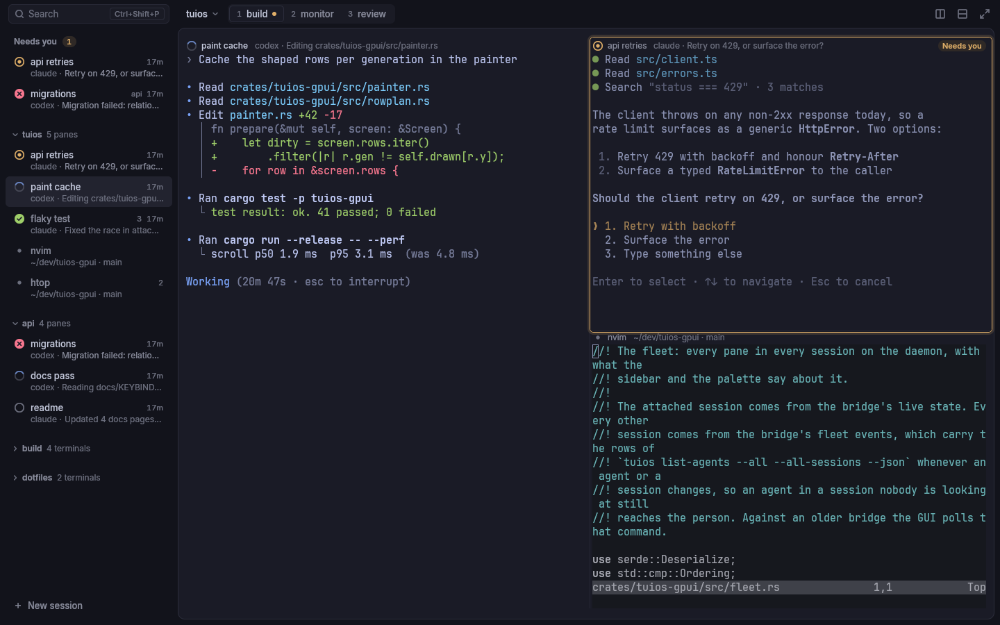

# tuios-gpui

A native, GPU-drawn desktop client for [tuios](https://github.com/Gaurav-Gosain/tuios).
It attaches to a tuios daemon session and draws every pane with
[GPUI](https://github.com/zed-industries/zed/tree/main/crates/gpui), Zed's UI
framework. Each pane runs its own copy of
[libghostty-vt](https://github.com/ghostty-org/ghostty), Ghostty's terminal
emulator library.

This is an experiment. It is not published, and it may move into the tuios
tree later.



More screenshots: [the command palette](docs/screenshots/dark-palette.png),
[another session after a jump](docs/screenshots/dark-other-session.png),
[gruvbox](docs/screenshots/dark-gruvbox.png), and the light theme
([main](docs/screenshots/light-main.png),
[palette](docs/screenshots/light-palette.png)). The design and the research
behind it are in [docs/DESIGN-RESEARCH.md](docs/DESIGN-RESEARCH.md).

## What it does

- Lists every session on the daemon in a sidebar, with each pane's state:
  needs you, error, working, done, idle, or a plain terminal. Panes that need
  you, from any session, sit at the top with the agent's question. Click a row
  to go to that pane, in any session.
- Draws the panes of the active workspace where tuios's own layout puts them.
  Each pane has a header in the row tuios leaves between panes: its state, its
  name (the agent, then the program, then the folder), and its folder and git
  branch. A pane that needs you gets the one coloured frame in the app.
- Feeds each pane's byte stream into its own libghostty-vt instance and paints
  the cells on the GPU: shaped runs per row with ligatures, wide characters,
  grapheme clusters, colour emoji, bold, italic, five underline styles,
  strikethrough, overline, truecolour, the 256-colour palette, box drawing
  snapped to the pixel grid, and the cursor in each shape.
- Repaints only the rows the emulator marked dirty. Unchanged rows replay a
  cached list of glyphs and rectangles.
- Encodes keys with Ghostty's key encoder, so cursor-key mode, the keypad
  mode, modifyOtherKeys and the kitty keyboard protocol follow what the program
  in the pane asked for. Text input goes through the platform input method.
- Sends mouse events to programs that enable mouse reporting. Otherwise the
  mouse selects text (double click for a word, triple click for a line, Alt
  for a block). The selection goes to the primary selection.
- Scrolls the scrollback by the pixel, with an eased animation for wheel steps.
- Pastes with bracketed paste when the program enabled it.
- Has a command palette for panes in every session, sessions, tuios actions
  and themes.
- Takes every colour from the tuios theme: the panes from its terminal
  colours, the chrome from its background and foreground, the agent states
  from tuios's own agent colours. Light and dark themes both work. The UI font
  is Inter, bundled.

## How it works

```
 tuios daemon  <-- gob over a unix socket -->  tuios gui-bridge  <-- frames over stdio -->  tuios-gpui
 (PTYs, state)                                 (tuios client model,                        (ghostty per pane,
                                                no renderer)                                GPUI painting)
```

The GUI starts `tuios gui-bridge`, a hidden tuios command. The bridge is a
normal tuios client without a screen: it runs the same model the terminal
client runs, so tiling, window placement and routed commands behave the same.
It sends the GUI the layout as JSON and each pane's stream as binary frames.
See [docs/RESEARCH.md](docs/RESEARCH.md) for why.

The bridge is on the local tuios branch `exp/gpui-bridge` (worktree
`~/dev/tuios-wt/gpui-bridge`). It adds:

- `internal/guibridge`: the bridge and the snapshot-to-VT conversion, with a
  round-trip test;
- `internal/app/stream_tap.go`: a hook that sees each pane's stream in the
  order the model applies it;
- `cmd/tuios/gui_bridge_command.go`: the `tuios gui-bridge` command.

## Build

You need Rust 1.96.1 (rustup picks it up from `rust-toolchain.toml`) and the
static libghostty-vt that tuios builds:

```sh
# In a tuios checkout:
./scripts/ghostty-lib.sh          # builds .ghostty-vt/native (needs zig 0.16)

# Here:
mkdir -p .ghostty-vt
ln -s /path/to/tuios/.ghostty-vt/native .ghostty-vt/native
cargo build --release
```

Or set `GHOSTTY_VT_DIR` to the directory that holds `lib/libghostty-vt.a`.

Build the tuios binary from the `exp/gpui-bridge` branch:

```sh
go build -o ~/.local/bin/tuios ./cmd/tuios
```

## Run

```sh
target/release/tuios-gpui                       # tuios on PATH, first session
target/release/tuios-gpui --session work
target/release/tuios-gpui --tuios /path/to/tuios --isolate /tmp/tuios-test
```

`--isolate DIR` gives the bridge and the daemon it starts their own runtime
directory, socket, config, state and home under DIR. Use it to test without
touching your own sessions.

### Settings

The theme comes from `[appearance] theme` in tuios's own `config.toml`. The
GUI only reads that file. Its own settings live in
`~/.config/tuios-gpui/config.toml`; every key is optional:

```toml
font_family = "JetBrainsMono Nerd Font Mono"   # the grid
ui_font_family = "Inter"                       # the chrome (bundled)
font_size = 14
line_height = 1.3
ligatures = true
theme = "tokyonight"                           # instead of tuios's theme
```

A missing font falls back to JetBrainsMono Nerd Font, JetBrains Mono, then any
monospace font. `--font`, `--font-size`, `--theme` and `--no-ligatures` set
the same things for one run. Pick a theme for the open window from the
command palette: type "theme" and part of its name.

### Keys

| Keys | Action |
| --- | --- |
| Ctrl+Shift+P | Open the command palette |
| Ctrl+Shift+J | Go to the next pane that needs you |
| Ctrl+Shift+T | New pane |
| Ctrl+Shift+D | Split right |
| Ctrl+Shift+E | Split down |
| Ctrl+Shift+W | Close the pane |
| Ctrl+Shift+Z | Zoom the pane |
| Ctrl+Tab, Ctrl+Shift+Tab | Next or previous pane |
| Alt+Arrow | Focus the pane in that direction |
| Alt+1 to Alt+9 | Go to a workspace |
| Ctrl+Shift+[ and ] | Previous or next session |
| Ctrl+Shift+C, Ctrl+Shift+V | Copy, paste |
| Shift+PageUp, Shift+PageDown | Scroll a page |
| Ctrl+=, Ctrl+-, Ctrl+0 | Text size |
| Ctrl+Shift+B | Show or hide the sidebar |
| Ctrl+Shift+Q | Quit |

Everything else goes to the focused pane.

## Test

```sh
cargo test                    # emulator wrapper, protocol, row planning, keys, palette
cargo run --release -- --perf --perf-out perf.json
```

`scripts/demo/seed.sh` fills a private daemon with sessions, panes and agent
states, and `scripts/screenshot.sh` takes a screenshot of the app against it in
a private, nested Hyprland, so it works while the desktop is locked.
`scripts/run-isolated.sh` starts the app against a private daemon, and
`--control SOCKET` with `scripts/ctl.py` drives it: synthetic keys, clicks,
drags and wheel events go through GPUI's own dispatch, and `dump` reports what
every pane shows. `scripts/hypr-type.py` types into the window through
Hyprland without moving the keyboard focus.

Performance numbers are in [docs/PERFORMANCE.md](docs/PERFORMANCE.md).

## Licence

Apache-2.0. Parts of the painter follow herdr-gpui (Apache-2.0); see
[NOTICE](NOTICE).

The UI font is Inter (SIL Open Font License 1.1,
`crates/tuios-gpui/assets/fonts/Inter-LICENSE.txt`). The icons are Lucide
(ISC, `crates/tuios-gpui/assets/icons/LICENSE-lucide.txt`).
