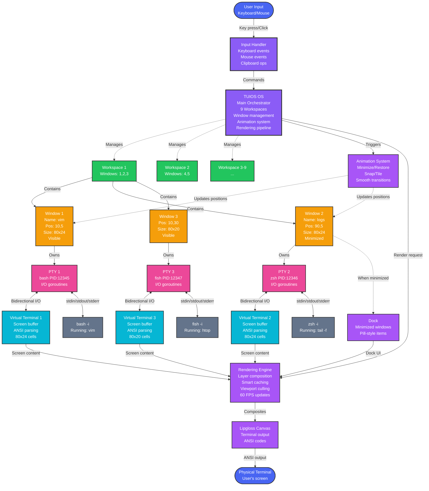
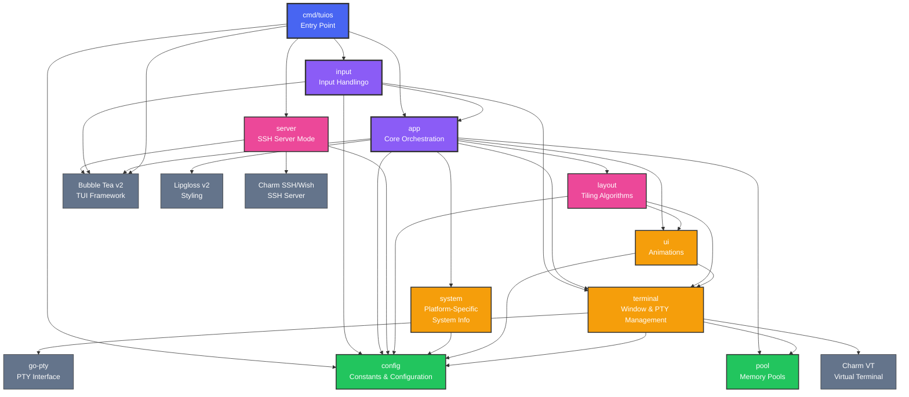

# TUIOS - Terminal UI Operating System


TUIOS is a terminal-based window manager that provides a modern, efficient
interface for managing multiple terminal sessions. Built with Go using the
Charm stack (Bubble Tea v2 and Lipgloss v2), TUIOS offers a vim-like modal
interface with comprehensive keyboard shortcuts, workspace support, and mouse
interaction.

## Features


### Core Functionality

- **Multiple Terminal Windows**: Create and manage multiple terminal sessions simultaneously
- **Workspace Support**: Organize windows across 9 independent workspaces
- **Modal Interface**: Vim-inspired design with Window Management Mode and
  Terminal Mode
- **Automatic Tiling**: Optional automatic window tiling with intelligent layouts
- **Window Minimization**: Minimize windows to dock with smooth animations
- **Real-time Updates**: 60Hz polling for responsive terminal content updates
- **Mouse Support**: Full mouse interaction for window management, dragging,
  and resizing

### Window Management

- **Dynamic Layouts**: Snap windows to screen edges, corners, or fullscreen
- **Workspace Organization**: 9 workspaces for organizing terminal sessions
- **Tiling Mode**: Automatic window arrangement with grid-based layouts
- **Drag and Drop**: Move windows by dragging with mouse (with tiling swap support)
- **Resize Support**: Right-click and drag to resize windows (disabled in tiling mode)
- **Window Minimization**: Minimize to dock with pill-style indicators
- **Z-index Management**: Automatic window layering and focus management
- **Visual Feedback**: Clear border colors indicating focus state and mode

### Advanced Features

- **Tmux-style Prefix Mode**: <kbd>Ctrl</kbd>+<kbd>B</kbd> prefix for advanced commands
- **Window Renaming**: Custom names for easy identification
- **Smart Animations**: Smooth transitions for minimize/restore/snap operations
- **CPU Monitoring**: Real-time CPU usage graph in status bar
- **Comprehensive Help System**: Built-in contextual help overlay
- **Text Selection & Copying**: Mouse and keyboard-based text selection with
  clipboard integration
- **Smart Notifications**: Responsive notification system with overflow protection
- **SSH Server Mode**: Run TUIOS as SSH server for remote terminal multiplexing
- **Session Isolation**: Each SSH connection gets dedicated TUIOS instance

## Architecture

### How TUIOS Works

TUIOS manages multiple terminal sessions through a hierarchical system of workspaces, windows, and PTY processes. The diagram below illustrates the core concepts and data flow:



#### Key Concepts

**Workspaces**: TUIOS provides 9 independent workspaces (like virtual desktops). Each workspace can contain multiple windows. You can switch between workspaces using <kbd>Alt</kbd>+<kbd>1-9</kbd>.

**Windows**: Each window represents a terminal session with its own:

- Position (X, Y coordinates)
- Size (width × height in characters)
- Custom name (optional, for easy identification)
- Minimization state (visible or minimized to dock)
- Workspace assignment (which workspace it belongs to)

**PTY (Pseudo-Terminal)**: Each window owns a PTY that creates a bidirectional communication channel with a shell process. The PTY handles:

- I/O operations through dedicated goroutines
- Process lifecycle (spawn, monitor, cleanup)
- Terminal size changes (SIGWINCH)

**Virtual Terminal (VT)**: Processes ANSI escape sequences from the shell and maintains:

- Screen buffer (grid of characters with attributes)
- Cursor position
- Text attributes (colors, bold, italic, etc.)
- Scrollback history

**Rendering Pipeline**:

1. VT screen buffers are read (60 FPS polling)
2. Windows are composed into layers with borders, titles, and content
3. Smart caching skips unchanged windows
4. Animations smoothly transition window positions
5. Lipgloss canvas composites everything
6. Final ANSI output is sent to the physical terminal

**Animation System**: Handles smooth transitions for:

- Minimize: Window → Dock (with easing)
- Restore: Dock → Window position
- Snap: Window → Screen edge/corner
- Tiling: Multiple windows rearranging

### Package Architecture

TUIOS is built with a clean, modular architecture organized into focused packages with clear separation of concerns. The dependency graph below shows the relationship between all packages:



### Package Responsibilities

- **cmd/tuios**: Application entry point, CLI argument parsing, initialization
- **config**: Centralized constants (100+ configuration values)
- **pool**: Memory pool management for performance optimization
- **terminal**: Window lifecycle, PTY management, shell detection
- **ui**: Animation system for smooth transitions
- **system**: Platform-specific system information (CPU monitoring)
- **layout**: Tiling algorithms and window positioning
- **server**: SSH server mode for remote access
- **app**: Core application logic, window management, rendering, workspace management
- **input**: Comprehensive input handling (keyboard, mouse, selection, clipboard)

### Design Principles

- **One-way dependencies**: Clear hierarchy prevents circular dependencies
- **Platform abstraction**: Build tags for Linux/macOS/Windows support
- **Separation of concerns**: Each package has a single, well-defined purpose
- **Performance focused**: Memory pools, smart caching, viewport culling
- **Testable architecture**: Focused packages enable comprehensive unit testing

## Installation

You can install TUIOS using one of the following methods:

### Quick Install (Linux/macOS)

Install the latest release with a single command:

```bash
curl -fsSL https://raw.githubusercontent.com/Gaurav-Gosain/tuios/main/install.sh | bash
```

Or if you prefer to inspect the script first:

```bash
curl -fsSL https://raw.githubusercontent.com/Gaurav-Gosain/tuios/main/install.sh -o install.sh
chmod +x install.sh
./install.sh
```

The script will automatically:
- Detect your OS and architecture
- Download the appropriate binary from the latest release
- Install it to `/usr/local/bin` (or `~/bin` if no sudo access)
- Verify the installation

### Download the latest release

Grab the latest release from the
[releases page](https://github.com/Gaurav-Gosain/tuios/releases) and extract
the archive to a location of your choice.

### Install using Go

> [!NOTE]
> Prerequisite: [Go](https://go.dev/) 1.24 or later installed on your system.

You can also install TUIOS using the `go install` command:

```bash
go install github.com/Gaurav-Gosain/tuios/cmd/tuios@latest
```

### Run using Docker

You can pull the latest docker image from the
[GitHub Docker Container Registry](https://github.com/Gaurav-Gosain/tuios/pkgs/container/tuios)
and run it using the following command:

```bash
docker run -it --rm ghcr.io/gaurav-gosain/tuios:latest
```

### Build from Source

If you prefer to build from source, follow these steps:

1. Clone the repository:

   ```bash
   git clone https://github.com/gaurav-gosain/tuios.git
   ```

2. Navigate to the project directory:

   ```bash
   cd tuios
   ```

3. Build the executable:

   ```bash
   go build -o tuios ./cmd/tuios
   ```

4. Run TUIOS:

   ```bash
   ./tuios
   ```

   Or check the version:

   ```bash
   ./tuios --version
   ```

### Prerequisites

- Go 1.24 or later (for building from source or using `go install`)
- A terminal with true color support (most modern terminals)

### Dependencies

TUIOS uses the following libraries:

- [Bubble Tea v2](https://github.com/charmbracelet/bubbletea) - Terminal UI framework
- [Lipgloss v2](https://github.com/charmbracelet/lipgloss) - Styling library
- [VT](https://github.com/charmbracelet/x/tree/main/vt) - Virtual terminal implementation
- [PTY](https://github.com/creack/pty) - Pseudo-terminal interface
- [Wish v2](https://github.com/charmbracelet/wish) - SSH server framework (for SSH mode)

## Usage

### Getting Started

**Local Mode (Default)**

Launch TUIOS from your terminal:

```bash
./tuios
```

The application starts with a welcome screen. Press <kbd>n</kbd> to create your first terminal window.

**SSH Server Mode**

Run TUIOS as an SSH server to allow remote connections:

```bash
# Start SSH server on default port 2222
./tuios --ssh

# Custom port and host
./tuios --ssh --port 2223 --host 0.0.0.0

# Specify custom SSH host key
./tuios --ssh --key-path ~/.ssh/custom_tuios_key
```

Each SSH connection gets its own isolated TUIOS instance with full terminal multiplexer capabilities.

### CLI Options

| Flag         | Description       | Default        |
| ------------ | ----------------- | -------------- |
| `--ssh`      | Run as SSH server | `false`        |
| `--port`     | SSH server port   | `2222`         |
| `--host`     | SSH server host   | `localhost`    |
| `--key-path` | SSH host key path | Auto-generated |

### Connecting to SSH Mode

```bash
# Connect to TUIOS SSH server
ssh -p 2222 localhost

# Connect from remote machine
ssh -p 2222 your-server-ip
```

### Keyboard Shortcuts

#### Window Management

| Key                             | Action                                   |
| ------------------------------- | ---------------------------------------- |
| <kbd>n</kbd>                    | Create new window                        |
| <kbd>x</kbd>                    | Close current window                     |
| <kbd>r</kbd>                    | Rename window                            |
| <kbd>m</kbd>                    | Minimize window                          |
| <kbd>Shift</kbd>+<kbd>M</kbd>   | Restore all minimized windows            |
| <kbd>Tab</kbd>                  | Focus next window                        |
| <kbd>Shift</kbd>+<kbd>Tab</kbd> | Focus previous window                    |
| <kbd>1</kbd>-<kbd>9</kbd>       | Select window by number (in tiling mode) |

#### Workspace Management

> [!NOTE]
> On macOS, use <kbd>Option</kbd> instead of <kbd>Alt</kbd>. The <kbd>Ctrl</kbd>+<kbd>B</kbd> prefix alternatives work universally and are recommended for tiling window managers like Aerospace.

| Key                                                                                    | Action                                        |
| -------------------------------------------------------------------------------------- | --------------------------------------------- |
| <kbd>Alt</kbd>+<kbd>1</kbd>-<kbd>9</kbd>                                               | Switch to workspace 1-9                       |
| <kbd>Alt</kbd>+<kbd>Shift</kbd>+<kbd>1</kbd>-<kbd>9</kbd>                              | Move window to workspace and follow           |
| <kbd>Ctrl</kbd>+<kbd>B</kbd>, <kbd>w</kbd>, <kbd>1</kbd>-<kbd>9</kbd>                  | Switch to workspace (prefix alternative)      |
| <kbd>Ctrl</kbd>+<kbd>B</kbd>, <kbd>w</kbd>, <kbd>Shift</kbd>+<kbd>1</kbd>-<kbd>9</kbd> | Move window to workspace (prefix alternative) |

#### Window Layout (Non-Tiling Mode)

| Key                       | Action                                                                  |
| ------------------------- | ----------------------------------------------------------------------- |
| <kbd>h</kbd>              | Snap window to left half                                                |
| <kbd>l</kbd>              | Snap window to right half                                               |
| <kbd>f</kbd>              | Fullscreen window                                                       |
| <kbd>u</kbd>              | Unsnap/restore window                                                   |
| <kbd>1</kbd>-<kbd>4</kbd> | Snap to corner (1=top-left, 2=top-right, 3=bottom-left, 4=bottom-right) |

#### Tiling Mode

| Key                                                          | Action                        |
| ------------------------------------------------------------ | ----------------------------- |
| <kbd>t</kbd>                                                 | Toggle automatic tiling       |
| <kbd>Shift</kbd>+<kbd>H</kbd> / <kbd>Ctrl</kbd>+<kbd>←</kbd> | Swap with window to the left  |
| <kbd>Shift</kbd>+<kbd>L</kbd> / <kbd>Ctrl</kbd>+<kbd>→</kbd> | Swap with window to the right |
| <kbd>Shift</kbd>+<kbd>K</kbd> / <kbd>Ctrl</kbd>+<kbd>↑</kbd> | Swap with window above        |
| <kbd>Shift</kbd>+<kbd>J</kbd> / <kbd>Ctrl</kbd>+<kbd>↓</kbd> | Swap with window below        |

#### Mode Switching

| Key                                        | Action              |
| ------------------------------------------ | ------------------- |
| <kbd>i</kbd>, <kbd>Enter</kbd>             | Enter Terminal Mode |
| <kbd>Esc</kbd>                             | Exit Terminal Mode  |
| <kbd>?</kbd>                               | Toggle help overlay |
| <kbd>q</kbd>, <kbd>Ctrl</kbd>+<kbd>C</kbd> | Quit application    |

#### Text Selection & Clipboard

| Key                                    | Action                                        |
| -------------------------------------- | --------------------------------------------- |
| <kbd>s</kbd>                           | Toggle selection mode                         |
| <kbd>Ctrl</kbd>+<kbd>S</kbd>           | Toggle selection mode from terminal mode      |
| <kbd>Mouse drag</kbd>                  | Select text (mouse-based)                     |
| <kbd>Arrow keys</kbd>                  | Move cursor in selection mode                 |
| <kbd>Shift</kbd>+<kbd>Arrow keys</kbd> | Extend selection                              |
| <kbd>c</kbd>                           | Copy selected text to clipboard               |
| <kbd>Ctrl</kbd>+<kbd>V</kbd>           | Paste from clipboard (works in terminal mode) |
| <kbd>Esc</kbd>                         | Clear current selection                       |

#### Window Navigation

| Key                                       | Action                          |
| ----------------------------------------- | ------------------------------- |
| <kbd>Ctrl</kbd>+<kbd>↑</kbd>/<kbd>↓</kbd> | Swap windows or maximize/unsnap |

#### System Controls

| Key                          | Action            |
| ---------------------------- | ----------------- |
| <kbd>Ctrl</kbd>+<kbd>L</kbd> | Toggle log viewer |

#### Prefix Mode (<kbd>Ctrl</kbd>+<kbd>B</kbd>)

Similar to tmux, TUIOS supports a prefix key for advanced commands. Press <kbd>Ctrl</kbd>+<kbd>B</kbd>, release, then press the command key:

| Key Sequence                                                                         | Action                                      |
| ------------------------------------------------------------------------------------ | ------------------------------------------- |
| <kbd>Ctrl</kbd>+<kbd>B</kbd> <kbd>c</kbd>                                            | Create new window                           |
| <kbd>Ctrl</kbd>+<kbd>B</kbd> <kbd>x</kbd>                                            | Close current window                        |
| <kbd>Ctrl</kbd>+<kbd>B</kbd> <kbd>,</kbd> / <kbd>r</kbd>                             | Rename window                               |
| <kbd>Ctrl</kbd>+<kbd>B</kbd> <kbd>n</kbd> / <kbd>Tab</kbd>                           | Next window                                 |
| <kbd>Ctrl</kbd>+<kbd>B</kbd> <kbd>p</kbd> / <kbd>Shift</kbd>+<kbd>Tab</kbd>          | Previous window                             |
| <kbd>Ctrl</kbd>+<kbd>B</kbd> <kbd>0</kbd>-<kbd>9</kbd>                               | Jump to window                              |
| <kbd>Ctrl</kbd>+<kbd>B</kbd> <kbd>Space</kbd>                                        | Toggle tiling mode                          |
| <kbd>Ctrl</kbd>+<kbd>B</kbd> <kbd>w</kbd> <kbd>1</kbd>-<kbd>9</kbd>                  | Switch to workspace (universal alternative) |
| <kbd>Ctrl</kbd>+<kbd>B</kbd> <kbd>w</kbd> <kbd>Shift</kbd>+<kbd>1</kbd>-<kbd>9</kbd> | Move window to workspace                    |
| <kbd>Ctrl</kbd>+<kbd>B</kbd> <kbd>m</kbd> <kbd>m</kbd>                               | Minimize focused window                     |
| <kbd>Ctrl</kbd>+<kbd>B</kbd> <kbd>m</kbd> <kbd>1</kbd>-<kbd>9</kbd>                  | Restore minimized window by number          |
| <kbd>Ctrl</kbd>+<kbd>B</kbd> <kbd>m</kbd> <kbd>Shift</kbd>+<kbd>M</kbd>              | Restore all minimized windows               |
| <kbd>Ctrl</kbd>+<kbd>B</kbd> <kbd>t</kbd> ...                                        | Window prefix (see below)                   |
| <kbd>Ctrl</kbd>+<kbd>B</kbd> <kbd>d</kbd>                                            | Detach from terminal (exit terminal mode)   |
| <kbd>Ctrl</kbd>+<kbd>B</kbd> <kbd>s</kbd>                                            | Toggle selection mode                       |
| <kbd>Ctrl</kbd>+<kbd>B</kbd> <kbd>Ctrl</kbd>+<kbd>B</kbd>                            | Send literal Ctrl+B to terminal             |

#### Window Prefix (<kbd>Ctrl</kbd>+<kbd>B</kbd>, <kbd>t</kbd>)

For users who prefer prefix-based controls matching normal mode keybinds, the window prefix provides an alternative way to access common window management commands:

| Key Sequence                                                               | Action                    |
| -------------------------------------------------------------------------- | ------------------------- |
| <kbd>Ctrl</kbd>+<kbd>B</kbd> <kbd>t</kbd> <kbd>n</kbd>                    | Create new window         |
| <kbd>Ctrl</kbd>+<kbd>B</kbd> <kbd>t</kbd> <kbd>x</kbd>                    | Close window              |
| <kbd>Ctrl</kbd>+<kbd>B</kbd> <kbd>t</kbd> <kbd>r</kbd>                    | Rename window             |
| <kbd>Ctrl</kbd>+<kbd>B</kbd> <kbd>t</kbd> <kbd>Tab</kbd>                  | Next window               |
| <kbd>Ctrl</kbd>+<kbd>B</kbd> <kbd>t</kbd> <kbd>Shift</kbd>+<kbd>Tab</kbd> | Previous window           |
| <kbd>Ctrl</kbd>+<kbd>B</kbd> <kbd>t</kbd> <kbd>t</kbd>                    | Toggle tiling mode        |

### Mouse Controls

- **Left Click**: Focus window
- **Left Drag**: Move window (swap in tiling mode) or select text (in selection mode)
- **Right Drag**: Resize window (disabled in tiling mode)
- **Window Controls**: Click minimize, maximize, or close buttons in title bar
- **Dock Click**: Click minimized windows in dock to restore

### Status Bar

The bottom status bar displays:

- **Mode Indicator**: `[W]` for Window Mode, `[T]` for Terminal Mode, `[T]` for Tiling
- **Workspace Indicator**: Shows current workspace and windows per workspace
- **Minimized Windows**: Pill-style dock items with custom names
- **CPU Graph**: Real-time CPU usage visualization

## Configuration

TUIOS uses sensible defaults but can be customized through code constants:

- **Window Defaults**: 20x5 characters for new windows
- **Animation Speed**: 300ms standard duration
- **Refresh Rate**: 60 FPS normal, 30 FPS during interactions
- **Buffer Sizes**: 100 log messages, efficient terminal rendering

## Architecture

### Technical Stack

| Component              | Technology    | Purpose                         |
| ---------------------- | ------------- | ------------------------------- |
| **UI Framework**       | Bubble Tea v2 | Event-driven terminal UI        |
| **Styling**            | Lipgloss v2   | Terminal styling and layouts    |
| **Terminal Emulation** | VT            | Virtual terminal implementation |
| **Process Management** | PTY           | Pseudo-terminal interface       |
| **Concurrency**        | Go Routines   | Parallel I/O and event handling |

### Core Components

1. **Window Manager** (`os.go`)
   - Workspace management
   - Window lifecycle
   - Focus handling
   - Event dispatching

2. **Terminal Windows** (`window.go`)
   - Process spawning
   - I/O multiplexing
   - Scrollback buffer
   - Content caching

3. **Input System** (`input.go`)
   - Modal keyboard handling
   - Mouse event processing
   - Prefix command parsing
   - Shortcut management

4. **Rendering Engine** (`render.go`)
   - Layer composition
   - Efficient redrawing
   - Animation frames
   - UI element styling

5. **Layout System** (`tiling.go`)
   - Automatic tiling
   - Window snapping
   - Grid calculations
   - Swap operations

## Performance

### Optimization Strategies

- **Smart Caching**: Terminal content cached with sequence-based change detection
- **Enhanced Viewport Culling**: Aggressive off-screen window culling with animation-aware margins
- **Adaptive Refresh**: Dynamic FPS based on activity (60Hz normal, 30Hz during interactions)
- **Expanded Memory Pooling**: Object pools for strings, byte buffers, layers, and styles
- **Intelligent Updates**: Background windows throttled to ~20Hz vs 60Hz for focused windows
- **Throttled Background Updates**: Focused windows update at 60Hz, background windows at ~20Hz
- **Frame Skipping**: Skip rendering when no changes and no active animations

### Benchmarks

| Operation        | Performance     |
| ---------------- | --------------- |
| Window Creation  | < 50ms          |
| Window Switch    | < 1ms           |
| Workspace Switch | < 5ms           |
| Full Render      | < 16ms (60 FPS) |

## Troubleshooting

### Common Issues

**Window not closing with exit/Ctrl+D**

- Fixed with improved process exit detection and context-based goroutine cleanup
- Windows now properly detect shell termination and clean up resources

**Performance issues with many windows**

- Enable tiling mode for better performance
- Background windows automatically throttle updates to ~20Hz
- Enhanced memory pooling reduces allocation overhead
- Smart caching prevents unnecessary terminal re-renders

**Resource leaks or high memory usage**

- Fixed with proper goroutine lifecycle management using context cancellation
- Enhanced I/O operation cleanup prevents hanging processes
- Object pooling reduces garbage collection pressure

**Mouse not working**

- Ensure your terminal supports mouse events
- Try running with `--mouse` flag if available

**Colors not displaying correctly**

- Verify terminal supports true color (24-bit)
- Set `COLORTERM=truecolor` environment variable

**Text selection not working**

- Ensure you're in selection mode (press `s` first)
- Use mouse drag or arrow keys to select text
- Text remains highlighted until copied or cleared with Escape

**Clipboard copying fails**

- Ensure your system has clipboard support
- Try alternative copy method if primary clipboard isn't available
- Selected text must be highlighted before copying with `c`

**SSH connection issues**

- Ensure TUIOS SSH server is running: `./tuios --ssh`
- Check firewall settings allow connections on the specified port
- SSH host key will be auto-generated on first run in `~/.ssh/tuios_host_key`
- For remote access, use `--host 0.0.0.0` to bind to all interfaces

**SSH authentication problems**

- TUIOS SSH server accepts any SSH connection (no authentication required)
- This is intended for development/local use - add authentication for production
- SSH keys are handled by the client's SSH configuration

### Debug Mode

Press <kbd>Ctrl</kbd>+<kbd>L</kbd> to open the log viewer and see system messages.

## Dependencies

TUIOS relies on the following third-party packages:

- [bubbletea](https://github.com/charmbracelet/bubbletea): A powerful little TUI framework
- [lipgloss](https://github.com/charmbracelet/lipgloss): Style definitions for nice terminal layouts
- [x/vt](https://github.com/charmbracelet/x/tree/main/vt): Virtual terminal emulator
- [pty](https://github.com/creack/pty): PTY interface for Go
- [wish](https://github.com/charmbracelet/wish): Make SSH apps, just like that!

## Roadmap

The following features are planned for future implementation:

### High Priority

- [x] Multiple terminal windows with tab support
- [x] Workspace management across 9 workspaces
- [x] Window tiling and snapping functionality
- [x] Mouse support for window management
- [x] SSH server mode for remote multiplexing
- [x] Text selection and clipboard integration
- [ ] **Scrollback Buffers**: Terminal history and scrolling
  - [ ] Mouse scroll wheel support for terminal content
  - [ ] Keyboard shortcuts for scrolling (Page Up/Down, Ctrl+U/D)
  - [ ] Configurable scrollback buffer size
  - [ ] Search within scrollback history
- [ ] **Enhanced Text Selection**: Improve selection capabilities
  - [ ] Word and line selection modes (double-click, triple-click)
  - [ ] Block/column selection mode
  - [ ] Search and select functionality
  - [ ] Copy with formatting preservation

### Medium Priority

- [ ] **Configuration System**: User-configurable settings
  - [ ] Custom key bindings
  - [ ] Theme and color customization
  - [ ] Performance tuning options
  - [ ] Configuration file support (YAML/TOML)
- [ ] **Session Management**: Save and restore terminal sessions
  - [ ] Workspace layouts persistence
  - [ ] Window state restoration
  - [ ] Custom session profiles
- [ ] **Advanced Terminal Features**:
  - [ ] Split panes within windows
  - [ ] Terminal tabs within windows
  - [ ] Background/foreground job management
  - [ ] Terminal bell notifications

### Low Priority

- [ ] **Plugin System**: Support for user extensions and customizations
  - [ ] Custom status bar widgets
  - [ ] Theme plugins
  - [ ] Custom layout algorithms
- [ ] **Advanced SSH Features**:
  - [ ] User authentication and authorization
  - [ ] Session sharing and collaboration
  - [ ] SSH tunneling support
- [ ] **Performance Monitoring**:
  - [ ] Memory usage graphs
  - [ ] Network I/O monitoring
  - [ ] Disk usage visualization
- [ ] **Accessibility Features**:
  - [ ] Screen reader support
  - [ ] High contrast themes
  - [ ] Keyboard navigation improvements

## Local Development

### Run locally using Docker

You can also run TUIOS locally using docker:

1. Clone the repository:

   ```bash
   git clone https://github.com/gaurav-gosain/tuios.git
   ```

2. Navigate to the project directory:

   ```bash
   cd tuios
   ```

3. Build the docker image:

   ```bash
   docker build -t tuios .
   ```

4. Run the docker image:

   ```bash
   docker run -it tuios
   ```

> [!NOTE]
> The above commands build the docker image with the tag `tuios`.
> You can replace `tuios` with any tag of your choice.

### Build from source

For building from source, refer to the [Build from Source](#build-from-source) section in the Installation guide above.

### Testing

```bash
go test ./...
```

## Contribution

Contributions are welcome! Whether you want to add new features,
fix bugs, or improve documentation, feel free to open a pull request.

### Development Setup

```bash
git clone https://github.com/gaurav-gosain/tuios.git
cd tuios
go mod tidy
go build -o tuios ./cmd/tuios
```

### Creating Releases

TUIOS uses [GoReleaser](https://goreleaser.com/) for automated releases. To create a new release:

1. Tag the commit with a semantic version:
   ```bash
   git tag -a v1.0.0 -m "Release v1.0.0"
   ```

2. Push the tag to trigger the release workflow:
   ```bash
   git push origin v1.0.0
   ```

The GitHub Actions workflow will automatically:
- Build binaries for multiple platforms (Linux, macOS, Windows, FreeBSD, OpenBSD)
- Create archives with checksums
- Generate a changelog
- Publish the release to GitHub

You can test the release configuration locally (requires [goreleaser](https://goreleaser.com/install/) installed):
```bash
goreleaser release --snapshot --clean
```

## Star History

[](https://star-history.com/#Gaurav-Gosain/tuios&Date)

<p style="display:flex;flex-wrap:wrap;"> 
 
 
 
 
 
 
 
 
 
 
</p>

## License

This project is licensed under the MIT License -
see the [LICENSE](LICENSE) file for details.

## Acknowledgments

- The Charm team for Bubble Tea and Lipgloss libraries
- The Go terminal ecosystem for PTY and VT implementations
- The vim and tmux communities for interface design inspiration
