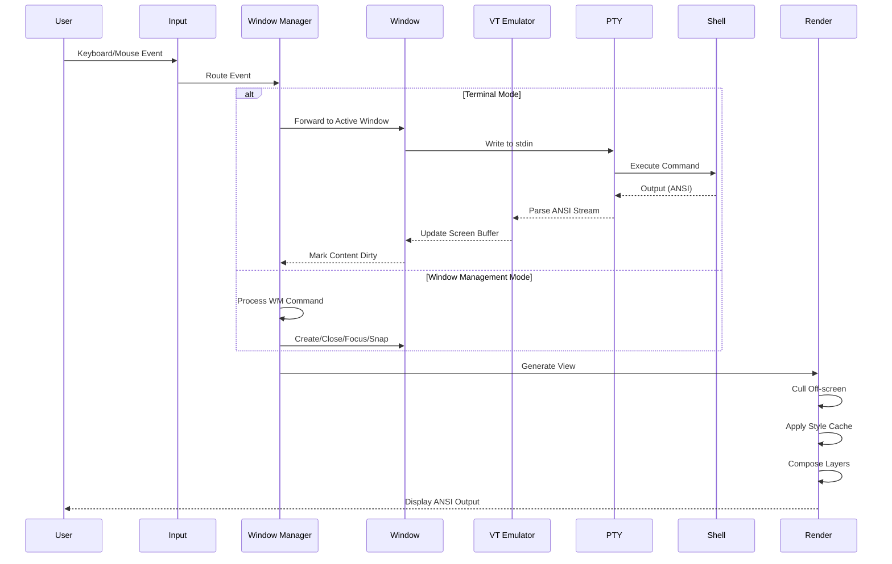
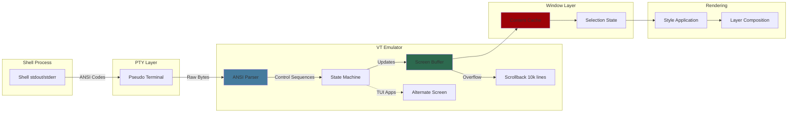
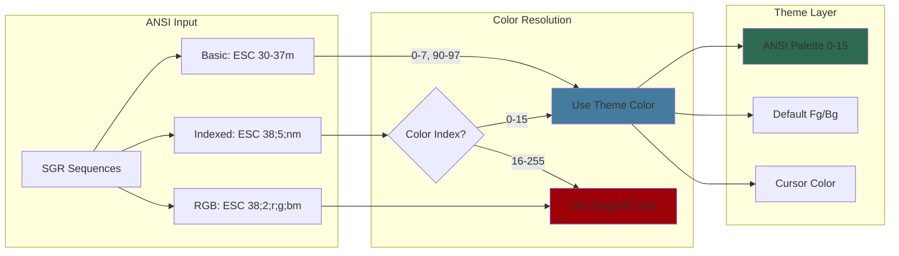
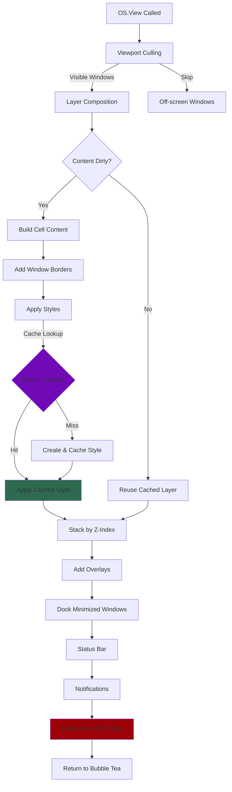

# TUIOS Architecture

This document provides a comprehensive overview of TUIOS's internal architecture, data flow, and component organization.

## Table of Contents

- [Overview](#overview)
- [System Architecture](#system-architecture)
- [Data Flow](#data-flow)
- [Terminal Emulation Stack](#terminal-emulation-stack)
- [Theme Color System](#theme-color-system)
- [Rendering Pipeline](#rendering-pipeline)
- [SSH Server Architecture](#ssh-server-architecture)
- [Core Components](#core-components)

## Overview

TUIOS follows a layered architecture built on the Model-View-Update (MVU) pattern provided by Bubble Tea v2. The application is organized into distinct layers that handle user interaction, window management, terminal emulation, and rendering.

Two things this page's diagrams predate, documented elsewhere:

- **The daemon.** In daemon mode the PTYs and emulators live in a separate
  daemon process (`internal/session`), and clients render what the daemon
  streams. The wire contract is in [protocol.md](protocol.md) and the
  attach/repaint contract in [REHYDRATION.md](REHYDRATION.md).
- **Two VT backends.** The emulator behind the `vt.Terminal` interface is
  either the pure Go implementation or libghostty-vt behind `-tags ghostty`;
  see [ghostty-vt.md](ghostty-vt.md).

## System Architecture

```mermaid
graph TB
    subgraph "User Interface Layer"
        UI[Terminal Display]
        Input[Keyboard & Mouse Input]
    end

    subgraph "Application Layer"
        OS[OS: Window Manager]
        IH[Input Handler]
        WS[Workspace Manager 1-9]
        ANI[Animation System]
    end

    subgraph "Window Management"
        WIN[Terminal Windows]
        LAYOUT[Layout System]
        TILE[Tiling Manager]
    end

    subgraph "Terminal Emulation"
        VT[VT Emulator]
        PTY[PTY Interface]
        SCROLL[Scrollback Buffer]
    end

    subgraph "Rendering Pipeline"
        RENDER[Rendering Engine]
        CACHE[Style Cache]
        POOL[Object Pools]
    end

    subgraph "External Integration"
        SSH[SSH Server Wish]
        SHELL[Shell Process]
    end

    Input --> IH
    IH --> OS
    OS --> WS
    OS --> WIN
    OS --> ANI
    WIN --> VT
    WIN --> LAYOUT
    LAYOUT --> TILE
    VT --> PTY
    VT --> SCROLL
    PTY --> SHELL
    OS --> RENDER
    RENDER --> CACHE
    RENDER --> POOL
    RENDER --> UI
    SSH --> OS

    style OS fill:#1d3557
    style VT fill:#2d6a4f
    style RENDER fill:#9d0208
    style SSH fill:#457b9d
```



### Component Responsibilities

**User Interface Layer:**

- Handles raw terminal I/O via Bubble Tea
- Processes keyboard and mouse events
- Displays rendered ANSI output

**Application Layer:**

- **OS (Window Manager)**: Central state coordinator, workspace management, mode switching
- **Input Handler**: Routes events based on current mode (Window Management, Terminal, Copy Mode)
- **Workspace Manager**: Manages 9 independent workspaces
- **Animation System**: Smooth transitions for minimize/restore/snap operations

**Window Management:**

- **Terminal Windows**: Individual terminal session containers
- **Layout System**: Window positioning and sizing
- **Tiling Manager**: BSP (Binary Space Partitioning) layout with automatic spiral pattern (alternating vertical/horizontal splits)

**Terminal Emulation:**

- **VT Emulator**: ANSI/VT100 escape sequence parser with kitty keyboard protocol (CSI u, fish 4.x compatible), mode 2026/2027, OSC 4/52
- **PTY Interface**: Pseudo-terminal communication with shell. Thread-safe HasMouseMode/HasAllMotionMode/KittyKeyboardFlags via atomics.
- **Scrollback Buffer**: 10,000 lines by default (`appearance.scrollback_lines`), on the client and on the daemon

**Rendering Pipeline:**

- **Rendering Engine**: Composites all visual layers
- **Style Cache**: LRU cache for Lipgloss styles (40-60% allocation reduction)
- **Object Pools**: Reusable byte buffers, layer slices, and highlight grids

## Data Flow



### Event Flow

1. **Input Reception**: User generates keyboard or mouse event
2. **Mode Routing**: Input handler determines current mode and routes appropriately
3. **Action Processing**:
   - **Terminal Mode**: Events sent to active window's PTY
   - **Window Management Mode**: Commands modify window state
   - **Copy Mode**: Vim-style navigation and selection
4. **State Update**: OS model updates based on commands
5. **Rendering**: Changes trigger view regeneration with optimizations
6. **Display**: Final ANSI output sent to terminal

## Terminal Emulation Stack



### Terminal Processing

1. **Shell Output**: Shell writes ANSI sequences to stdout/stderr
2. **PTY Capture**: Pseudo-terminal captures raw byte stream
3. **ANSI Parsing**: State machine parses control sequences
4. **Screen Update**: Parsed sequences update screen buffer or alternate screen
5. **Scrollback**: Overflowing lines pushed to scrollback buffer
6. **Caching**: Screen content cached with sequence-based invalidation
7. **Selection**: Copy mode overlays selection state
8. **Styling**: Lipgloss styles applied
9. **Composition**: Final layer composited for rendering

## Theme Color System

TUIOS implements a comprehensive theming system that allows terminals to use
configurable color palettes while maintaining compatibility with standard ANSI
color codes.

### Color Resolution Architecture



### Theme Color Handling

**Basic ANSI Colors (30-37, 40-47, 90-97, 100-107):**

- Automatically mapped to theme's 16-color palette
- Indices 0-7: standard colors (black, red, green, yellow, blue, magenta, cyan, white)
- Indices 8-15: bright variants

**Indexed Colors (38;5;n, 48;5;n, 58;5;n):**

- Colors 0-15: Routed through theme palette for consistency
- Colors 16-255: Pass through unchanged (256-color compatibility)
- Allows TUI apps to benefit from theming while preserving extended colors

**RGB/Truecolor (38;2;r;g;b):**

- Always pass through unchanged
- Preserves application-specified exact colors
- Full 24-bit color support

### SGR Sequence Processing

The pure Go emulator's SGR handler (`internal/vt/csi_sgr.go`) reads every SGR
through one function, `readStyleWithTheme`, with or without a theme. It used to
hand the unthemed case to `uv.ReadStyle`, which read an underline
subparameter such as `4:7` as a bare SGR 7 and dropped SGR 21, so a pane drew
differently depending on whether a theme was set. The colours agree either
way:

- **SGR 30-37, 40-47, 90-97, 100-107** resolve through `PaletteColor`: the
  theme's colour when a theme or the guest's own OSC 4 has claimed the slot,
  and otherwise the index itself, so the host paints it from the user's own
  palette.
- **Indexed `38;5;n`, `48;5;n`, `58;5;n`** go through `parseThemedColor`,
  which lets `ansi.ReadStyleColor` decide what is a colour and how many
  parameters it takes, then resolves an index from 0 to 15 through the theme.
  Indices 16 to 255 pass through.
- **Truecolor** passes through unchanged. An SGR that is one truecolor colour
  and nothing else, which is what a truecolor repaint sends for every cell, is
  answered before the loop.

This keeps:

- Consistent colour schemes across themed windows
- Respect for application-specific colour choices (256-colour, RGB)
- The user's own palette for every slot nothing has claimed

### Background Color Treatment

A cell written on the default background keeps a nil background, so the
terminal's own background shows through it and TUI applications that expect to
control their own background render correctly. The theme's colours reach the
emulator through `applyTheme` (`internal/terminal/window_theme.go`):

```go
t.SetThemeColors(
    theme.TerminalFg(),
    theme.TerminalBg(),
    theme.TerminalCursor(),
    theme.GetANSIPalette(),
)
```

The theme background given here is the emulator's default background. It is
what an OSC 11 query is answered with when the guest has set no background of
its own and no pane background is painted, and it never becomes a cell's
background.

**Design Rationale:**

Most TUI applications (vim, tmux, htop, etc.) expect to control their own background rendering. Setting the terminal's default background to an opaque color would:

- Override application-intended backgrounds
- Break visual elements expecting transparency
- Cause rendering issues with box-drawing characters

By keeping the background transparent, applications can freely use indexed background colors while the outer terminal's background shows through, providing the expected visual appearance.

**The background options.** `appearance.background` and one option per surface (`pane_background`, `desktop_background`, `window_chrome_background`, `dock_background`, `sidebar.background`; each `off`, `theme` or `#RRGGBB`, a surface's own value winning and empty following `background`; see `config.ResolveBackground`) paint a ground on cells with no background of their own, without changing any of the above: the emulator's cells keep their nil background. The paint is applied in the compositor (`internal/app/background.go`), on the cells each layer parses to, and only to cells whose background is nil, so a colour the application or the chrome set is never replaced. Each layer is assigned a surface by its id: a pane's layer is the pane surface inside its content rectangle and the window chrome outside it, the shared-border separators and the capture marquee are chrome, the scrollbar and the scrollback browser are the pane's, `sidebar` and `dock` are their own, and every other layer (the welcome splash, the keycast, the screen saver) sits on the desktop. The desktop itself is not a layer: the canvas is cleared to the desktop's ground before the layers land, so every cell no layer covers is desktop. Because every render path for a pane (the unfocused fast path, the per-cell path, cached content, scrollback and copy mode, zoomed and floating panes, both VT backends, and the SSH and browser clients, which receive the same composed frame) reaches the screen through that one parse, one pass covers them all. The paint is stored with the parsed cells and keyed on each ground's setting and theme and on the content rectangle, so a layer that did not change costs nothing extra on the next frame; with every option off the cost is the comparisons that find them off. The fullscreen fast path builds no layer, so it stands down while the pane, chrome or dock background is on; the desktop and rail backgrounds leave it alone. The pane background is also what a program's OSC 11 and OSC 10 queries are answered with (`vt.Terminal.SetReportColors`), told to a local pane's emulator before each frame and to the daemon's emulators through the client's state sync (`SessionState.PaneReportBg` and `PaneReportFg`).

### Dynamic Theme Updates

TUIOS supports live theme switching without restarting windows:

**Update Flow:**

1. Theme change triggered (user action or config reload)
2. `OS.UpdateAllWindowThemes()` called (`internal/app/os_window.go`)
3. For each window: `Window.UpdateThemeColors()` (`internal/terminal/window_theme.go`)
4. VT emulator's theme colors refreshed via `Terminal.SetThemeColors()`
5. Windows marked dirty to trigger re-render
6. New theme colors immediately visible

**Theme Components:**

- **Foreground**: Default text color (ESC[39m)
- **Background**: Default background color (ESC[49m)
- **Cursor**: Cursor block color
- **ANSI Palette**: 16 colors (indices 0-15) for SGR sequences

### Implementation Files

| Component         | File                          | Responsibility                             |
| ----------------- | ----------------------------- | ------------------------------------------ |
| **SGR Handler**   | `internal/vt/csi_sgr.go`      | Parse SGR sequences, resolving the sixteen palette slots through the theme when one claims them |
| **Theme Colors**  | `internal/terminal/window_theme.go` | Initialize and update window theme colors; cells keep a nil default background |
| **Theme Manager** | `internal/app/os_window.go`   | Propagate theme changes to all windows     |
| **Theme Config**  | `internal/theme/theme.go`     | Define color palettes and theme variants   |

## Rendering Pipeline



### Rendering Optimizations

1. **Viewport Culling**: Off-screen windows skipped entirely
2. **Content Caching**: Unchanged window content reused from cache
3. **Viewport Clipping**: Window content clipped to viewport bounds using ANSI-aware line-based approach
4. **Drag Bounds Checking**: Mouse operations prevent windows from going off-screen during drag (improves UX and prevents ANSI clipping edge cases)
5. **Style Caching**: Lipgloss styles cached and reused (LRU cache)
6. **Object Pooling**: Byte buffers, layer slices, and highlight grids pooled
7. **Z-Index Sorting**: Windows stacked by priority (focused, animating, minimized)
8. **Frame Skipping**: No render when no changes and no animations
9. **Event-Driven Refresh**: renders are scheduled by state changes, not a timer; an idle session schedules none (see [perf.md](perf.md))

## Multi-Client Architecture

TUIOS supports multiple clients connecting to the same daemon session simultaneously. All clients see synchronized state updates in real-time.

### Thread-Safe Event Channels

The multi-client system uses channel-based message passing to prevent race conditions:

```mermaid
graph LR
    subgraph "Network Goroutine"
        CB[Callback Handler]
    end

    subgraph "Channels"
        SSC[StateSyncChan]
        CEC[ClientEventChan]
    end

    subgraph "Bubble Tea Event Loop"
        LSS[ListenForStateSync]
        LCE[ListenForClientEvents]
        UPD[Update Handler]
    end

    CB -->|Non-blocking send| SSC
    CB -->|Non-blocking send| CEC
    SSC -->|Blocking read| LSS
    CEC -->|Blocking read| LCE
    LSS -->|Message| UPD
    LCE -->|Message| UPD

    style SSC fill:#2d6a4f
    style CEC fill:#2d6a4f
    style UPD fill:#1d3557
```



**Event Channels:**

| Channel | Purpose | Events |
|---------|---------|--------|
| `StateSyncChan` | State synchronization from other clients | Mode changes, window updates, workspace switches |
| `ClientEventChan` | Client join/leave notifications | Join with size, leave with count |
| `WindowExitChan` | Window process termination | PTY exit signals |

**Thread Safety:**

- Callbacks from network goroutines send to channels (non-blocking with `select/default`)
- Listener commands read from channels (blocking)
- Messages processed in Bubble Tea's single-threaded Update loop
- Prevents race conditions when iterating over `m.Windows`

### Client Notifications

When clients join, leave, or sync state, notifications are displayed:

- **Client joined/left**: "Client joined (N connected)", "Client left (N connected)"
- **Window changes**: "Window created (N total)", "Window closed (N remaining)"
- **Workspace changes**: "Switched to workspace N"
- **Session size**: "Session size: WxH (N clients)" when the shared size changes

## SSH Server Architecture

```mermaid
graph TB
    subgraph "SSH Clients"
        C1[SSH Client 1]
        C2[SSH Client 2]
        C3[SSH Client N]
    end

    subgraph "TUIOS SSH Server :2222"
        WISH[Wish v2 Middleware]
        AUTH[Session Handler]
    end

    subgraph "Isolated Instances"
        OS1[OS Instance 1]
        OS2[OS Instance 2]
        OS3[OS Instance N]
    end

    subgraph "Terminal Sessions"
        W1[Windows + PTY + Shell]
        W2[Windows + PTY + Shell]
        W3[Windows + PTY + Shell]
    end

    C1 -->|SSH Connection| WISH
    C2 -->|SSH Connection| WISH
    C3 -->|SSH Connection| WISH

    WISH --> AUTH
    AUTH -->|Dedicated Context| OS1
    AUTH -->|Dedicated Context| OS2
    AUTH -->|Dedicated Context| OS3

    OS1 --> W1
    OS2 --> W2
    OS3 --> W3

    style WISH fill:#457b9d
    style OS1 fill:#1d3557
    style OS2 fill:#1d3557
    style OS3 fill:#1d3557
```



### SSH Session Isolation

By default `tuios ssh` attaches each connection to a session of the daemon, like
a local `tuios attach`, so several connections can share one session and it
outlives them (see [CLI_REFERENCE.md](CLI_REFERENCE.md#tuios-ssh)). The diagram
above is `--ephemeral`, where each SSH connection receives:

- Dedicated OS instance (window manager state)
- Independent workspace configuration
- Isolated window collection
- Separate PTY processes
- Own terminal size and capabilities

This ensures:

- No cross-session interference
- Individual user preferences
- Clean session teardown
- Scalable multi-user support

## Core Components

| Component             | File                            | Purpose                    | Key Responsibilities                                            |
| --------------------- | ------------------------------- | -------------------------- | --------------------------------------------------------------- |
| **Window Manager**    | `internal/app/os.go`            | Central state management   | Workspace orchestration, mode handling, window lifecycle        |
| **Terminal Windows**  | `internal/terminal/window.go`   | Terminal session container | PTY lifecycle, VT emulator integration, content caching         |
| **Input Handler**     | `internal/input/keyboard.go`    | Event dispatcher           | Modal routing, prefix commands, keyboard/mouse processing       |
| **Action Registry**   | `internal/input/actions.go`     | Command execution          | 40+ action handlers for window management and navigation        |
| **VT Emulator**       | `internal/vt/emulator.go`       | ANSI parser                | Screen buffer management, scrollback, escape sequence handling, kitty keyboard protocol (CSI u, fish 4.x compatible), OSC 4/52, mode 2026/2027  |
| **Kitty Passthrough** | `internal/app/kitty_passthrough.go` | Graphics forwarding    | Flicker-free image passthrough with ID reuse and mode 2026 sync. Video playback via mpv --vo=kitty (shm and base64) and youterm. Unicode placeholders forwarded as declarations, see below. |
| **Sixel Passthrough** | `internal/app/sixel_passthrough.go` | Sixel forwarding       | Raw sixel passthrough with window boundary awareness            |
| **Rendering Engine**  | `internal/app/render.go`        | View generation            | Layer composition, viewport culling, ANSI generation            |
| **Layout System**     | `internal/layout/tiling.go`     | Window positioning         | Grid calculations, tiling algorithms, snap positions            |
| **BSP Tiling**        | `internal/layout/bsp.go`        | BSP tree management        | Binary space partitioning, spiral layout, split rotation        |
| **SSH Server**        | `internal/server/ssh.go`        | Remote access              | Wish middleware, per-session isolation, authentication          |
| **Config System**     | `internal/config/userconfig.go` | Configuration              | TOML parsing, keybinding validation, defaults management        |
| **Keybind Registry**  | `internal/config/registry.go`   | Keybinding mapping         | Action lookup, conflict detection, help generation              |
| **Style Cache**       | `internal/app/stylecache.go`    | Performance optimization   | Lipgloss style caching, LRU cache (40-60% allocation reduction) |
| **Object Pools**      | `internal/pool/pool.go`         | Memory management          | Byte/layer/grid pooling, GC pressure reduction                  |
| **Copy Mode**         | `internal/input/copymode_*.go`  | Vim navigation             | 50+ vim motions, search, visual selection, character search     |
| **Workspace Manager** | `internal/app/workspace.go`     | Multi-workspace support    | Workspace switching, window movement, focus memory              |
| **Animation System**  | `internal/app/animations.go`    | Visual transitions         | Minimize/restore/snap animations, easing functions              |

### Component Interactions

**Startup Flow:**

1. Parse CLI flags and load configuration
2. Initialize Bubble Tea program
3. Create OS model with default workspace (no windows initially)
4. Enter main event loop

**Window Creation Flow:**

1. User triggers new window command
2. OS allocates window with PTY
3. PTY spawns shell process and starts I/O polling goroutines
4. Window added to current workspace
5. Layout recalculated (if tiling enabled)
6. Focus transferred to new window

**Rendering Flow:**

1. Bubble Tea calls OS.View()
2. Viewport culling filters visible windows
3. Each window renders content from cache or VT buffer
4. Styles applied from LRU cache
5. Layers stacked by Z-index
6. Overlays added (help, logs, dock, status bar)
7. ANSI output returned to Bubble Tea

### Kitty Unicode Placeholders

Most applications place a kitty image themselves: they transmit it and say
"draw it here", and tuios intercepts that, works out where "here" is on the
host screen given the pane's position and scroll offset, and re-emits the
placement at the recomputed coordinates. That is the passthrough described
above, and it is what `internal/app/kitty_passthrough_placement.go` spends its
time on.

Unicode placeholders work the other way round, and a multiplexer has almost
nothing to do. The application transmits the image, declares that it occupies a
box of `c` columns by `r` rows, and then prints cells of U+10EEEE carrying the
image id in their foreground color and the image row and column in combining
marks. The terminal draws the part of the image belonging to each of those
cells. Because the position lives in the text grid, the image scrolls, clips
and reflows exactly as the text does, which is why kitty's documentation points
multiplexers at this protocol and why a pager can use it.

tuios forwards the declaration (`internal/app/kitty_passthrough_forward.go`,
`forwardVirtualPlace`) and lets the cells travel the ordinary text path. It
tracks no placement, computes no coordinates and does no clipping for these
images: scrolling the pane scrolls the cells, and the host redraws whatever is
still on screen. The one thing it must do is rewrite the image id the cells
name, because the host knows the image by whichever id it actually arrived
under and a cell naming an unknown id draws nothing. That rewrite happens in
the emulator as the cells are built (`internal/vt/kitty_placeholder.go`).

Two consequences follow from the id living in a color:

- A placeholder cell is exempt from dimming (`dimCell`). Blending its
  foreground would rename the image rather than fade it.
- A host that quantizes 24-bit color would rename the image too, so these
  images need a truecolor host.

Placeholders need a host terminal that implements them: kitty, Ghostty and
WezTerm do, and xterm.js does not, so they do not appear in `tuios-web`.

### Images under a window

A kitty image is painted by the host terminal over the finished frame, not
composited with the cells, so a pane drawn on top of one does not cover it the
way it covers text. tuios used to hide any image a higher window touched at all,
which meant one cell of overlap took the whole picture away.

It is now cropped to what is actually clear
(`internal/app/kitty_occlusion.go`). One placement shows one rectangle, so the
visible region is subtracted exactly and drawn as up to `maxVisibleSlices`
placements, one per rectangle: a window over a corner leaves an L and both of
its strips are drawn. Past that cap the image falls back to the single largest
clear rectangle, which only several overlapping windows can reach. Placement
ids run from the image's own upward, and the ones left over from a frame with
more slices are deleted, or a strip that is no longer clear would stay on
screen after the window moved off it.

A placeholder image needs none of this: its cells are text, the compositor has
already decided which of them survive, and the host draws exactly those, so the
visible region can be any shape at all. The self-placed remote video stream used
by browser panes still hides rather than crops.

### Deciding whether to use placeholders

There is no way to ask a terminal whether it draws Unicode placeholders. The
graphics protocol's query action answers for graphics as a whole, and kitty's
capability kitten reports names, fonts, colours and the operating system and
nothing about images. The obvious probe does not work either: the specification
says a virtual placement must carry `c` and `r`, so a terminal that implements
placeholders ought to refuse one without them, but Ghostty answers `OK` to
exactly that while supporting the feature.

So tuios asks the terminal who it is, with XTVERSION (`CSI > q`) in the
capability probe's existing round trip, and looks the answer up in a table of
known versions (`internal/app/kitty_placeholder_caps.go`). That is a heuristic,
but a better one than reading `TERM`: XTVERSION is answered by the terminal on
the other end of this tty now, while `TERM` and `TERM_PROGRAM` are inherited
variables that go stale and that a multiplexer rewrites.

What keeps it honest is the direction it fails in. Placeholder cells are kept
only on a positive match; everywhere else they are dropped, exactly as they were
before this existed, leaving the blank space the application made room for.
Keeping them on a terminal that cannot draw them would fill that space with
missing-glyph boxes instead. A table that is wrong or out of date therefore
costs the feature and never the picture.

`appearance.kitty_placeholders` overrides the table: `auto` asks the terminal,
`on` and `off` say so outright. `TUIOS_KITTY_PLACEHOLDERS=1` or `0` overrides
both, for a one-off.

### Why placeholder cells carry both marks

An application writes the row diacritic on the first cell of each row and leaves
the rest to be worked out: a placeholder cell with no marks is the cell to its
left, one column on. kitty's specification is explicit that this "will not work
for horizontal scrolling and overlapping images", and a multiplexer produces
both constantly. A pane dragged off the left edge of the screen is clipped
there, and a window drawn over the left half of an image replaces those cells
with its own; either way the leftmost surviving cell has nothing to inherit
from, and the rest of its row goes with it.

So tuios fills the marks in as the cells are built, while the row is still
whole: every cell is given its own row and column, which is exactly what the
cell to its left would have told it. No cell then needs a neighbour, and any of
them can be clipped away without taking the others. The colours are what
separate two images sitting side by side, so the inference never walks out of
one image into the next.

### What hides a placeholder image

Nothing has to. The paths that hide a placed image, `HideAllPlacements` for a
resize and `SetOverlayActive` for a full-screen overlay, exist because the host
paints a placement over the finished frame and it would otherwise be drawn on
top of the overlay. A placeholder image is drawn only where its cells are, and
an overlay composited over the pane replaces those cells, so the host draws
nothing there without being asked. A partial overlay leaves the uncovered part
of the picture showing, which is what should happen and what a placement cannot
express.

Both of those functions walk `placements`, which a placeholder image is not in,
so neither touches it. What does have to be explicit is freeing the image: it
carries no placement, so the teardown that walks `placements` cannot see it.
`OnWindowClose` and `ClearWindow` both free them, the latter because a screen
clear takes the cells with it and a pager walked through a directory of pictures
would otherwise leave every one of them resident in the host.

### Kitty image payloads and transmission media

A kitty graphics payload is base64, and the protocol leaves padding to the
sender. kitten icat sends none (its encoder is Go's `RawStdEncoding`); chafa,
timg and mpv pad. `vt.DecodeKittyPayload` accepts both, per chunk, since only a
chunk that is not the last has to be a multiple of four characters. A payload
that is not base64 at all is never passed on as image bytes: the command comes
out of the parser with `PayloadErr` set, the emulator answers the guest
`EINVAL` when kitty would (an id was given and `q` is not 2), and the
passthrough drops the rest of that chunked transmission.

A guest can also send a path instead of bytes: a file (`t=f`), a temporary
file (`t=t`) or a shared memory object (`t=s`). A path means something only on
the machine it was written on, so where it gets read decides whether it works.

- **Standalone.** The pane and tuios are on one machine. When the host
  terminal can read files there (the capability probe's `i=2` answer), tuios
  hands it the path. When it cannot (a browser, an SSH client), tuios reads the
  file itself and sends the bytes inline. The `a=q` answer says which: file
  media are refused when the host cannot read files, so a guest that asks,
  such as icat, streams the bytes instead.
- **Daemon.** The daemon answers `a=q` itself, before any client sees the
  query, so it answers for the one thing it knows: whether the path will be
  read on the machine it names a file on. File media are refused for a pane
  whose process runs on another machine over a link, and while any client
  attached over a link is drawing the session. Everywhere else they are
  accepted, and each client handles the path as in standalone. Direct
  transmission is always accepted.

Reading a guest's file is not a new privilege. The pane's process and tuios
run as the same user on the same machine, so tuios reads nothing the guest
could not read and send itself. What the read guards against is the file
itself: only a regular file is read, up to the transmit cap, so `/dev/zero`, a
FIFO or a device cannot hang or exhaust the process. A guest on another
machine that asks is told not to send a path at all. One that sends a path
without asking has it read on the wrong machine, where it names nothing or
names one of the user's own files, and at worst that file is drawn, badly, on
the user's own screen.

## Performance Characteristics

**Memory Management:**

- Style cache: reduces per-frame style allocations
- Object pool reuse: Reduces GC pressure
- Scrollback limit: `appearance.scrollback_lines` per pane, 10,000 by default, on both sides of the socket
- Content caching: Prevents redundant terminal parsing

**Concurrency:**

- Per-window PTY polling goroutines
- Context-based cancellation for cleanup
- Mutex-protected shared state, atomic HasMouseMode/HasAllMotionMode/KittyKeyboardFlags for thread safety

## Related Documentation

- [Keybindings Reference](KEYBINDINGS.md): Complete keyboard shortcut reference
- [Configuration Guide](CONFIGURATION.md): Customize keybindings and settings
- [CLI Reference](CLI_REFERENCE.md): Command-line options and flags
- [README](../README.md): Project overview
