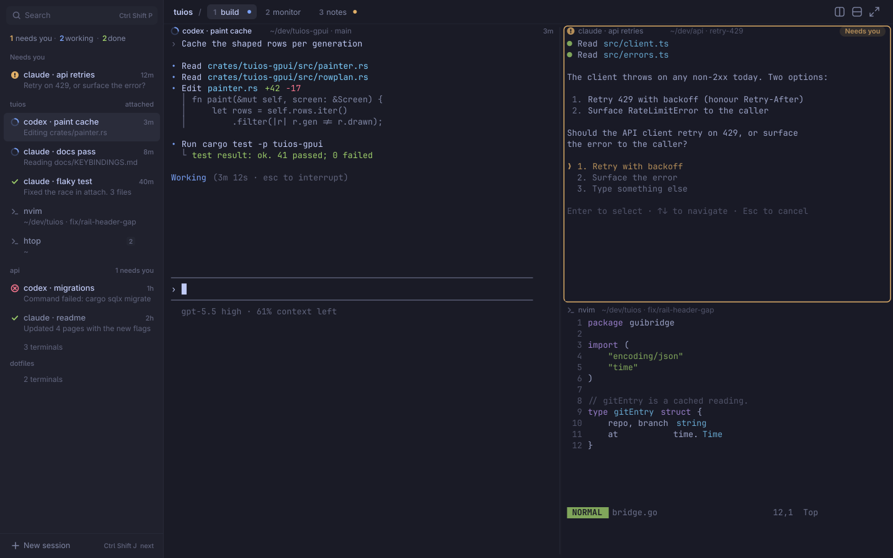
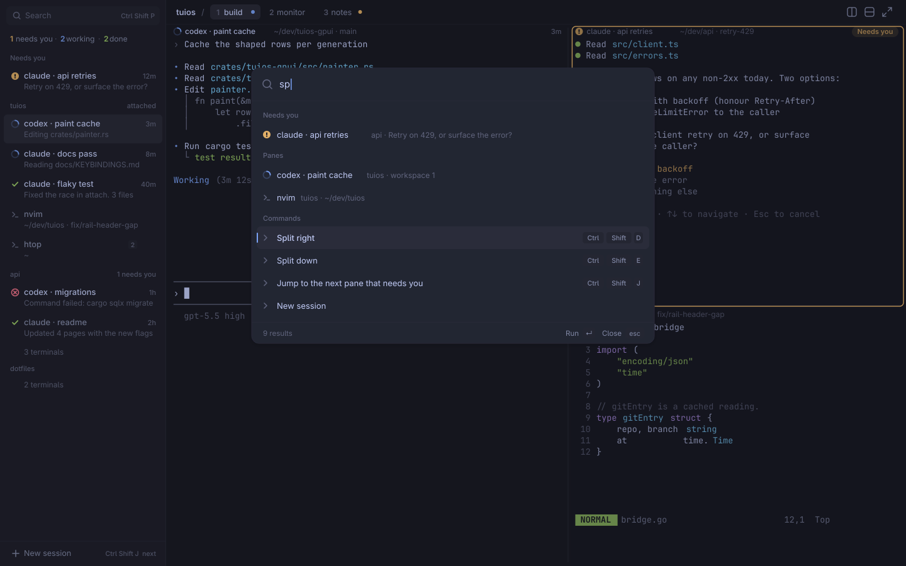
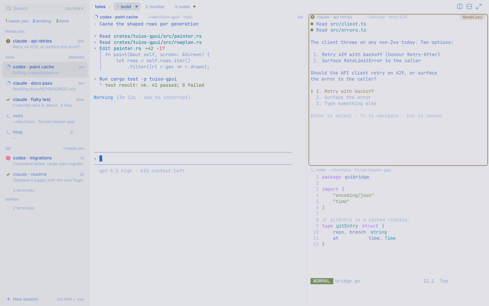

# Design research for the tuios desktop app

This note records what was studied before the UI was rebuilt, what each
product does well and badly, and the design that came out of it. Reference
images are in `~/.cache/agent-tmp/design-refs/` (not in the repo, since they
are other products' screenshots). Studied 2026-10-06. Pixel numbers from
marketing images are estimates; numbers from source code say so.

The verdict on the first version was that it looked like a debugging tool:
monospace chrome, loud coloured pane frames, "Terminal fcf75e" labels,
"unknown" badges on every pane, a status bar repeating what the sidebar said,
and no answer to the question the app exists for: which agent needs me.

## 1. Products

### herdr-gpui

GPUI client for the herdr daemon (source read at commit 068c317).

- **Organisation.** Sidebar with "SPACES" (repo, then worktree children) over
  "AGENTS" (flat, sorted by urgency: blocked, done, working, idle). Tabs above
  the panes. Status bar below. The daemon draws splits as box characters.
- **Density and type.** Everything in chrome is monospace 12 px. Sidebar
  232 px (160 to 480). Tabs are fixed 64 x 24 px cells. Almost no corner
  radius: square panes and tabs, round dots only.
- **Colour.** About seven tokens and one accent. Agent colours are hard coded
  Catppuccin pastels whatever the terminal theme.
- **Agent state.** 8 px dots or glyphs (working, blocked, done, idle). Unknown
  state is a 3 px dot so missing data reads quieter. No pulsing rows.
- **Motion.** 180 ms in, 150 ms out, cubic ease out, stateless.
- **Leaves out.** Pane title bars, pane borders, gradients, shadows.
- **Best idea.** The 3 px dot for "no data": absence is drawn quieter than any
  state, not as a badge that says "unknown".
- **Worst mistake.** Fixed pastels: yellow means working and green means idle,
  against every reader's instinct, and teal "done" is hard to tell from green
  "idle" at 8 px.

### cmux

Native macOS terminal on libghostty with a vertical workspace sidebar.

- **Organisation.** Window, then workspace (a sidebar row), then splits, then
  tabs inside each split. Each split has its own 28 pt tab strip.
- **Density and type.** System sans 13 pt titles, 11 pt summaries. Sidebar
  240 pt. Rows are 3 to 4 line cards of about 90 pt: title, latest
  notification text, PR link, `branch · ~/path`. Only 11 rows fit in 1158 px.
- **Colour.** Sidebar and terminal backgrounds do not share a tone. One blue
  accent does three jobs: selected row fill, unread badge, attention ring.
- **Agent state.** The latest notification text sits in the row. A pane that
  needs attention gets a 2 pt ring, 2 pt inset, 6 pt radius, with a glow that
  flashes at 0.6 on arrival and rests at 0.35. Working is plain grey text.
- **Motion.** A spinner and the one shot ring flash. Nothing ambient.
- **Best idea.** Say what and where at once: the row carries the agent's last
  sentence, and a ring sits on the exact pane.
- **Worst mistake.** The selected row is a saturated blue block, the loudest
  thing on screen, and it competes with the ring that is meant to pull the
  eye. Prose rows must be read, not glanced at.

### Ghostty

- **Organisation.** Windows, tabs, splits. Native widgets. No sessions, no
  sidebar.
- **Chrome.** `macos-titlebar-style = transparent` takes the terminal
  background. The tab bar hides with one tab. Window padding 2 px, balanced.
  A resize overlay shows the grid size for 750 ms.
- **Focus.** `unfocused-split-opacity = 0.7`: unfocused splits get the terminal
  background painted over them at 30 %. No border, no title, no accent.
- **Palette.** Floating panel about 58 % of the window, 12 pt radius, same
  background as the terminal, large query text, 32 pt rows, no icons.
- **Agent state.** None. A bell adds an emoji to the title. A split border on
  bell is opt in.
- **Best idea.** Focus by dimming toward the background. It costs no pixels
  and no colour.
- **Worst mistake.** No attention model. With many panes you cannot tell which
  one wants you.

### Warp

- **Organisation.** Titlebar with a centred omnibox ("Search sessions, agents,
  files"), vertical tabs (one per agent or session), blocks, a universal input
  with chip toolbars, and a separate floating Agents hub.
- **Density and type.** Proportional 15 pt titles, 70 pt rows with a 32 pt
  harness avatar. About eight sessions fit.
- **Agent state.** A badge on the avatar with a distinct shape per state:
  half circle in progress, square blocked, check done, triangle error. Plus a
  one line reason ("Requires your approval of generated code diff").
- **Best idea.** Shape per state, so state survives colour blindness and
  greyscale.
- **Worst mistake.** It looks like a web app: glass, blur, large rows, and
  three surfaces (tabs, hub, omnibox) listing the same agents.

### T3 Code

- **Organisation.** Thread list (256 px, from source), chat transcript, diff
  pane. No terminal anywhere.
- **Agent state.** One status pill per thread with a fixed priority: pending
  approval (amber), awaiting input (indigo), working (sky, the only one that
  pulses), plan ready, completed (only while unseen). Threads fall into
  sections: pinned, active, working, snoozed, and a collapsed "Settled (143)".
- **Best idea.** The list sorts itself by "does this need me", and old work
  folds away.
- **Worst mistake.** 3 line rows fit seven threads, and you never see two
  agents work side by side.

### Zed agent panel and terminal

- **Organisation.** Threads sidebar grouped under plain project headers
  ("zed, cloud"), agent panel, editor. The terminal is a separate bottom dock.
- **Rows.** Line 1: a 16 px leading slot and the title, faded at the edge
  instead of an ellipsis. Line 2 (24 px): branch, `+25 -15`, a dot at 40 %
  opacity, age. Selected row is one shade lighter, no border, no radius.
- **Agent state.** The leading slot swaps one glyph with strict precedence:
  error (red X), waiting for confirmation (warning triangle), unread (accent
  dot), running (spinner, one turn per 2 s), idle (the harness logo). The row
  layout never moves.
- **Approval card.** Bordered, about 6 px radius, text buttons, only Deny is
  red. No filled buttons.
- **Best idea.** One fixed slot, one precedence rule.
- **Worst mistake.** Threads and terminals are separate worlds. A thread has no
  pane, and a terminal does not know its thread.

### Conductor

- **Organisation.** Repo, workspace (a worktree), chat tabs, a run panel and a
  terminal. Sidebar about 254 pt with sentence case section labels.
- **Rows.** One line, 38 pt pitch, title and right aligned age ("10h"). Unread
  is bold white, read is regular grey.
- **Agent state.** Monochrome braille dot animations for working and typing.
  "Ready to merge" with a green Merge button is the headline at the top right.
- **Colour.** Chrome `#1c1c1c`, content `#191919`. Almost the same tone. Green
  only for merge readiness and additions.
- **Best idea.** Weight as the unread signal, and braille motion that belongs
  in a terminal app.
- **Worst mistake.** No per row state: "needs approval" and "finished" look the
  same in the list.

### Superset

- **Organisation.** Projects, then local checkout, then worktrees. Workspace
  tabs, a preset strip (Claude, Codex, OpenCode), panes with headers, a right
  changes panel. The pane is the real agent TUI in a terminal.
- **Agent state.** The branch glyph in the row becomes a braille spinner while
  running and gets a green badge dot when done and unread. Zero extra width.
- **Best idea.** Put state in the glyph that is already there.
- **Worst mistake.** Five navigation systems, and a second chat composer
  bolted under the TUI's own prompt.

### Sculptor (Imbue)

- **Organisation.** Flat list of agents, one container and branch each. Plan,
  Changes, Terminal and Logs tabs on the right. "Pairing mode" toggle in the
  header.
- **Agent state.** Two dot colours only: working and ready.
- **Best idea.** The sync state lives on the button you use to change it.
- **Worst mistake.** No "needs you" state at all, and saturated diff grounds
  that dominate a quiet UI.

### Claude Code: desktop app and agent view

- **Organisation.** Desktop: sessions sidebar filterable by status, project
  and environment; panes inside a session (chat, diff, terminal, plan). Agent
  view (`claude agents`): one screen of every background session.
- **Agent view.** A count line ("1 awaiting input · 1 working · 2 completed"),
  then groups under plain headers: Needs input, Working, Completed. Each row:
  glyph, name, one live summary line, age at the right. A blocked row shows the
  question itself. Colour carries state (yellow, animated, green, red, dim).
  Glyph shape carries process liveness (running, exited but resumable,
  sleeping). The footer teaches the keys: "enter to open · space to reply".
- **Best idea.** Group by state, needs-you on top, and show the actual question
  in the row.
- **Worst mistake.** Four places show state with four words for the same thing:
  "Needs input", "Waiting on you", "awaiting input", "blocked".

### Codex app

- **Organisation.** 56 px icon rail, 300 px thread sidebar (Pinned, Recents,
  Projects), thread and diff as floating cards. A host filter on mobile (All,
  Cloud, a machine with a green online dot).
- **Rows.** About 40 px. Title, then the project as a muted suffix on the same
  line, then one trailing state mark: blue unread dot, clock, spinner. A running
  row's title dims to about 50 %.
- **Best idea.** The row grammar: title, muted context, one trailing mark.
- **Worst mistake.** No distinct "needs approval" state.

### Cursor 3 agents window

- **Organisation.** Sidebar (about 245 px) grouped by repo, agent
  conversation, right panel (changes, browser, terminal, files). 3.1 adds tiled
  agents.
- **Agent state.** A 12 px leading glyph: grey dot, blue dot, ring spinner,
  green or purple PR icon, trailing cloud mark.
- **Best idea.** One primary button in the header for the next step ("Mark as
  Ready").
- **Worst mistake.** Four icon meanings in one gutter at the same size and
  weight, so running, unread and PR open cannot be told apart pre-attentively.

### Linear

- **Organisation.** An inverted L: sidebar about 220 px, header with
  breadcrumbs, content inset as a panel. Inbox rows: 20 px avatar, 13 px title,
  12 px event line, status icon and compressed age ("23h", "3d").
- **Colour.** Themes come from three inputs (base, accent, contrast) in LCH,
  which replaced 98 hand set variables. Accent is kept off chrome on purpose.
  The 2026 refresh dims the sidebar "a few notches" so navigation recedes,
  softens or removes separators, warms the neutrals, and nests layers with a
  smaller radius than their parent.
- **State.** A fixed 14 px status icon family (dashed, empty, half, checked).
- **Best idea.** Derive every chrome colour from a few inputs, and keep accent
  off the chrome.
- **Worst mistake.** Labels removed for density, so meaning depends on icons
  the rest of the system mutes.

### Raycast

- **Anatomy.** 56 px search field with 18 px text. 28 px section headers. 40 px
  rows: 20 px icon, 14 px title, subtitle in tertiary grey, accessories right.
  Selection is a filled rounded row (about 8 px radius, 6 px inset), never a
  border. A 40 px footer states the primary action and its key ("Open ↵"),
  then "Actions ⌘K". Toasts live in the footer, not on top of the content.
- **Colour.** One brand red, used only in a background glow, never in controls.
- **Best idea.** Every view states its primary action and key, so the app
  teaches itself.
- **Worst mistake.** All accessories in the same tertiary grey: a row with
  three becomes a grey wall.

## 2. What the products agree on

1. State lives in one fixed leading slot that swaps glyphs (Zed, Superset,
   Claude agent view). Rows never move.
2. Only "working" moves. "Needs you" is still and loud in colour.
3. Colour is for state and diffs. Chrome sits one small step from the content
   background (Conductor 3 %, Codex, Ghostty 0 %).
4. Two line rows with a muted second line are the density sweet spot. Three or
   four line cards fail past ten agents.
5. Sort by attention, fold away what is settled.
6. No product shows several agents' live terminals side by side with per pane
   state. tuios already has that, so the panes stay the centre of the app.

## 3. Principles

1. **The panes are the product.** Chrome exists to choose a pane and to say
   which pane needs you. It takes no space from the grid that it cannot justify.
2. **One loud thing.** Only "needs you" may use a saturated colour on chrome.
   Selection, focus and hover are tone steps, never accent fills.
3. **State has one slot and one word.** A 16 px leading glyph with a fixed
   precedence (needs you, error, working, done and unseen, idle, plain
   terminal). The word is always "Needs you". Shape and colour both encode it.
4. **Only work moves.** The working glyph turns. Nothing else animates except
   the palette opening and one flash when a pane starts to need you.
5. **Chrome is made of the terminal's own colours.** Surfaces are the theme
   background mixed a few percent toward its foreground. Text is the foreground
   mixed toward the background. A theme change recolours everything at once.
6. **Proportional type for chrome, monospace for content.** Inter at 11, 12,
   13 and 15 px, weights 400, 500 and 600. Ages use tabular figures.
7. **Absence is quiet.** A pane with no agent shows a terminal glyph and its
   folder. Never "unknown", never a UUID.
8. **Name things by what they do.** A pane is named after its agent, then its
   program, then its folder. A session row says how many need you.
9. **Focus by dimming, not by framing.** The focused pane is at full strength,
   the rest sit back a little. No coloured borders.
10. **Everything from the keyboard, and the app says the keys.** The palette
    shows each command's key. The sidebar footer shows the next useful key.
11. **No status bar.** What it said belongs in the pane header or nowhere. The
    grid size shows briefly while the window resizes.

## 4. Design

### Layout

```
+-------------+------------------------------------------------------+
| sidebar     | top bar: session / workspace tabs        split  zoom |
| 264 px      +------------------------------------------------------+
|             | pane header (in tuios's border row)                  |
| count line  |                                                      |
| Needs you   |   terminal grid                                      |
|   rows      |                                                      |
| Session A   +---------------------------+--------------------------+
|   rows      | pane header               | pane header              |
| Session B   |   terminal grid           |   terminal grid          |
|   rows      |                           |                          |
| footer      |                           |                          |
+-------------+---------------------------+--------------------------+
```

- **Sidebar, 264 px, toggles with Ctrl+Shift+B.** Background is the theme
  background mixed 3.5 % toward the foreground (light themes: 3 % toward
  black). A 1 px hairline at 7 % foreground separates it from the panes.
- **Top bar, 38 px,** on the terminal background so it reads as part of the
  pane area (Ghostty's transparent titlebar). Left: the session name in 13 px
  medium, a muted slash, then workspace tabs. Right: split right, split down
  and zoom as 28 px icon buttons.
- **Pane headers** live in the row tuios already reserves for the window
  border, so they cost no grid rows. Each header shows the state glyph, the
  pane name (12 px, medium when focused), and its context (folder, branch) in
  muted text. A pane that needs you shows a "Needs you" pill at the right of
  its header. Shared borders become 1 px hairlines at 8 % foreground.
- **Unfocused panes** get the background painted over them at 22 %. The
  focused pane has no frame.
- **A pane that needs you** gets a 1.5 px ring in the needs-you colour, inset
  2 px, radius 6, the only coloured frame in the app. It flashes once (one
  600 ms pulse) when the state arrives.

### Typography

| Use | Font | Size | Weight |
| --- | --- | --- | --- |
| Terminal grid | JetBrainsMono Nerd Font Mono | 14 px, line height 1.25 | 400, 700 |
| Palette query | Inter | 15 px | 400 |
| Row titles, session names, tabs | Inter | 13 px | 500 (400 when read) |
| Second lines, pane headers | Inter | 12 px | 400 |
| Section labels, ages, keycaps | Inter | 11 px | 500 |

Inter (OFL) is bundled, so the chrome looks the same on every machine. Section
labels are sentence case, never uppercase.

### Palette rules

Inputs: the theme's terminal background `bg`, foreground `fg`, its ANSI
colours, tuios's accent, and tuios's agent colours (worked out for contrast by
tuios's own theme code and sent by the bridge).

| Token | Dark theme | Light theme |
| --- | --- | --- |
| `canvas` (panes, top bar) | `bg` | `bg` |
| `sidebar` | mix(bg, fg, 3.5 %) | mix(bg, black, 3 %) |
| `hover` | mix(bg, fg, 6 %) | mix(bg, black, 5 %) |
| `selected` | mix(bg, fg, 9.5 %) | mix(bg, black, 8 %) |
| `raised` (palette) | mix(bg, fg, 6 %) | `bg` |
| `hairline` | fg at 8 % | fg at 11 % |
| `text` | fg | fg |
| `text_2` | mix(fg, bg, 38 %) | mix(fg, bg, 35 %) |
| `text_3` | mix(fg, bg, 58 %) | mix(fg, bg, 52 %) |
| `accent` | tuios accent | tuios accent |
| `needs_you` | tuios agent colour | same |

Accent appears in three places only: the working glyph, the palette selection
bar, and the text caret. State colours appear only in glyphs, the needs-you
pill and the needs-you ring.

### Agent and session model in the UI

tuios has sessions, each with workspaces 1 to 9, each with panes. A pane may
run an agent, which reports a state. The sidebar lists every session on the
daemon (from `tuios list-agents --all --all-sessions --json`, polled), so an
agent in a session you are not attached to still reaches you.

- **Count line** at the top: "1 needs you · 2 working · 3 done", with the
  numbers in their state colours. Hidden when nothing runs.
- **Needs you section,** shown only when not empty: every waiting agent in any
  session, oldest first. Row line 2 is the agent's message, which is usually
  the question.
- **One group per session,** the attached one first. The group header is the
  session name with a needs-you count. Its rows are its panes, sorted by
  state, then workspace. Groups of other sessions list agents only and fold
  their plain terminals into one "3 terminals" line.
- **Row anatomy, 46 px:** 16 px state slot. Line 1: name (13 px) and, at the
  right, the age of the state in tabular 11 px. Line 2 (12 px, `text_3`): the
  agent message, or program · folder · branch. The focused pane's row has the
  `selected` fill, 6 px radius, 6 px inset. A pane on another workspace shows
  a small workspace number before its age.
- **State glyphs:** needs you, a filled circle with a bar (amber); error, a
  circle with an X (red); working, a turning arc (accent); done and unseen, a
  check (green); idle agent, a hollow circle (`text_3`); terminal, a prompt
  chevron (`text_3`).
- Clicking a row attaches its session if needed, goes to its workspace and
  focuses the pane.

### Keyboard model

| Keys | Action |
| --- | --- |
| Ctrl+Shift+P | Command palette |
| Ctrl+Shift+J | Jump to the next pane that needs you |
| Ctrl+Shift+T | New pane |
| Ctrl+Shift+D, Ctrl+Shift+E | Split right, split down |
| Ctrl+Shift+W | Close the pane |
| Ctrl+Shift+Z | Zoom the pane |
| Alt+Arrow | Focus the pane in that direction |
| Ctrl+Tab, Ctrl+Shift+Tab | Next, previous pane |
| Alt+1 to Alt+9 | Go to a workspace |
| Ctrl+Shift+[ and ] | Previous, next session |
| Ctrl+Shift+B | Show or hide the sidebar |
| Ctrl+Shift+C, Ctrl+Shift+V | Copy, paste |
| Ctrl+=, Ctrl+-, Ctrl+0 | Text size |

All other keys go to the focused pane.

### Command palette

Raycast's anatomy in Ghostty's place. A 640 px panel 12 % from the top, on
`raised`, 1 px hairline border, 12 px radius, a soft two layer shadow, over a
scrim of 20 % black (8 % on light themes).

- 52 px query row with a search icon and 15 px text.
- Results in sections with 11 px labels: Needs you, Panes, Sessions, Commands,
  Themes. Themes appear only when the query matches "theme" or a theme name.
- 36 px rows: 16 px glyph, 13 px title, 12 px muted subtitle, keycaps at the
  right. The selected row has the `selected` fill and a 2 px accent bar.
- A 34 px footer: result count at the left, "Run ↵" and "Close esc" keycaps
  at the right.

### Motion

- Palette: 140 ms fade and 6 px rise, ease out. Closing is instant.
- Working glyph: one turn per 1.2 s.
- Needs-you ring: one 600 ms pulse when the state arrives, then steady.
- Resize overlay: shows while the grid size changes, fades after 750 ms.
- Nothing else moves. Hover is an instant tone step.

## 5. Mockups







The SVG sources are next to the PNGs in `docs/mockups/`.
