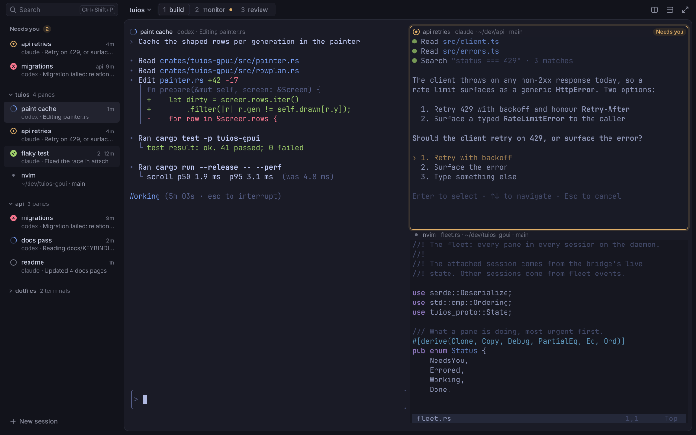
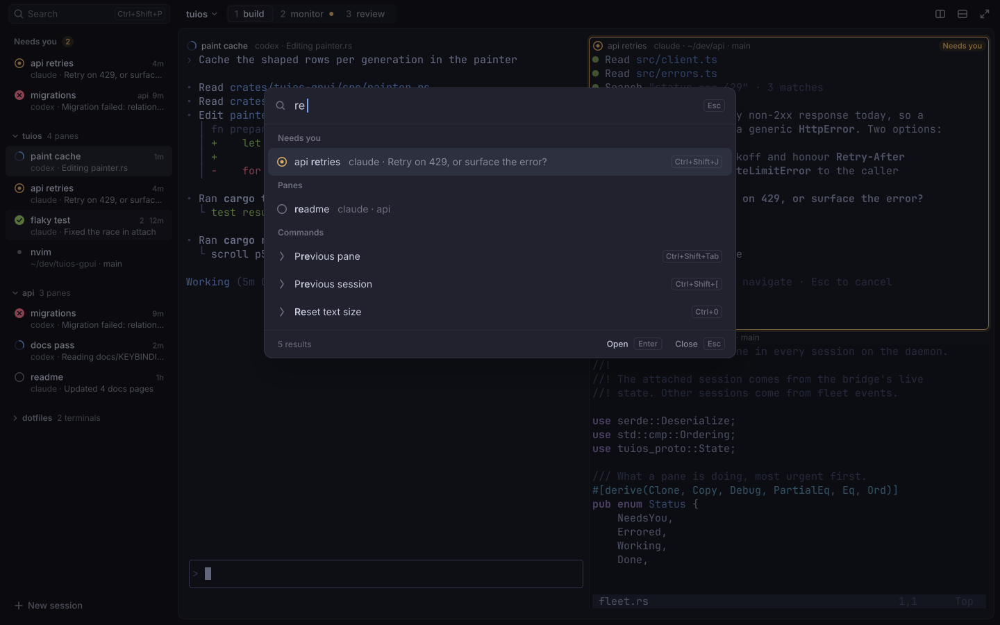
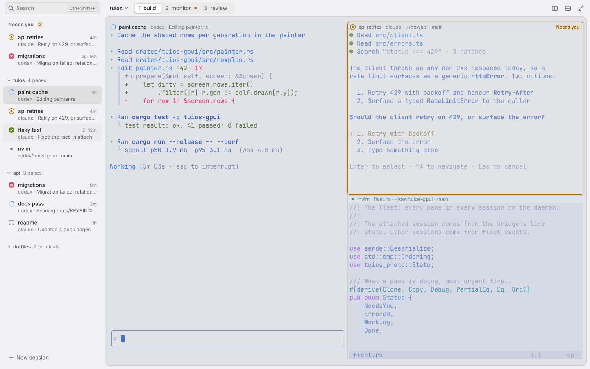

# tuios-gpui design: final spec

This is the single source of truth for the look of tuios-gpui. It replaces
`direction-a.md`, `direction-b.md` and section 4 of `DESIGN-RESEARCH.md`.
Where this file and an older one differ, this file wins.







`final/tokens.py` computes every colour in section 3. `final/mock.py` draws
the mockups from it (section 13). SVG text is not GPUI text: judge
crispness in the app, never in these PNGs.

## 0. Decision

**Base: Direction B (crafted product).** The current build is already a
flat, edge-to-edge layout, and the maintainer rejected it. Direction A is a
careful refinement of that same flat layout, so it would read as "the same
app, tidier". Direction B changes the structure: one darker shell (sidebar
and title band), and the panes on an inset, rounded stage one tone lighter.
That one move is what makes Linear, Raycast and Arc read as modern. It costs
one bordered quad per frame.

**Grafted from Direction A:**

1. The pane header has no fill strip. It sits on the stage, and splits are
   1 px hairlines in both directions. B's grey strips made every pane look
   like a form field.
2. Text tokens are solved on every ground they sit on, not only three.
3. Hover, press and focus are instant in both directions. No fade frames.
4. The palette opens with opacity and a whole-pixel rise only. No scale,
   because scaled text is blurred text.
5. Every 1-device-pixel rule: a 2 px caret, no 1.5 px fills, integer offsets.
6. The full pixel-grid rules for glyphs, blocks, braille, Powerline, icons,
   emoji and CJK.
7. The keyboard focus ring shows only after keyboard use.
8. The speed and memory budget, and 3,000 lines of default scrollback.
9. Empty states for "connecting" (after 400 ms) and "session ended".
10. The narrow-window rules, with the rail hidden below 720 px.
11. Unfocused panes dim 12 % on light themes, 30 % on dark.
12. The overlay scrollbar.

## 1. Principles

1. **Panes first.** The stage is the brightest surface and takes every pixel
   the chrome does not need. Nothing in the chrome is brighter than terminal
   text.
2. **Two layers, one step apart.** The shell is one tone. The stage is the
   terminal background. Only the palette floats above them.
3. **One loud colour.** Only "Needs you" and errors put saturated colour on
   the chrome. Hover, selection and focus are tone steps.
4. **One state slot, one icon family.** Every place that shows agent state
   uses the same 14 px icon in a 16 px slot.
5. **Crisp before pretty.** Every edge, glyph origin and baseline lands on a
   whole device pixel. Grayscale text with extra contrast. No blur.
6. **Only work moves.** Motion is short. Nothing loops while the window is
   not active.

## 2. Type

### 2.1 Fonts

| Role | Family | Source | Licence |
| --- | --- | --- | --- |
| Chrome | Inter 4.x static: Regular 400, Medium 500, SemiBold 600 | Already bundled in `crates/tuios-gpui/assets/fonts` | SIL OFL 1.1, `Inter-LICENSE.txt` |
| Terminal | JetBrains Mono 2.304 static: Regular, Bold, Italic, BoldItalic | Bundle the four TTFs from `fonts/ttf/` of the v2.304 release zip (about 1.1 MB) | SIL OFL 1.1. Ship `OFL.txt` as `JetBrainsMono-LICENSE.txt` |
| Icon fallback | Symbols Nerd Font Mono | System copy. Load it only when a Private Use Area code point appears | MIT |
| Emoji, CJK | Noto Color Emoji, Noto Sans Mono CJK | System only | SIL OFL 1.1 |

- Fetch: `curl -LO https://github.com/JetBrains/JetBrainsMono/releases/download/v2.304/JetBrainsMono-2.304.zip`.
- Never default to a patched Nerd Font family. One JetBrains Mono NF weight
  is 2.5 MB, one GeistMono NF weight is 7.7 MB.
- `font_family` in `config.toml` wins. Keep "JetBrainsMono Nerd Font Mono" as
  the second fallback, so existing configs keep their icons.
- Inter features: `tnum` on ages, counts, workspace numbers and the resize
  badge. Nothing else.
- Terminal features: `calt=0`, `liga=0` by default. `ligatures = true` turns
  them on.

### 2.2 Chrome type scale

Whole pixels at scale 1. Tracking 0. Weights 400, 500 and 600 only.
Sentence case everywhere. No uppercase labels.

| Token | Size / line | Weight | Use |
| --- | --- | --- | --- |
| `label` | 11 / 16 | 500 | Ages, workspace numbers, keycap chips |
| `label-strong` | 11 / 16 | 600 | Pills, count badges |
| `small` | 12 / 16 | 400 | Row second lines, header detail, palette fragments, footers |
| `small-strong` | 12 / 16 | 500 (pane title), 600 (section and group labels) | |
| `body` | 13 / 18 | 400 or 500 | Row titles (500), segments (500), session switcher (600), buttons (500), search placeholder (400) |
| `item` | 14 / 20 | 400, matched characters 600 | Palette row titles |
| `query` | 16 / 24 | 400 | Palette query |
| `title` | 15 / 20 | 600 | Empty state title |

## 3. Colour

### 3.1 Inputs and rules

Inputs from the tuios theme export: terminal `bg`, `fg`, `cursor`, the 16 ANSI
colours, `ui.Accent`, and the agent colours `needs_input`, `done`, `errored`.
Everything else is derived, once per theme change, never per frame.

- `mix(a, b, t)` is a straight sRGB mix. t = 0 keeps `a`.
- `over(c, g, α)` is `c` at alpha `α` on ground `g`, as the GPU blends it.
- Contrast is WCAG 2.
- `desaturate(c, keep)` pulls `c` toward its own luma. It is the existing
  `theme.rs` function.

### 3.2 Formulas

| Token | Dark theme | Light theme |
| --- | --- | --- |
| `stage` (panes, pane headers) | `bg` | `bg` |
| `base` (sidebar, title band) | mix(bg, #000, 0.30) | mix(bg, #000, 0.06) |
| `field` (search, segmented control) | mix(base, fg, 0.045) | mix(base, #fff, 0.5) |
| `hover` | mix(base, fg, 0.04) | mix(base, #000, 0.03) |
| `selected` | mix(base, fg, 0.09) | mix(base, #000, 0.07) |
| `raised` (palette) | mix(bg, fg, 0.045) | mix(bg, #fff, 0.85) |
| `raised_sel` (chosen palette row) | mix(raised, fg, 0.075) | mix(raised, #000, 0.06) |
| `border` (stage edge, chips, buttons) | fg at 13 % | #000 at 18 % |
| `hairline` (splits, palette dividers) | fg at 12 % | #000 at 14 % |
| `scrim` | #000 at 45 % | #000 at 18 % |
| `dim` (unfocused pane content) | `stage` at 30 % | `stage` at 12 % |
| `ink` | desaturate(fg, 0.45) | desaturate(fg, 0.12), then mix toward #000 in 2 % steps (one step per channel once 2 % rounds to nothing) until 10.5:1 on `worst` |
| `text` | `ink` | `ink` |
| `text2` | mix(ink, worst, t), largest t that keeps 4.6:1 on `worst` | same |
| `text3` | the same, for 3.1:1 | same |
| `accent`, `need`, `done`, `err` | the tuios colour as sent | OKLCH: keep the hue, raise chroma to at least 0.13, lower L in 0.005 steps until 3:1 on `worst` and on its own fill |
| `<state>_fill` | mix(base, state, 0.14) | same |
| `<state>_ink` (text in a pill) | the state colour | OKLCH as above, for 4.5:1 on the fill |
| `selection` | over(accent, pane bg, 0.28) | over(accent, pane bg, 0.22) |
| `on_state` (mark on a filled disc) | `bg` | #fff |

- `worst` is whichever of `base`, `stage`, `hover`, `selected`, `field` and
  `raised` gives `ink` the lowest contrast. Text passes on all of them.
- `raised_sel` is left out of `worst`. On the chosen palette row the muted
  fragment uses `text2`, not `text3`.
- Light themes start the state colours from the dark agent hues, so amber
  stays amber (`#916208`), never brown.
- In both themes the stage is the brightest surface the panes sit on. In a
  light theme the shell is a step darker than the stage, and the search
  field and the palette are lighter than both.
- The light ink stops at 10.5:1, not 11: with the shell darker than the
  stage, a near-neutral ink cannot reach 11 on `selected`.

### 3.3 Resolved values

tokyonight (dark) and tokyonight_day (light), from `final/tokens.py`.
Alpha tokens are shown composited on `stage`.

| Token | Dark | Light | Contrast on `worst` (dark / light) |
| --- | --- | --- | --- |
| `stage` | #1a1b26 | #e1e2e7 | |
| `base` | #12131b | #d4d4d9 | |
| `field` | #1a1b25 | #eaeaec | |
| `hover` | #191a24 | #ceced2 | |
| `selected` | #22232f | #c5c5ca | |
| `raised` | #21232f | #fafbfb | |
| `raised_sel` | #2d303e | #ebecec | |
| `border` | #303241 | #b8b9bd | |
| `border` on `raised` | #363949 | #cdcece | |
| `hairline` | #2e303f | #c2c2c7 | |
| `text` | #c6cbde | #161616 | 9.6 / 10.5 |
| `text2` | #888b9b | #515153 | 4.6 / 4.6 |
| `text3` | #6c6f7e | #6a6a6d | 3.1 / 3.1 |
| `accent` | #7aa2f7 | #1569d3 | 6.2 / 3.1 |
| `need` / fill / ink | #e0af68 / #2f2926 / #e0af68 | #916208 / #cbc4bc / #704b07 | 7.8 / 3.1, ink 4.5 on fill |
| `done` / fill | #9ece6a / #262d26 | #4d7802 / #c1c7bb | 8.5 / 3.1 |
| `err` / fill / ink | #f7768e / #32212b / #f7768e | #ba3f5b / #d0bfc7 / #9a1e41 | 5.9 / 3.1, ink 4.5 on fill |
| `selection` | #354161 | #b4c7e3 | |
| `on_state` | #1a1b26 | #ffffff | |

### 3.4 Where colour goes

- **Accent:** the working arc, the text caret, text selection, a split while
  it is dragged, and the keyboard focus ring. Never a row fill, never a bar.
- **Need:** the needs-you icon, pill, ring, sidebar badge and workspace dot.
- **Done, err:** their icons only. No pill for them.
- **Shadows:** the palette, and the active workspace segment (one 1 px
  shadow). Nothing else.
- **Terminal colours** go to the cells unchanged. No chrome token touches a
  cell colour, except the `dim` quad and `selection`.

## 4. Spacing, radii, fixed sizes

- **Spacing scale (px):** 2, 4, 6, 8, 12, 16, 20, 24, 32, 40. Nothing else.
- **Radii:**

  | Token | px | Use |
  | --- | --- | --- |
  | `r-chip` | 4 | Keycap chips |
  | `r-row` | 6 | Sidebar rows, search field, buttons, icon buttons, needs-you ring |
  | `r-seg` | 7 outer, 5 inner | Segmented control |
  | `r-pick` | 8 | Chosen palette row |
  | `r-pill` | 8 | Pills and badges (16 px tall) |
  | `r-stage` | 10 | Stage |
  | `r-panel` | 12 | Palette |

  A nested shape always has a smaller radius than its parent.

- **Fixed sizes (logical px):**

  | Part | Size |
  | --- | --- |
  | Title band | 40 tall, full window width |
  | Sidebar | 256 wide, 220 to 360 when dragged |
  | Rail (narrow window) | 52 wide |
  | Search field, icon button, segmented control | 28 tall |
  | Sidebar row | 44 tall, 2 px gap (46 pitch), inset 8 |
  | Group header | 28 tall. Section label 24 tall |
  | Stage margin | 8 right and bottom, 0 left and top |
  | Pane padding | 12 from each slot edge to the text, 32 at the top (section 11) |
  | Pane header | 28 tall (section 11) |
  | Split hit area | 8 |
  | Palette | 680 wide, query row 52, row 40, section label 28, footer 40 |
  | Keycap chip | 18 tall, 6 px side padding |
  | Pill | 16 tall, 6 px side padding |
  | Button | 32 tall, 12 px side padding |

## 5. Layout

Reference: 1440 x 900 at scale 1, cell 9 x 20.

```
 0               256                                                1432 1440
 +----------------+----------------------------------------------------+---+
 |[Search  Ctrl+Shift+P]| tuios v [1 build|2 monitor *|3 review]  [][][]   |  40 band (base)
 |                +----------------------------------------------------+   |
 | Needs you (2)  | stage: bg, radius 10, 1 px border                   |   |
 |  rows          |  paint cache  codex ...  | api retries ... [Needs you] |
 | v tuios 4 panes|  grid                    |  grid                     |   |
 |  rows          |                          |---------------------------|   |
 | v api 3 panes  |                          |  nvim  fleet.rs ...       |   |
 |  rows          |                          |  grid                     |   |
 | + New session  +----------------------------------------------------+ 892
 +----------------+------------------------------------------------------- 8
```

### 5.1 Window and stage

- The window is `base`. Client-side decorations: the title band is the drag
  region. A double click on empty band space maximizes.
- **Stage:** x = sidebar width, y = 40, right margin 8, bottom margin 8,
  radius 10, fill `stage`, 1 px `border` drawn inside. The sidebar and the
  band have no edge lines. The stage edge separates them.
- **Grid:** tuios lays the panes out in cells with a one-cell gap. A pane's
  **slot** is its cells plus the gap after them: half a gap column on each
  side and the gap row above. `cols = floor(stage_w / cell_w) - 1` and
  `rows = floor(stage_h / cell_h) - 1`, so the slots fill the stage, and the
  leftover is split evenly around them.
- All padding and leftover is `stage`. A pane whose program set its own
  background (OSC 11) fills its slot below the header, out to the stage
  edge where it touches it, clipped by the stage radius. Its header stays
  `stage`.
- **Padding takes the edge colour,** as Ghostty's
  `window-padding-color = extend`: each row's first and last cell run their
  background out to the slot's sides, and the first and last rows run theirs
  up and down. A side runs on only when at least half the rows have a
  background on it, so a coloured shell prompt leaves the padding alone. A
  box-drawing or Powerline cell never runs on. The `dim` quad covers the
  padding too.
- The stage, grid origin, hairlines and ring snap to device pixels at every
  scale.

### 5.2 Title band (40 px, `base`)

- **Over the sidebar:** the search field. x 12, y 6, 232 x 28, radius 6,
  fill `field`, 1 px `border` at 70 %. Search icon 14 px at x 20 in `text3`.
  "Search" in `body` `text3` at x 40. A `Ctrl+Shift+P` chip, right aligned
  6 px in. A click opens the palette.
- **Over the stage, from the grid's left edge (x 268):**
  - Session switcher: the session name in `body` 600 `text`, then a 12 px
    chevron in `text3`. A click opens the palette on Sessions.
  - 12 px later, the segmented control: y 6, 28 tall, radius 7, fill
    `field`, 2 px inner padding. Each segment is 24 tall, radius 5, 10 px
    side padding: the number in `label` `text3` (tnum), 6 px, then the name
    in `body` 500 (`text2`, or `text` when active). The active segment is
    filled `stage` (dark) or #fff (light), with a 1 px `border` and a
    0 1 0 shadow at 25 %. An unnamed workspace shows its number only, at
    least 28 wide. A workspace with a pane that needs you shows a 6 px `need`
    dot 6 px after its name.
  - A session with one unnamed workspace shows no segmented control.
  - Right: split right, split down, zoom. 28 x 28 icon buttons, 16 px
    outline icons with 1.5 px strokes in `text3`, 4 px apart, the last one
    ending at the stage's right edge.
  - When the app draws its own decorations and the window floats (GNOME,
    for example), minimize, maximize and close follow, 8 px after zoom:
    the same icon buttons. Close fills `err` under the pointer, its icon
    `on_state`. A tiled window, or one the compositor frames, shows none.
- All band baselines sit at y 25.

### 5.3 Sidebar (256 px, `base`)

From the top, after the band:

1. 8 px space.
2. **Needs you**, only when not empty. 24 px label row: "Needs you" in
   `small-strong` 600 `text2` at x 20, 8 px, then a count badge (16 tall,
   radius 8, `need_fill`, `label-strong` `need_ink`, tnum). It counts every
   row in the section. With errors only, it is `err_fill` with `err_ink`.
   This is the only count of waiting agents in the app. Rows: every pane in any session that
   needs you or has an error, oldest first.
3. **Session groups**, the attached session first. 14 px above each. 28 px
   header: a 12 px fold chevron in `text3` at x 22, the name in
   `small-strong` 600 `text2` at x 32, then "4 panes" or "2 terminals" in
   `small` `text3`. A group with no agents starts folded. The attached group
   lists every pane by state, then workspace. Other groups list agents only.
4. **Footer:** a 32 px "New session" text button at x 12, 12 from the
   bottom: a 12 px plus and `body` 500 `text2`. No keyboard hint line, no
   summary line.

**Row (44 tall, 2 gap, inset 8 so x 8 to 248, radius 6):**

| Part | Position | Style |
| --- | --- | --- |
| State icon | centre (28, top + 15) | Section 6 |
| Title | x 44, baseline top + 20 | `body` 500 `text`. A done-and-seen row or a plain terminal uses `text2`. Ellipsis before the age |
| Age | right edge x 236, baseline top + 20 | `label` `text3`, tnum: "1m", "2h", "3d". None for plain terminals |
| Workspace | 6 px before the age | `label` `text3`, only for a pane on another workspace |
| Second line | x 44, baseline top + 36 | `small`: harness in `text3`, " · ", then the message in `text2` for needs-you and error rows, `text3` for the rest. A plain terminal shows folder and branch in `text3` |

- A row is named after the agent's task, then the running program, then the
  shell for a plain terminal or the folder for an agent. The harness goes on
  line 2, never in the title.
- In "Needs you", a pane in another session names its session on line 2,
  after the harness: "codex · api · Migration failed". The slot before the
  age is for the workspace number only.
- Fill: `selected` for the focused pane, `hover` under the pointer.
- A pane that needs you appears in "Needs you" and in its session, on
  purpose. In its session it is a 28 px row: the icon and the title, no
  second line, since "Needs you" shows the message.
- Drag the stage edge to resize, 220 to 360. A double click on it resets
  256. `Ctrl+Shift+B` hides the sidebar.

### 5.4 Panes, headers and splits

- **Header** (the top 28 px of the pane's slot):
  - No fill and no line. It sits on `stage`.
  - State icon centred at (text.x + 7, slot_top + 14).
  - Title at text.x + 22, baseline slot_top + 18: `small-strong` 500
    `text` when focused, 400 `text2` when not.
  - Detail 10 px after the title in `small` `text3`: harness and activity
    for an agent, or file, folder and branch for a program.
  - Right: the "Needs you" pill, 18 tall, radius 9, 8 px side padding,
    ending 12 px in from the slot's right edge.
  - No age. The sidebar shows it.
  - When space runs out, cut the detail first, then the title, with an
    ellipsis. Hide the detail when less than 40 px remain. The icon and the
    pill are never cut.
- **Splits:** 1 px `hairline` on the slot edges, which are the gap centre
  lines, both directions. Each pane draws the line on its left and the line
  above it, the full length of its slot.
  During a drag the line is 2 px `accent` at 60 %. 8 px hit area.
- **Unfocused panes:** the `dim` quad over the content rows only. The header
  keeps full strength, so state marks never fade. Only its title colour
  changes.
- **Needs-you ring:** 1 px `need`, radius 6, on the slot edges. Where the
  pane touches the stage edge, the ring sits 2 px inside the edge, and a
  corner that meets a stage corner has radius 8. Outside it, a 3 px stroke
  of `need` at 16 % gives the glow, on the sides away from the stage edge
  only, so the glow never tints the stage border. The ring replaces the hairline on its sides.
  It is drawn after `dim`. It is the only coloured frame in the app.
- **Zoom:** the zoomed pane fills the grid. The zoom button shows its icon
  in `text`.
- **Inner padding:** text sits 12 px from a split and from the ring, and
  4 px below the header (section 11).

### 5.5 Command palette

- Over a full-window `scrim`. Panel 680 wide (window width minus 64 if
  smaller), centred, top at 14 % of the window height, at most 60 % of the
  window tall. Radius 12, fill `raised`, 1 px `border` inside. Shadow, dark:
  0 2 3 at 14 %, 0 8 16 at 18 %, 0 24 48 at 22 % black. Light: the same
  offsets at 6 %, 8 %, 10 %.
- **Query row, 52:** a 16 px search icon centred at x 24 in `text3`. The
  query in `query` `text` at x 44. Caret 2 x 20 `accent` at a whole pixel.
  With no query the caret sits at x 44 and "Search panes, sessions and
  commands" in `text3` follows it. An "Esc" chip 16 px from the right. A
  `hairline` under the row.
- **Sections**, in order: Needs you, Panes, Sessions, Commands, Themes. 28 px
  label in `small-strong` 600 `text3` at x 20. Themes show only when the
  query matches "theme" or a theme name.
- **Row, 40, inset 6, radius 8:** icon centred at x 26 (the state icon, or a
  14 px chevron in `text3` for commands). Title in `item` at x 44: matched
  characters 600, the rest 400, both `text`. One fragment 12 px later in
  `small` `text3` (`text2` on the chosen row): the agent's message or the
  folder, never both. The key chip right aligned 20 px in.
- **Chosen row:** `raised_sel` fill. No accent bar. Hover moves the choice.
- **Names:** a plain terminal is named after its running program or title,
  then its shell ("bash"). The folder goes on line 2 and in the header
  detail, and is left out when it equals the name. A title is never two
  path parts. Twins in one session with the same name and folder are
  numbered by workspace: "bash 1", "bash 2". Two rows with one title show
  the session as their fragment ("~ · api"), and the workspace too when
  that is what differs.
- **Scrolling:** while the list has more rows than fit, the overlay
  scrollbar (section 7) shows at its right. Up and Down scroll only as far
  as needed to keep the chosen row in view.
- **Footer, 40,** a `hairline` above: "5 results" in `small` `text3` at
  x 20. Right: "Open" (`small` 500 `text`) with an `Enter` chip, then "Close"
  (`small` 500 `text2`) with an `Esc` chip.
- **No results:** one 80 px block, "No results for “query”" in `body`
  `text2`, centred.

### 5.6 Keycap chips

One chip per shortcut: "Ctrl+Shift+P", never one box per key. `label`
`text3`, 18 tall, 6 px side padding, radius 4, 1 px `border`, no fill. Chips
show in the search field, palette rows, the palette footer and empty state
buttons only.

### 5.7 Empty and waiting states

Centred in the stage, a 320 px column. No illustrations, no logo. A 24 px
icon in `text3` above the title is allowed. 12 px between title and line,
16 px between line and actions.

| Case | Title (`title` `text`) | Line (`body` `text2`) | Actions |
| --- | --- | --- | --- |
| Workspace has no panes | No panes here | Open a terminal to start. | "New pane" button with `Ctrl+Shift+T`, "Open palette" text button |
| Connecting | none for 400 ms, then "Connecting to tuios" in `body` `text2` | | |
| Cannot reach the daemon | Cannot reach tuios | Start it with `tuios daemon`, then try again. The error follows in 12 px mono `text3`. | "Try again" button |
| No sessions | No sessions yet | Create a session to start. | "New session" button |
| Session ended | The session ended | Pick another session or start a new one. | "New session" button |

- Button: 32 tall, radius 6, 12 px side padding, fill `raised`, 1 px
  `border`, `body` 500 `text`, the chip 8 px after the label.
- Text button: no fill, no border, `body` 500 `text2`, `hover` fill on hover.

### 5.8 Light theme

Same layout and sizes. The shell is a step darker than the stage, so the
stage stays the brightest surface, as the editor is in Zed's light themes.
The search field and the palette are lighter than both. Ink is a neutral
near-black, never the theme's blue. State colours follow 3.2. `dim` is
12 %, so text in an unfocused pane stays readable. The scrim is 18 % and
the palette shadow is lighter.

### 5.9 Narrow windows

- **Below 1000 px:** the sidebar becomes a 52 px rail on `base`. One 36 x 36
  cell per row (state icon centred, `selected` fill for the focused pane,
  radius 6). Session headers become a 1 px `hairline` with 8 px above and
  below. The search field becomes an icon button. Hover shows a tooltip with
  the title and line 2 after 400 ms. The segmented control shows numbers
  only.
- **Below 720 px:** the rail hides. A sidebar button appears at the left of
  the band.
- `Ctrl+Shift+B` opens the full sidebar at any width. Below 1000 px it
  overlays the stage with a 1 px `border` and the palette shadow, and does
  not resize the grid.

## 6. Agent state

One family. 14 px icons in a 16 px slot, 1.5 px strokes, centred on whole
pixels.

| Precedence | State | Drawing | Colour |
| --- | --- | --- | --- |
| 1 | Needs you | ring r 6.25 with a filled centre r 2.5 | `need` |
| 2 | Error | filled disc r 7, an X of 4.8 px | `err`, mark `on_state` |
| 3 | Working | ring r 6.25 in `text3` at 35 %, a 120° arc | arc `accent` |
| 4 | Done, not seen | filled disc r 7, a check | `done`, mark `on_state` |
| 5 | Idle agent | ring r 6.25 | `text3` |
| 6 | Plain terminal | dot r 2.5 | `text3` |

- The slot never moves and a row never changes height.
- "Done" becomes seen once the pane has been focused. It then shows as done
  with the title in `text2` until the agent works again.
- The word is always "Needs you". Never "blocked", "waiting" or "input".

## 7. Interaction states

| Element | Hover | Pressed | Selected or active | Keyboard focus |
| --- | --- | --- | --- | --- |
| Sidebar row | `hover` | `selected` | `selected` (focused pane) | ring |
| Icon button | `hover`, icon `text2` | `selected` | icon `text` (zoom on, sidebar on) | ring |
| Segment | text to `text` | none | raised segment | ring |
| Text button | `hover` | `selected` | | ring |
| Palette row | moves the choice | | `raised_sel` | the choice is the focus |
| Search field | border to 100 % | | | 1 px `accent` border |
| Group header | chevron to `text2` | | | ring |
| Split | line to `text3` | 2 px `accent` at 60 % | | |
| Scrollbar | thumb 4 to 6 px wide, `text3` at 70 % | `text2` | | |

- **Ring:** 1 px `accent` inside the element at its own radius, only when
  focus came from the keyboard. Pointer focus shows no ring. The pane with
  keyboard input shows it by the others' `dim`, never by a ring.
- All of these change at once, in and out. No transitions.
- The pointer is a hand only over links in terminal output.
- **Scrollbar:** an overlay, shown only while scrolling. Thumb 4 px wide,
  `text3` at 50 %, radius 2, 2 px from the pane's right edge. It fades out
  150 ms after 600 ms without scrolling.
- **Text selection:** `selection` behind the cells. Text keeps its colour.
  Block selection (Alt) looks the same. In the palette query: `accent` at
  28 %.
- **Terminal cursor:**
  - The shape is what the program asks for. The colour is the theme `cursor`.
  - Block: fills the cell rect on device pixels. The glyph under it is drawn
    in the cell's background colour.
  - Bar: 2 device px at the left of the cell. Underline: 2 device px at the
    bottom.
  - Unfocused pane, or window not active: a 1 px hollow block.
  - Blink: 600 ms on, 600 ms off, a hard step. A key press resets it to on.
    No blink while the window is not active.

## 8. Motion

| Token | Duration | Curve |
| --- | --- | --- |
| `decelerate` | | cubic-bezier(0.2, 0, 0, 1) |
| `exit` | | cubic-bezier(0.4, 0, 1, 1) |

| What | Duration | Change | Curve |
| --- | --- | --- | --- |
| Palette and scrim open | 120 ms | opacity 0 to 1, panel rises 4 px in whole pixels. No scale | `decelerate` |
| Palette and scrim close | 80 ms | opacity only | `exit` |
| Needs you arrives | 400 ms | pill and ring opacity 0 to 1, glow 0 to 40 % to 16 %. No size change | `decelerate` |
| Needs you clears | 160 ms | opacity 1 to 0 | `exit` |
| Working icon | 2.4 s loop | the arc's opacity 100 % to 70 % and back, sine, drawn at 10 fps. It never dims far enough to read as the idle ring | |
| Resize badge | in at once, out 150 ms after 750 ms without change | opacity | `exit` |
| Cursor blink | 600 / 600 ms | step | |
| Hover, press, focus, workspace switch, pane focus, row reorder, sidebar hide | instant | | |

- When the window is not active or hidden, every loop stops. The working
  arc holds at 100 %. It holds too while the palette is open, under the
  scrim, and keeps its colour.
- `reduce_motion = true`, or the desktop's "animations off" setting, makes
  every duration 0 and the working arc still.
- An animation redraws only its own cached view (section 10). The working
  icon never redraws the window.
- Wheel scroll is direct: one step moves whole cell rows, no smoothing.
  Touchpad scroll follows the finger in whole device pixels.

## 9. Terminal text rendering

Each rule has a check that must pass before merge.

1. **Size and cell.** 15 px JetBrains Mono, `line_height` 1.333. Advance is
   600/1000 em, so the cell is exactly 9 x 20 at scale 1.
   - `cell_w = round(advance_em × size × scale)`,
     `cell_h = round(max(natural, size × line_height) × scale)`, in device
     pixels. Logical = device / scale.
   - Text size keys step 12, 13, 14, 15, 16, 18, 20. Sizes are whole pixels.
   - Store `scale` in `Metrics`. Rebuild the metrics, shape cache and glyph
     keys when it changes.
   - Check: 9 x 20 at scale 1, 11 x 25 device px at scale 1.25.
2. **Whole-pixel grid.** Glyph x is `origin_x + col × cell_w`, never a sum of
   advances. When the advance is not whole, centre the glyph in the cell and
   round the offset. `baseline = row_top + round((cell_h - (ascent + descent)) / 2 + ascent)`,
   one value for the whole grid. Grid origin, pane rects, header baselines,
   hairlines and the ring are floored to device pixels.
   - Check: zero glyphs off the pixel grid at scale 1 and 1.25 (46 % today
     at 1.25). The grid never starts at y 74.5.
3. **Grayscale antialiasing.** `cx.set_text_rendering_mode(TextRenderingMode::Grayscale)`
   at startup, and `ZED_FONTS_GRAYSCALE_ENHANCED_CONTRAST=2.0` before GPUI
   starts. Config `text_antialias = "grayscale" | "subpixel"`, `text_contrast`
   0 to 4.
   - Check: a 1:1 crop of sidebar text has 0 coloured pixels (461 today). A
     1:1 crop on the real 240 Hz monitor, dark and light, before and after.
4. **Hinting.** Rasterise with hinting on (swash `hint(true)`). Patch the
   vendored text system if GPUI does not expose it.
   - Check: in an 8x crop of "Illegal1|" at 15 px, every stem is one or two
     full pixels, never a 50 % grey column.
5. **No ligatures** by default. `===` is three characters.
6. **Cell-filling glyphs.** Box drawing (U+2500 to U+257F), blocks
   (U+2580 to U+259F), braille (U+2800 to U+28FF) and Powerline
   (U+E0B0 to U+E0BF) are drawn as snapped rectangles and paths that fill the
   cell, never font glyphs. Box drawing does this today. Add the rest.
7. **Decorations.** Underline `max(1, round(size × scale / 15))` device px at a
   whole-pixel y. Strikethrough at the cell middle, snapped.
8. **Bold** uses the real Bold face. No synthetic bold, no bold-as-bright.
9. **Icons** from the fallback font, scaled to the cell height, left aligned.
   An icon spills into the next cell only when that cell is a space.
10. **Emoji and wide CJK** are two cells wide. Emoji are cell height. CJK is
    centred.

## 10. Speed and memory budget

Measured as in `docs/PERF-AUDIT.md`.

| Case | Budget |
| --- | --- |
| Idle, window active | 0 frames/s, except the cursor blink (2/s) |
| Idle, window not active | 0 frames/s |
| Agents working, nothing else changes | 10 frames/s, only the icon views, app CPU under 1 % |
| One pane streaming | only that pane's view redraws. Sidebar and band do not rebuild |
| Paint, 4 busy panes | p95 under 2 ms |
| Anonymous memory, 4 panes | under 40 MB |

What the design needs from the code (no visible features):

- **Cached views.** `Sidebar`, `TitleBand`, one `Pane` per pane, and
  `Palette`, each wrapped in `AnyView::cached`. Each working icon is a tiny
  view of its own.
- **Spinner timer.** Runs only while at least one agent works and the window
  is active.
- **Fleet updates.** Bridge events replace the 1.5 s `list-agents` and `ls`
  polling. Ages redraw once a minute.
- **Chrome cost.** One bordered quad for the stage, one hairline quad per
  split, and for a needs-you pane two ring quads. No blur, no backdrop
  filter, no gradients. The only shadows are the palette and the active
  segment.
- **Memory.** Plain JetBrains Mono plus one lazy symbols font. A 1 byte per
  pixel grayscale atlas. Scrollback defaults to 3,000 lines (`scrollback`
  setting). Hidden panes keep their history but drop shaped-row caches. So
  does a pane without focus that has not changed for 30 s. A pane that
  keeps printing drops the rows that scrolled out of view 30 s before.
- **GPU.** `gpu = "auto"` (the default) loads only the integrated GPU's
  Vulkan driver when that GPU drives every connected display and a second
  GPU is present. A window drawn on one GPU and shown by a compositor on
  another can come up black. `"integrated"` forces it, `"any"` loads every
  driver. Unless `gpu = "any"`, the OpenGL drivers are not loaded while a
  Vulkan driver is installed (about 10 MB of memory).

### Config keys

| Key | Default |
| --- | --- |
| `font_family` | "JetBrains Mono" |
| `font_size` | 15 |
| `line_height` | 1.333 |
| `ligatures` | false |
| `text_antialias` | "grayscale" |
| `text_contrast` | 2.0 |
| `scrollback` | 3000 |
| `reduce_motion` | false |
| `gpu` | "auto" |

## 11. Bridge insets

`tuios gui-bridge` (Go, branch `exp/gpui-bridge`) takes per-pane pixel
insets: `--insets` at start and `insets` on every `resize` command, in
device pixels, top, left, right, bottom. The GUI sends 32, 12, 12, 12. Each
inset is measured from the pane's slot (section 5.1). The bridge sizes each
pane's PTY to the whole cells left inside:
`cols = floor(((w + 1) × cell_w - left - right) / cell_w)`, and the same
for rows. The GUI lays out the text with the same formula
(`Window::inset_cells`, `terminal.InsetCells` in tuios).

- Header 28 tall: icon centre y + 14, title baseline y + 18, pill 18 tall,
  radius 9, 8 px side padding.
- 12 px pane padding, 4 px between header and grid.
- The ring sits on the slot edges.

## 12. Do not

- Do not use a patched Nerd Font as the default font.
- Do not turn on ligatures by default.
- Do not use subpixel antialiasing by default, or synthetic bold.
- Do not place a glyph, edge or baseline off a whole device pixel. No 1.5 px
  fills, no scaled text during an animation.
- Do not use blur, backdrop filters, gradients or glows other than the
  needs-you glow.
- Do not add a shadow anywhere except the palette and the active segment.
- Do not use the accent for a row fill, a bar, a pane frame or a header.
- Do not frame panes. The needs-you ring is the only frame.
- Do not fill the pane header. Do not put an age in it.
- Do not repeat a fact: no summary line, no footer hint, no count on groups.
- Do not join "harness · title" in a row title, or
  "session · workspace · message" in a palette row.
- Do not draw one box per key. One chip per shortcut.
- Do not use uppercase labels, or weights other than 400, 500 and 600.
- Do not animate hover, focus, layout or size. Do not loop anything while the
  window is not active.
- Do not redraw the whole window for a spinner, an age or one pane's output.
- Do not hard-code a colour in chrome. Every colour comes from section 3.
- Do not use em dashes, "unknown" badges or hex ids in UI text.

## 13. Mockups

- `final/main-dark.png`: tokyonight, three panes. "paint cache" is focused
  and working. "api retries" needs you. nvim sets its own background.
- `final/palette-dark.png`: the palette with the query "re".
- `final/main-light.png`: tokyonight_day.

They use the older layout with one-cell headers, from before the bridge had
insets. The screenshots in `docs/screenshots` show the current one. Rebuild:

```sh
# fonts.conf adds crates/tuios-gpui/assets/fonts to the system fonts
FONTCONFIG_FILE=fonts.conf python3 docs/design/final/mock.py docs/design/final
for n in main-dark palette-dark main-light; do
  FONTCONFIG_FILE=fonts.conf rsvg-convert docs/design/final/$n.svg -o docs/design/final/$n.png
done
```

The mockups use JetBrainsMono NL Nerd Font Mono, which has the same Latin
glyphs as plain JetBrains Mono.
