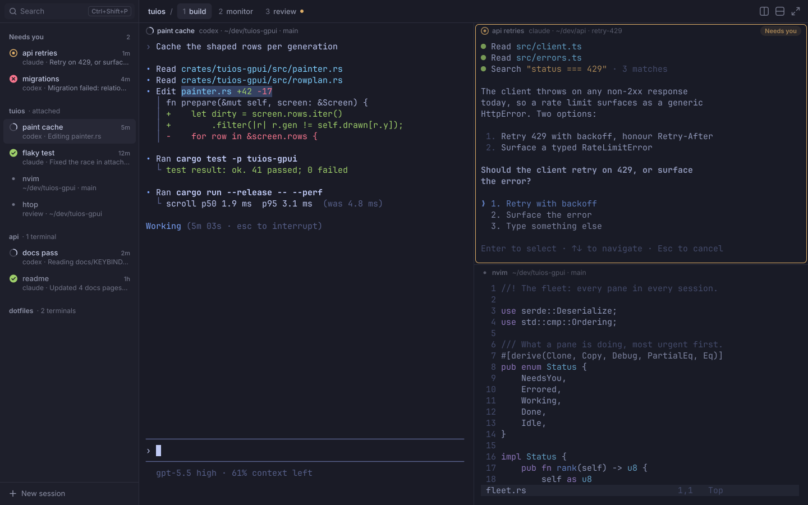
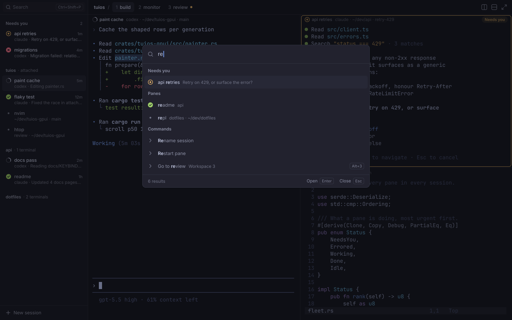
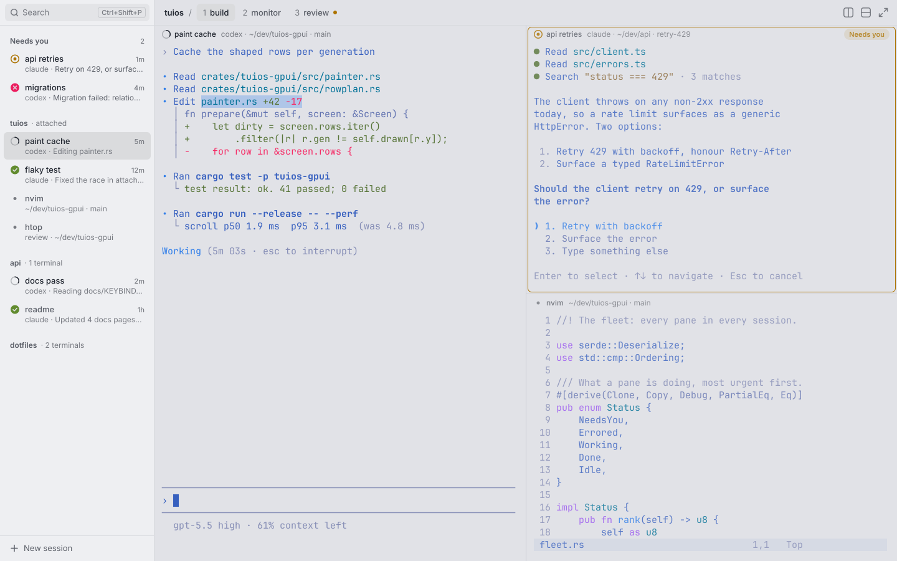

# Direction A: quiet native

A buildable design spec for tuios-gpui. It is closest to Ghostty and Zed: the
chrome nearly disappears, the terminal is the hero, there is one accent, the
dividers are hairlines, and the spacing is generous but strict.

It replaces the tokens and sizes in `docs/DESIGN-RESEARCH.md` section 4. The
principles in section 3 of that file still hold. The problems it answers are
in the visual and rendering audits (`docs/PERF-AUDIT.md` and the audit notes).







The mockups are drawn from the numbers in this file. `direction-a/tokens.py`
computes every colour, `direction-a/mock.py` draws the SVGs, and
`direction-a/render.sh` turns them into PNGs.

## 1. Rules

1. **The terminal is the hero.** Chrome is one tone step from the terminal
   background at most. Nothing in the chrome is brighter than terminal text.
2. **One accent.** The accent marks the text caret, the keyboard focus ring,
   text selection, and the active divider during a drag. Nothing else.
3. **One loud state.** Only "Needs you" and "Error" use a saturated colour on
   the chrome. Working, done and idle are quiet.
4. **Hairlines, not boxes.** Regions are split by 1 px lines at low alpha.
   Panes have no frames. The needs-you ring is the only coloured frame.
5. **A 4 px grid.** Every size and gap in this file is on the spacing scale.
6. **Crisp before pretty.** Every edge lands on a whole device pixel. Text is
   grayscale antialiased with extra contrast. No blur, no gradients.
7. **Nothing moves without a reason.** Only the working glyph loops. It stops
   when the window is not active.

## 2. Fonts

| Role | Family | Source | Licence |
| --- | --- | --- | --- |
| Chrome | Inter 4.x, static Regular 400, Medium 500, SemiBold 600 | Bundled now (`crates/tuios-gpui/assets/fonts`) | SIL OFL 1.1 (`Inter-LICENSE.txt`) |
| Terminal | JetBrains Mono 2.304, static Regular, Bold, Italic, Bold Italic | Bundle the plain TTFs (about 270 KB each, 1.1 MB in all) | SIL OFL 1.1. Ship `OFL.txt` next to them. |
| Icon fallback | Symbols Nerd Font Mono | Use the system copy when present. Load it only when a Private Use Area code point appears. | MIT and OFL 1.1 (per bundled icon set) |
| Emoji fallback | Noto Color Emoji | System only | SIL OFL 1.1 |
| CJK fallback | Noto Sans Mono CJK | System only | SIL OFL 1.1 |

- Do not use a Nerd Font patched family as the default. One GeistMono NF
  weight is 7.7 MB and one JetBrains Mono NF weight is 2.5 MB. Plain
  JetBrains Mono plus one lazy symbols font keeps font memory and the glyph
  atlas small.
- `font_family` in `config.toml` still wins. A user who sets
  "JetBrainsMono Nerd Font Mono" gets it.
- Inter features: `tnum` on ages, counts, workspace numbers and the resize
  badge. No other features.
- Terminal features: `calt` and `liga` off by default (Ghostty users set
  `font-feature = -calt`). `ligatures = true` turns them on.

## 3. Type scale

Inter for all chrome. Sizes are whole pixels. Line heights are whole pixels.

| Token | Size / line | Weight | Tracking | Use |
| --- | --- | --- | --- | --- |
| `caption` | 11 / 14 | 500 | +0.1 px | Ages, counts, keycap chips |
| `pill` | 11 / 14 | 600 | +0.1 px | The "Needs you" pill |
| `small` | 12 / 16 | 400 | 0 | Row second lines, pane header detail, palette subtitles, footers |
| `label` | 12 / 16 | 600 | 0 | Section and session headers |
| `header` | 12 / 16 | 500 | 0 | Pane header name |
| `body` | 13 / 18 | 400 or 500 | 0 | Row titles (500), tabs (500), palette rows (400, matches 600), search text |
| `input` | 15 / 20 | 400 | 0 | Palette query |
| `title` | 15 / 20 | 600 | -0.1 px | Empty state title |

Three weights only: 400, 500, 600. No uppercase labels. Sentence case
everywhere.

## 4. Spacing, radii and fixed sizes

**Spacing scale (px):** 2, 4, 6, 8, 12, 16, 20, 24, 32, 40.

**Radii (px):**

| Token | Value | Use |
| --- | --- | --- |
| `r-chip` | 4 | Keycap chips |
| `r-ctl` | 6 | Rows, tabs, fields, icon buttons, the needs-you ring |
| `r-panel` | 10 | The palette |
| `r-pill` | 9 | The "Needs you" pill (half its height) |

Panes are square. The window has no radius of its own (the compositor owns
that).

**Fixed sizes (px, logical):**

| Part | Size |
| --- | --- |
| Top band | 40 tall, full window width |
| Sidebar | 248 wide by default, 200 to 360 when dragged |
| Sidebar rail (narrow windows) | 52 wide |
| Search field | 28 tall, 8 from the sidebar sides, 6 from the top |
| Section and session header | 28 tall |
| Sidebar row | 44 tall, 2 apart (46 pitch), inset 6 each side |
| Sidebar foot ("New session") | 40 tall |
| Workspace tab | 28 tall, padding 10, gap 2 |
| Icon button | 28 x 28, 16 px icon |
| State icon | 14 px glyph in a 16 px box |
| Pane header | 28 tall (needs bridge insets, section 7.5) |
| Pane padding | 12 left, right and bottom. 4 between header and grid. |
| Divider | 1 px line, 8 px hit area |
| Palette | 640 wide, top at 14 % of the window height, at most 60 % of the window tall |
| Palette query row | 52 |
| Palette row | 36, inset 6 |
| Palette section header | 28 |
| Palette footer | 36 |
| Keycap chip | 18 tall, padding 6 |

## 5. Colour

### 5.1 Inputs

From the tuios theme, as the bridge sends it: terminal `bg`, `fg`, `cursor`,
the 16 ANSI colours, `ui.Accent`, and the agent colours `needs_input`,
`errored`, `done`. Everything else is derived. A theme change recolours the
whole app at once.

### 5.2 Formulas

All mixes are in OKLab. `mix(a, b, t)` moves `a` toward `b` by `t`.
`over(c, g, α)` is `c` at alpha `α` composited on `g` in sRGB, which is what
the GPU blend does. Contrast is WCAG 2.

**Dark themes** (`light = false`):

| Token | Formula |
| --- | --- |
| `canvas` | `bg` (panes, top band over panes) |
| `chrome` | `mix(bg, fg, 0.03)` (sidebar, top band over the sidebar) |
| `hover` | `mix(bg, fg, 0.055)` |
| `selected` | `mix(bg, fg, 0.09)` |
| `raised` | `mix(bg, fg, 0.045)` (palette panel) |
| `ink` | `fg` with OKLCH chroma capped at 0.035 |

**Light themes** (`light = true`):

| Token | Formula |
| --- | --- |
| `canvas` | `bg` |
| `chrome` | `mix(bg, #ffffff, 0.45)`. The sidebar is lighter than the canvas. |
| `hover` | `mix(chrome, #000000, 0.035)` |
| `selected` | `mix(chrome, #000000, 0.065)` |
| `raised` | `mix(bg, #ffffff, 0.70)` |
| `ink` | OKLab L 0.27, chroma 0.02, at the hue of `fg`. Neutral ink, never the theme blue. |

**Both:**

| Token | Formula |
| --- | --- |
| `text` | `ink` |
| `text2` | The colour on the OKLab line from `ink` to `worst` with contrast 4.6:1 on `worst` |
| `text3` | The same line at 3.1:1 |
| `worst` | Of `chrome`, `canvas`, `hover` and `selected`, the one where `ink` has the least contrast |
| `hairline` | `over(ink, chrome, α)`, α = 0.09 dark, 0.11 light |
| `hairline_canvas` | `over(ink, canvas, α)`, same α |
| `panel_border` | `over(ink, raised, α)`, α = 0.10 dark, 0.14 light |
| `chip_border` | `over(ink, ground, hairline α + 0.04)` |
| `accent` | `ui.Accent` |
| `selection` | `over(accent, pane bg, 0.28)`. Text keeps its own colour. |
| `dim` | `canvas` at α 0.30 dark, 0.20 light, over an unfocused pane |
| `scrim` | `#000000` at α 0.45 dark, 0.18 light |

**State colours.** Dark themes use the tuios agent colours as sent. Light
themes keep each colour's hue, raise OKLCH chroma to at least 0.13, then
lower OKLab L from 0.78 in 0.005 steps until the colour reads at 3:1 on its
own pill (`over(state, chrome, 0.14)`). That keeps amber amber, where the
plain theme colour turns brown.

| Token | Use |
| --- | --- |
| `need` | Needs-you icon, pill text, pill fill at 14 %, ring, tab dot |
| `err` | Error icon (filled disc) |
| `done` | Done icon (filled disc) |
| Working | `text` arc on a `text3` ring at 50 %. No colour. |
| Idle | `text3` ring |

The tab dot is the only state mark in the top band, and only for needs you.

### 5.3 Values for tokyonight and tokyonight_day

Measured by `tokens.py`. Contrast is on `chrome` unless stated.

| Token | tokyonight | Contrast | tokyonight_day | Contrast |
| --- | --- | --- | --- | --- |
| `canvas` | `#1a1b26` | | `#e1e2e7` | |
| `chrome` | `#1e1f2b` | | `#eeeff2` | |
| `hover` | `#222330` | | `#e3e4e7` | |
| `selected` | `#272836` | | `#dadbdd` | |
| `raised` | `#20222e` | | `#f6f6f8` | |
| `hairline` | `#2d2e3d` | | `#d7d9dd` | |
| `hairline_canvas` | `#292b39` | | `#cccdd3` | |
| `panel_border` | `#303340` | | `#d8d9dc` | |
| `text` | `#c5cbe4` | 10.1 | `#212630` | 13.2 |
| `text2` | `#8c90a5` | 5.2 (4.6 on `selected`) | `#5b5f68` | 5.6 (4.6 on `selected`) |
| `text3` | `#707386` | 3.5 | `#777a81` | 3.7 (3.3 on `canvas`) |
| `accent` | `#7aa2f7` | 6.5 | `#2e7de9` | 3.5 |
| `need` | `#e0af68` | 8.2 | `#ac7300` | 3.5, 3.0 on its pill |
| `done` | `#9ece6a` | 8.9 | `#618b2e` | 3.5, 3.0 on its pill |
| `err` | `#f7768e` | 6.2 | `#ec1c5e` | 3.7, 3.0 on its pill |
| `selection` | `#354161` | | `#afc6e8` | |

`text2` holds the agent's question, so it must pass 4.5:1 on every ground it
sits on. `text3` is only for ages, counts, labels and detail that repeats
something shown elsewhere.

## 6. Layout

### 6.1 Window

```
+--------------------------+----------------------------------------------------+
| [Search      Ctrl+Shift+P] | tuios / [1 build] 2 monitor 3 review •    [][]⤢  |  40
+--------------------------+----------------------------------------------------+  1 px hairline, full width
| Needs you              2 | o paint cache  codex · ~/dev/x |  o api retries [Needs you]
|  o api retries        1m |                                |  ...
|    claude · Retry on...  |   terminal grid                +---------------------
| tuios · attached         |                                |  · nvim  ~/dev/x
|  [o paint cache      5m] |                                |  ...
|  ...                     |                                |
+--------------------------+                                |
| + New session            |                                |
+--------------------------+--------------------------------+---------------------
   248                        panes fill the rest, no outer margin
```

- The window has no outer padding. Panes run to the window edges. Their own
  12 px padding, filled with the pane's background, gives the air.
- The sidebar column is `chrome` from top to bottom, top band included. The
  top band over the panes is `canvas`, so it reads as part of the pane area.
- One 1 px `hairline` runs under the top band across the whole window. One
  1 px `hairline` runs down the sidebar's right edge.

### 6.2 Top band (40 px)

- **Over the sidebar:** the search field. 28 tall at y 6, x 8 to 240,
  `hover` fill, radius 6. A 16 px search icon at x 16 in `text3`, then
  "Search" in `body` `text3` at x 36. A `Ctrl+Shift+P` chip at the right,
  6 px in. Clicking it opens the palette.
- **Over the panes, left:** the session name in `body` 600 `text` at x +16,
  a "/" in `text3` with 8 px each side, then the workspace tabs.
- **Workspace tab:** 28 tall at y 6, radius 6. The number in `body` `text3`
  with `tnum`, 6 px gap, the name in `body` 500. The active tab has the
  `selected` fill and `text`. The others have no fill and `text2`. A
  workspace that holds a pane that needs you shows a 6 px `need` dot, 7 px
  after the name. An unnamed workspace shows "Workspace 2", never a bare "2".
- **Over the panes, right:** split right, split down and zoom. Icon buttons
  28 x 28, 8 px from the window edge, no gap between them. Icons are 16 px
  outline, 1.5 px stroke, `text3`.
- All baselines in the band sit at y 25.

### 6.3 Sidebar

From the top, after the band:

1. 12 px space.
2. **Needs you** section, only when not empty. Header 28 tall: "Needs you" in
   `label` `text2` at x 16, the count in `caption` `text3` right aligned at
   x 232. Rows: every pane, in any session, that needs you or has an error,
   oldest first.
3. 12 px space, then one **session group** per session, the attached one
   first. Header 28 tall: the session name in `label` `text2`, then a muted
   suffix in `small` `text3`: "· attached" for the attached session, or
   "· 2 terminals" for the plain terminals of a session you are not attached
   to. A 12 px fold chevron shows at x 4 on hover only. A folded group shows
   only its header.
4. Rows of the attached session: every pane of every workspace, by state then
   workspace. Rows of other sessions: agents only.
5. The foot: a 1 px `hairline`, then "New session" 40 tall, a 10 px plus in
   `text2` at x 18 and the label in `body` `text2` at x 38.

There is no summary count line and no "next" key hint. Each fact shows once.

**Row anatomy (44 px, inset 6, radius 6):**

| Part | Position | Style |
| --- | --- | --- |
| State icon | centre x 24, y +14.5 | Section 6.6 |
| Title | x 40, baseline +19 | `body` 500, `text`. A done and seen row, or a plain terminal, uses `text2`. Cut with an ellipsis before the age. |
| Age | right x 232, baseline +19 | `caption` `text3`, `tnum`. "1m", "2h", "3d". None for plain terminals. |
| Second line | x 40, baseline +35 | `small`. The harness and " · " in `text3`, then the message. The message is `text2` for needs you and error rows, `text3` for the rest. |

- The title is the task or pane name ("api retries"), never "claude · api
  retries". The harness moves to the second line.
- A pane on another workspace puts the workspace name first on the second
  line ("review · ~/dev/tuios-gpui").
- A plain terminal row's second line is its folder and branch.
- The focused pane's row has the `selected` fill.

### 6.4 Pane header (28 px)

| Part | Position | Style |
| --- | --- | --- |
| State icon | centre x +19, y +14 | Section 6.6 |
| Name | x +32, baseline +18 | `header`, `text` when focused, `text2` otherwise |
| Detail | 8 px after the name | `small` `text3`: harness, folder, branch, joined by " · " |
| Pill | right, 12 px in, y +5 | Needs you only. 18 tall, radius 9, padding 8, fill `need` at 14 %, text `pill` in `need`. |

- The header sits on the pane's own background, with no fill and no line
  under it.
- When space runs out, cut the detail first, then the name. Hide the detail
  completely when fewer than 40 px remain.
- No age in the header. The sidebar shows it.

### 6.5 Panes, splits and dividers

- **Padding.** Inside each pane: 12 px left, right and bottom, and 4 px
  between the header and the grid. Leftover space that is less than one cell
  is split evenly, left and right, top and bottom. Fill the padding and the
  leftover with the pane's current default background (`screen.bg`, which
  OSC 11 can change), so nvim and htop reach the edge.
- **Dividers.** Adjacent panes share one 1 px `hairline_canvas` line. No
  gutter colour, no gap of app background. The hit area is 8 px centred on
  the line. While a drag is active the line is 2 px `accent`.
- **Focus.** The focused pane is drawn as is. Every other pane gets the `dim`
  quad over its whole rect, header included. No focus border, no accent.
- **Needs-you ring.** 1 px `need`, radius 6, inset 2 px from the pane rect, so
  it never touches the divider or the text (10 px of air on each side). It is
  drawn after the dim quad, so it stays at full strength on an unfocused
  pane. It is the only frame in the app.
- **Zoom.** A zoomed pane fills the pane area. The zoom icon button shows its
  active state (icon in `text`).

### 6.6 State icons

One family. Each icon is 14 px inside a 16 px box, 1.5 px strokes, centred on
whole pixels. Marks inside filled discs use `canvas`.

| State | Drawing | Colour |
| --- | --- | --- |
| Needs you | Ring r 6.25, plus a filled centre r 2.5 | `need` |
| Error | Filled disc r 7, an X of 4.8 px | `err`, mark `canvas` |
| Working | Ring r 6.25 at 50 %, plus a 120° arc that turns | ring `text3`, arc `text` |
| Done, unseen | Filled disc r 7, a check | `done`, mark `canvas` |
| Done, seen | Same as done, the row title in `text2` | |
| Idle agent | Ring r 6.25 | `text3` |
| Plain terminal | Dot r 2.5 | `text3` |

**Precedence** in one slot: needs you, error, working, done, idle, terminal.
The slot never moves, and the row never changes height.

### 6.7 Command palette

- Over a full-window `scrim`. The panel is 640 wide, centred, its top at 14 %
  of the window height. `raised` fill, 1 px `panel_border` inside, radius 10.
- **Shadow** (the only shadow in the app): `0 12 32` at 32 % black plus
  `0 2 4` at 20 % black on dark. On light: 12 % and 6 %.
- **Query row, 52 px.** A 16 px search icon at x 16 in `text3`. The query in
  `input` `text` at x 44. The caret is 2 x 18 `accent`, after the typed
  text. With no query, the caret sits at x 44 and the placeholder
  "Search panes, sessions and commands" in `text3` starts after it.
  A 1 px `panel_border` line under the row.
- **Sections:** Needs you, Panes, Sessions, Commands, Themes. Header 28 tall,
  `label` `text2` at x 16. Themes show only when the query matches "theme"
  or a theme name.
- **Row, 36 px, inset 6, radius 6.** Icon centred at x 23: the state icon for
  panes, a 1.5 px chevron in `text3` for commands. Title at x 44 in `body`:
  matched characters weight 600 `text`, the rest weight 400 `text2` (`text`
  on the chosen row). One muted fragment after 8 px in `small` `text3`: the
  agent's message, or the session and folder, never both. The keys at the
  right as one chip.
- **Chosen row:** `selected` fill on dark, `hover` fill on light. No accent
  bar.
- **Names.** A plain terminal is named by its running program or title, then
  by folder. Never three rows that read "env-dark/home".
- **Footer, 36 px,** after a `panel_border` line: "6 results" in `small`
  `text3` at the left. At the right: "Open" `Enter`, then "Close" `Esc`, in
  `small` `text2` with chips.
- **No results:** one 72 px block, "No results for “xyz”" in `body` `text3`,
  centred.

### 6.8 Keycap chips

One chip per shortcut: "Ctrl+Shift+P", not three boxes. `caption` `text3`,
18 tall, padding 6, radius 4, a 1 px `chip_border` line, no fill. Chips show
in the search field, the palette rows and the palette footer only.

### 6.9 Empty and waiting states

Centred in the pane area. A block 360 wide at most. No illustrations.

| State | Title (`title` `text`) | Body (`body` `text2`) | Actions |
| --- | --- | --- | --- |
| Workspace has no panes | This workspace is empty | Open a terminal to start. | "New terminal" with `Ctrl+Shift+T`, "Open palette" with `Ctrl+Shift+P` |
| Cannot reach the daemon | Cannot reach tuios | Start tuios, then try again. The error line follows in 12 px mono `text3`. | "Try again" |
| Connecting | (none for the first 400 ms) then "Connecting to tuios" in `body` `text2` | | |
| Session ended | The session ended | Pick another session or start a new one. | "New session" |

- 12 px between title and body, 16 px between body and actions.
- Actions are 28 px text buttons, radius 6, padding 10, `hover` fill,
  `body` 500 `text`, the chip 8 px after the label.
- The sidebar has no empty state of its own. With no agents, the Needs you
  section is gone and the session groups show their terminals.

### 6.10 Narrow windows

- **Below 1000 px wide:** the sidebar becomes a 52 px rail on `chrome`. It
  shows one 36 px cell per row in the same order: the state icon, centred.
  Session headers become 1 px `hairline` lines with 8 px above and below.
  Hover shows a tooltip with the title and the second line. The search field
  becomes a 28 px icon button.
- **Below 720 px wide:** the rail hides. A sidebar button appears at the left
  of the top band.
- Pane headers cut the detail before the name at every width.
- `Ctrl+Shift+B` toggles the sidebar at every width.

### 6.11 Light theme

The layout is the same. The differences are all in section 5:

- The sidebar is lighter than the canvas (`chrome` is mixed toward white), so
  the window is not one flat grey block.
- Ink is a neutral near black, never the theme's blue foreground.
- State colours are darkened by the formula in 5.2.
- Unfocused panes dim at 20 %, not 30 %, so their text stays above 3:1.
- The scrim is 18 % black and the palette shadow is lighter.
- The chosen palette row uses `hover`, because `selected` is too heavy on
  `raised`.

## 7. Interaction states

### 7.1 Pointer

| Element | Rest | Hover | Pressed | Active or selected |
| --- | --- | --- | --- | --- |
| Sidebar row | none | `hover` fill | `selected` fill | `selected` fill (focused pane) |
| Workspace tab | none, `text2` | `hover` fill | `selected` fill | `selected` fill, `text` |
| Icon button | none, icon `text3` | `hover` fill, icon `text2` | `selected` fill | icon `text` (zoom on, sidebar on) |
| Palette row | none | `hover` fill | | chosen: see 6.7 |
| Text button | `hover` fill | `selected` fill | `selected` fill | |
| Session header | none | chevron shows | | |
| Divider | 1 px `hairline_canvas` | pointer becomes a resize cursor | 2 px `accent` | |
| Scrollbar | thumb 4 px, `text3` at 50 %, only while scrolling, fades 600 ms after it stops | 6 px, `text3` at 70 % | `text2` | |

Hover and pressed states change at once. No transition.

### 7.2 Keyboard focus

- A 1 px `accent` ring inside the element at its own radius, only when the
  focus came from the keyboard. Pointer focus shows no ring.
- The search field, when focused, shows the same ring.
- The pane that holds keyboard input is shown by dimming the others (6.5). It
  gets no ring.

### 7.3 Text selection

- In panes: `selection` behind the cells, text in its own colour. A block
  selection (Alt) looks the same.
- In the palette query: `accent` at 28 % behind the text.

### 7.4 Cursor

- The shape is what the program asks for: block, bar or underline. The
  colour is the theme `cursor`. Text under a block cursor is drawn in the
  pane background colour.
- Bar: 2 device px wide. Underline: 2 device px tall at the bottom of the
  cell. Both are snapped to whole device pixels.
- An unfocused pane, or any pane while the window is not active, shows a
  hollow block: a 1 px outline in the cursor colour.
- Blink: 600 ms on, 600 ms off, a hard step with no fade. A key press resets
  it to on. No blink while the window is not active.

### 7.5 What needs the bridge

The 28 px header and the 12 px padding need per-pane pixel insets in the
bridge. The GUI tells the bridge the space each pane loses to chrome (top 32,
sides 12, bottom 12) and the bridge sizes each pane's columns and rows to the
inner rect. This is a Go change on `exp/gpui-bridge`.

Until then, use this fallback:

- The header lives in the one cell row tuios reserves above each pane. With
  the new 20 px cell it is 20 px tall: icon centre y +10, text baseline +14,
  pill 16 tall with radius 8.
- Padding is the leftover space only, split evenly on both axes, with at
  least 4 px per side.
- The ring keeps its 2 px inset, which leaves 2 px of air at the narrowest
  point. Say so in the release notes, and treat insets as the first bridge
  task.

## 8. Motion

Curves:

- `decelerate`: `cubic-bezier(0.2, 0, 0, 1)`
- `exit`: `cubic-bezier(0.4, 0, 1, 1)`

| What | Duration | Change | Curve |
| --- | --- | --- | --- |
| Palette and scrim open | 120 ms | opacity 0 to 1, panel rises 4 px | `decelerate` |
| Palette and scrim close | 80 ms | opacity 1 to 0 | `exit` |
| Needs-you arrives | 400 ms | ring and pill opacity 0 to 1. No size change. | `decelerate` |
| Needs-you clears | 160 ms | ring and pill opacity 1 to 0 | `exit` |
| Working glyph | 1.2 s per turn | the 120° arc turns. At most 15 frames a second. | linear |
| Sidebar hide or show | 160 ms | width | `decelerate`. Resize the panes once, at the end. |
| Resize badge | in at once, out 150 ms after 750 ms without a change | opacity | `exit` |
| Wheel scroll | 100 ms per step | offset, whole device pixels per frame | `decelerate` |
| Touchpad scroll | direct | offset | none |
| Cursor blink | 600 ms on, 600 ms off | step | none |
| Hover, press, focus, tab switch, row reorder, pane focus | instant | | none |

- When the window is not active, or is hidden, every loop stops: the working
  arc holds still and the cursor stops blinking.
- With reduced motion (the desktop's "animations off" setting, or
  `reduce_motion = true` in `config.toml`), every duration is 0 and the
  working arc is still.

## 9. Terminal text rendering

### 9.1 Defaults

| Setting | Default | Notes |
| --- | --- | --- |
| `font_family` | JetBrains Mono (bundled) | |
| `font_size` | 15 px | Its advance is exactly 9.0 px (600/1000 em), so the cell needs no rounding at 1x. Ghostty's Linux default is near 16 px. The current 14 px rounds 8.4 down to 8, which squeezes glyphs. |
| `line_height` | 1.3 | Of the font size, floored at the font's natural height. At 15 px: 19.5, natural 19.8, cell 20. |
| Cell at 1x | 9 x 20 px | 2x: 18 x 40 device px |
| `ligatures` | false | |
| `text_antialias` | `grayscale` | `subpixel` stays an option. |
| `text_contrast` | 2.0 | Sets `ZED_FONTS_GRAYSCALE_ENHANCED_CONTRAST` before GPUI starts. |

Text size keys step the size by 1 px. Sizes are always whole pixels.

### 9.2 Pixel grid

1. **Cell size** in device pixels: `cell_w = round(advance × size × scale)`,
   `cell_h = round(max(natural, size × line_height) × scale)`. Logical size is
   device size divided by scale. Store `scale` in `Metrics`, and rebuild the
   metrics, the shape cache and the glyph keys whenever it changes.
2. **Glyph x** is `origin_x + col × cell_w`, never a running sum of advances.
   When the advance is not a whole number of device pixels, centre the glyph
   in the cell and round the offset.
3. **Baseline** is `cell_top + round(pad_top + ascent × size × scale)`, where
   `pad_top` is half the spare cell height, rounded down. One value for the
   whole grid.
4. **Grid origin**, pane rects, header text baselines, hairlines and the ring
   are floored to whole device pixels. At scale 1.25 the grid must not start
   at y 74.5.
5. **Smooth scroll** moves by whole device pixels each frame.
6. **Box drawing, block elements, braille and Powerline glyphs** are drawn as
   rectangles and paths that fill the cell exactly, never as font glyphs.
   This is already done for box drawing. Extend it to blocks, braille and
   Powerline.
7. **Bold** uses the real Bold face. No synthetic bold, no bold-as-bright.
8. **Nerd icons** come from the fallback font, scaled to the cell height and
   left aligned. An icon may spill into the next cell only when that cell is
   a space.
9. **Emoji** are two cells wide and as tall as the cell.
10. **Wide CJK** glyphs are two cells wide and centred.

### 9.3 Antialiasing

- Grayscale antialiasing with enhanced contrast 2.0, on Wayland and X11. It
  removes the blue and orange fringes, and the glyph atlas drops to one byte
  per pixel.
- Text is blended in linear light where GPUI allows it. Check light themes,
  where thin stems fade first.
- Proof before merge: a 1:1 crop on the real 240 Hz monitor, before and
  after, at 15 px, dark and light. The nested compositor cannot show subpixel
  order, so the screenshot harness is not enough.

## 10. Speed and memory budget

The design is built to cost little. These are the limits an implementation
must meet, measured as in `docs/PERF-AUDIT.md`:

| Case | Budget |
| --- | --- |
| Idle, nothing changes, window active | 0 frames a second, apart from the cursor blink (2 a second) |
| Idle, window not active | 0 frames a second |
| Agents working, nothing else changes | 15 frames a second at most, app CPU under 1 % |
| One pane streaming | Only the grid view redraws. The sidebar and top band do not rebuild. |
| Paint, 4 busy panes | p95 under 2 ms |
| Anonymous memory, 4 panes | under 40 MB |

What the design does to meet them:

- Only the working arc loops, and it stops when the window is not active.
- No blur, no backdrop filter, no gradients. One shadow, on the palette only.
- Grayscale text: one byte per atlas pixel.
- Plain fonts, one symbols fallback loaded on demand.
- The sidebar, top band, pane grid and palette are separate cached views, so
  each redraws only for its own changes. Ages update once a minute.
- Hidden panes keep about one screen of history. Scrollback defaults to 3,000
  lines and is a setting.

The engine work behind these (cached views, bridge fleet events, the GPU
setting, the shape and row caches) is listed in `docs/PERF-AUDIT.md`.

## 11. Changes from the current build

| Area | Now | Direction A |
| --- | --- | --- |
| Sidebar width | 264 | 248 |
| Top band | 38, hairline stops at the sidebar | 40, one hairline across |
| Terminal font | 14 px, cell 8 x 18, ligatures on, subpixel | 15 px, cell 9 x 20, ligatures off, grayscale with contrast 2.0 |
| Pane header | 18 px cell row, 12 px Inter | 28 px with insets (20 px fallback) |
| Pane padding | 4 px, app background in the leftover | 12 px, pane background everywhere |
| Ring | 1.5 px, 4 px outside the content | 1 px, inset 2 px, radius 6 |
| Unfocused dim | 25 % | 30 % dark, 20 % light |
| Summary line, footer hint | shown | removed |
| Row title | "codex · paint cache" | "paint cache", harness on line 2 |
| Status icons | five unrelated shapes | one family, section 6.6 |
| Working colour | accent | neutral (`text` arc) |
| Keycaps | three filled boxes | one outlined chip |
| Palette | 2 px accent bar, weak scrim, no match highlight | no bar, 45 % scrim, matches in 600 |
| Text tokens | fixed mix ratios | solved for 4.6:1 and 3.1:1 |
| Light ink | desaturated theme blue | neutral near black |
| Narrow window | sidebar keeps 264 | rail below 1000 px, hidden below 720 px |
| Needs-you flash | ring grows for 900 ms | opacity only, 400 ms |
| Cursor blink | 530 ms, always | 600 ms, stops when inactive |

In `theme.rs`, the `Theme` struct keeps its fields. `sidebar` becomes
`chrome`, and `hairline`, `text2` and `text3` take the formulas in 5.2. Add
`hairline_canvas`, `panel_border`, `dim` and `scrim`.

## 12. Open decisions

- **Bridge insets.** The full layout needs per-pane pixel insets in the Go
  bridge (7.5). Until then the fallback layout ships.
- **Font size.** 15 px costs about 11 % of the columns against 14 px. It is
  the smallest size with a whole-pixel JetBrains Mono advance above 14 px.
  Ghostty users at 13 px can set it. The other whole-advance sizes are 10, 20
  and 25 px.
- **Grayscale or subpixel.** Grayscale is the default. Confirm on the real
  monitor with a 1:1 crop.
- **Bundling JetBrains Mono.** It adds about 1.1 MB to the binary. The other
  choice is to use the installed JetBrainsMono NL Nerd Font Mono when found,
  which is 2.5 MB per weight in memory.
