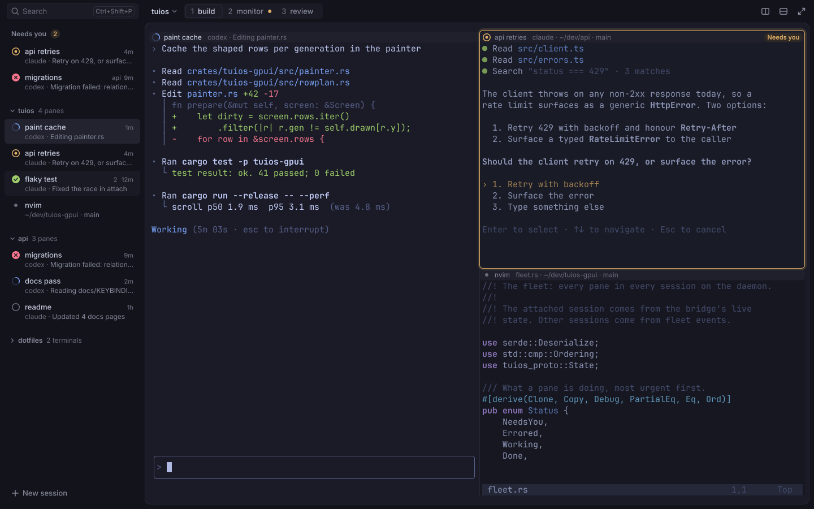
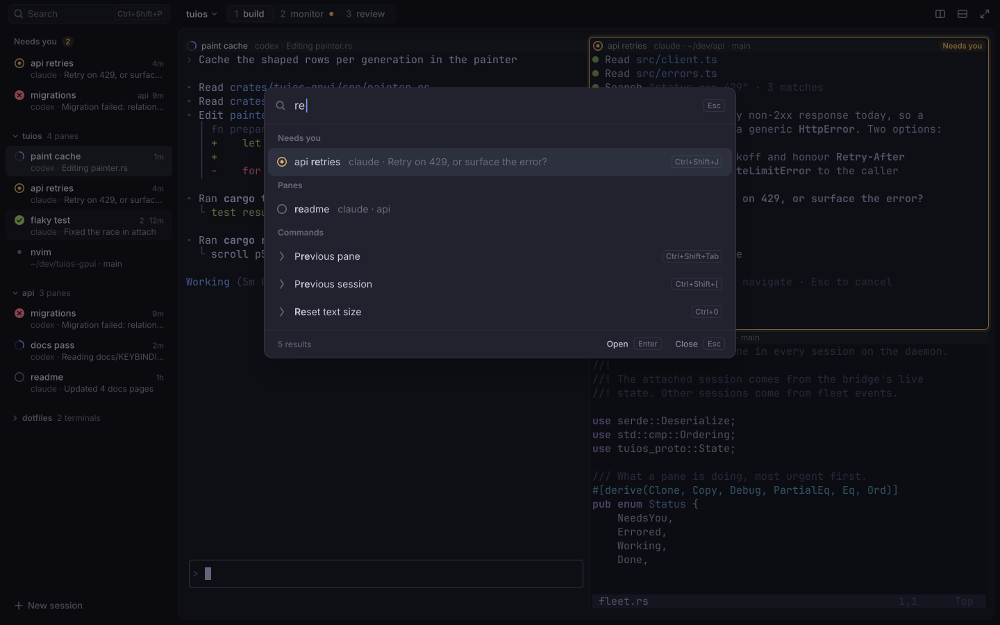
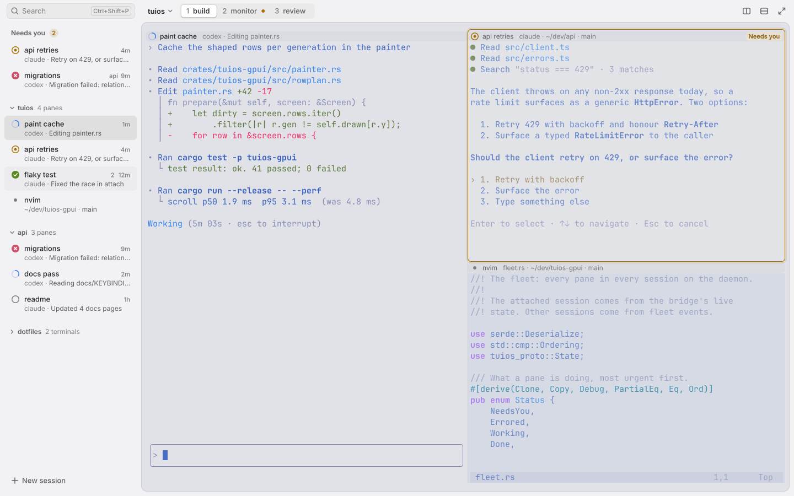

# Direction B: crafted product

This is the design spec for the next look of tuios-gpui. It follows Linear and
Raycast: layered surfaces, a quiet sidebar with clear state marks, a premium
command palette and small, purposeful motion. The panes stay the largest and
brightest thing in the window.

It answers the visual audit of `ba69b2c` (fuzzy text, no pane padding, cramped
headers, low contrast, a flat sidebar, full-window redraws). Every number here
is meant to be built as written. The colour formulas have a reference
implementation in [direction-b/tokens.py](direction-b/tokens.py), and the
mockups are generated from it by [direction-b/mock.py](direction-b/mock.py).



## 1. Principles

1. **Panes first.** The stage that holds the panes is the brightest surface
   and takes every pixel the chrome does not need.
2. **Two layers, one step apart.** The shell (sidebar and title band) is one
   tone. The stage is the terminal background, one step away. Nothing else
   gets its own surface except the palette.
3. **One loud colour.** Only "Needs you" puts a saturated colour on chrome.
   Hover, selection and focus are tone steps.
4. **One state slot, one icon family.** Every place that shows agent state
   uses the same 14 px icon in a 16 px slot.
5. **Crisp before pretty.** Whole-pixel cells, grayscale text with contrast,
   no ligatures by default.
6. **Only work moves.** Motion is short, and it stops when the window is not
   active.

## 2. Tokens

### 2.1 Fonts

| Role | Family | Source | Licence |
| --- | --- | --- | --- |
| Chrome | Inter 4.x static: Regular 400, Medium 500, SemiBold 600 | Already bundled in `crates/tuios-gpui/assets/fonts` | SIL OFL 1.1, `Inter-LICENSE.txt` is there |
| Terminal | JetBrains Mono 2.304 static: Regular, Bold, Italic, BoldItalic | Bundle it. About 270 KB per file, 1.1 MB in total | SIL OFL 1.1. Ship `OFL.txt` as `JetBrainsMono-LICENSE.txt` next to the files |
| Terminal icons | Symbols Nerd Font Mono | Use the installed copy as a fallback font. Do not bundle | MIT |

- The plain JetBrains Mono is not installed on this machine. Only the Nerd
  Font builds are. Fetch it with:
  `curl -LO https://github.com/JetBrains/JetBrainsMono/releases/download/v2.304/JetBrainsMono-2.304.zip`
  and take the four files from `fonts/ttf/`.
- Do not use a patched Nerd Font family as the default. One weight of
  JetBrainsMono NF is 2.5 MB and GeistMono NF is 7.7 MB. The plain font plus
  one fallback symbols font costs less memory and keeps the atlas small.
- The user's `font_family` setting still wins. Keep JetBrainsMono Nerd Font
  Mono as the second fallback so existing configs keep their icons.
- Inter features: `tnum` on every age, count and workspace number. Nothing
  else.
- Terminal features: `calt=0`, `liga=0` by default (`ligatures = false`). The
  maintainer's Ghostty also sets `font-feature = -calt`.

### 2.2 Type scale (chrome)

All sizes are whole px at scale 1. Tracking is 0 everywhere.

| Token | Size / line height | Weight | Use |
| --- | --- | --- | --- |
| `label` | 11 / 16 | 500 | Ages, workspace numbers, keycaps |
| `label-strong` | 11 / 16 | 600 | Pills, count badges |
| `small` | 12 / 16 | 400 | Second lines, pane header detail, palette footer |
| `small-strong` | 12 / 16 | 500, or 600 for section and group labels | Pane header title (500), section labels (600) |
| `body` | 13 / 18 | 400 or 500 | Sidebar row titles (500), session switcher (600), workspace tabs (500), search placeholder |
| `item` | 14 / 20 | 400, 600 for matched characters | Palette row titles |
| `query` | 16 / 24 | 400 | Palette query |

Weights are 400, 500 and 600 only. Section labels are sentence case.

### 2.3 Spacing, sizes and radii

- **Spacing scale:** 2, 4, 6, 8, 12, 16, 20, 24, 32 px. Nothing else.
- **Radii:**

  | Token | px | Use |
  | --- | --- | --- |
  | `r-chip` | 4 | Keycaps |
  | `r-row` | 6 | Sidebar rows, search field, buttons, pane header strips, needs-you ring |
  | `r-seg` | 7 outer, 5 inner | Workspace segmented control |
  | `r-pick` | 8 | Palette selected row |
  | `r-pill` | 8 (full) | Pills and badges, 16 px tall |
  | `r-stage` | 10 | Stage |
  | `r-panel` | 12 | Palette |

  A nested shape always has a smaller radius than its parent.
- **Fixed sizes:** title band 40, search field 28, icon button 28, sidebar
  row 44 with a 2 px gap, group header 28, section label 24, palette query
  row 52, palette row 40, palette section label 28, palette footer 40.

### 2.4 Colour formulas

Inputs from the tuios theme export: terminal `bg`, `fg`, `ansi[16]`, the UI
accent, and the agent colours (`needs_input`, `done`, `errored`, `working`).
`mix(a, b, t)` is a straight sRGB mix where t = 0 keeps `a`.
`contrast` is the WCAG 2 ratio. `dark` means the theme says it is dark.

| Token | Dark theme | Light theme |
| --- | --- | --- |
| `stage` | `bg` | `bg` |
| `base` (sidebar, title band) | mix(bg, #000, 0.30) | mix(bg, #fff, 0.55) |
| `header` (pane header strip) | mix(bg, fg, 0.03) | mix(bg, #000, 0.025) |
| `field` (search, segmented control) | mix(base, fg, 0.045) | mix(base, #000, 0.035) |
| `hover` | mix(base, fg, 0.04) | mix(base, #000, 0.03) |
| `selected` | mix(base, fg, 0.09) | mix(base, #000, 0.08) |
| `raised` (palette) | mix(bg, fg, 0.045) | mix(bg, #fff, 0.75) |
| `raised_sel` | mix(raised, fg, 0.075) | mix(raised, #000, 0.06) |
| `border` (stage, palette, chips) | fg at 10 % alpha | #000 at 12 % |
| `hairline` (splits, palette dividers) | fg at 7 % | #000 at 9 % |
| `scrim` | #000 at 45 % | #000 at 18 % |
| `ink` | desaturate(fg, 0.45) | desaturate(fg, 0.12), then mix toward #000 in 2 % steps until 11:1 on `worst` |
| `text` | `ink` | `ink` |
| `text2` | mix(ink, worst, t) with the largest t that keeps 4.6:1 on `worst` | same |
| `text3` | the same, for 3.1:1 | same |
| `accent`, `need`, `done`, `err` | the tuios colour as sent | OKLCH: keep the hue, raise chroma to at least 0.13, lower L until 3:1 on `worst` and on its own fill |
| `<state>_fill` | mix(base, state, 0.14) | same |
| `<state>_ink` (text in a pill) | the state colour | OKLCH as above, for 4.5:1 on the fill |
| `selection` (text) | accent at 28 % | accent at 22 % |
| `on_state` (mark on a filled disc) | `bg` | #fff |

- `worst` is whichever of `base`, `stage` and `header` gives `ink` the lowest
  contrast. Text tokens are measured there, so they pass on every ground.
- `desaturate(c, keep)` pulls `c` toward its own luma. It is the existing
  `theme.rs` function.
- Light themes use the dark theme's agent hues as the starting point. The
  tokyonight_day amber `#8c6c3e` reads as brown. The OKLCH rule turns
  `#e0af68` into `#a97200`, which reads as amber.
- Compute the tokens once per theme change. Never per frame.

Resolved values for tokyonight (dark) and tokyonight_day (light):

| Token | Dark | Light |
| --- | --- | --- |
| `stage` | #1a1b26 | #e1e2e7 |
| `base` | #12131b | #f2f2f4 |
| `header` | #1f202c | #dbdce1 |
| `field` | #1a1b25 | #eaeaeb |
| `hover` | #191a24 | #ebebed |
| `selected` | #22232f | #dfdfe0 |
| `raised` / `raised_sel` | #21232f / #2d303e | #f8f8f9 / #e9e9ea |
| `text` | #c6cbde (10.0:1) | #24262c (11.0:1) |
| `text2` | #858999 (4.6:1) | #5e5f65 (4.7:1) |
| `text3` | #6a6c7b (3.1:1) | #797a80 (3.1:1) |
| `accent` | #7aa2f7 | #2c7be7 |
| `need` / fill / ink | #e0af68 / #2f2926 / #e0af68 | #a97200 / #e8e0d2 / #875a03 |
| `done` / fill | #9ece6a / #262d26 | #5c8820 / #dde3d6 |
| `err` / fill | #f7768e / #32212b | #cf526c / #eddce1 |

Contrast figures are on `worst`. On `base` they are higher: `text2` is 5.3:1
dark and 5.7:1 light.

### 2.5 Where colour goes

- **Accent:** the working icon, the text caret, text selection, the active
  split while it is dragged, and a keyboard focus ring. Never a row fill.
- **Need:** the needs-you icon, pill, ring and the workspace dot. It is the
  only saturated colour on chrome.
- **Done and err:** their icons only. A pill for them is not shown.
- **Shadows:** only the palette, and the active workspace segment (one 1 px
  shadow). No blur anywhere. Backdrop blur costs a full-window pass in GPUI.

## 3. Layout

Reference window: 1440 x 900 at scale 1, default font (cell 9 x 20).

```
 0                256                                                  1432 1440
 +-----------------+---------------------------------------------------------+
 | [Search  Ctrl+Shift+P] | tuios v  [1 build|2 monitor •|3 review]   [] [] [] |  40 band (base)
 |                 +---------------------------------------------------------+ 40
 | Needs you  (2)  | stage: bg, radius 10, 1 px border                      |
 |  rows           |  12 px  +-- header ----------+ +-- header -----------+ |
 |                 |         | pane A             | | pane B (needs you)  | |
 | v tuios  4 panes|         |                    | +-- header -----------+ |
 |  rows           |         |                    | | pane C              | |
 | v api  3 panes  |         +--------------------+ +---------------------+ |
 |  rows           |                                                    8 px |
 | + New session   +---------------------------------------------------------+ 892
 +-----------------+---------------------------------------------------------+
```

### 3.1 Window

- The window is `base`. Client-side decorations: the title band is the drag
  region, and a double click on empty band space maximizes.
- **Stage:** x = sidebar width, y = 40, right margin 8, bottom margin 8,
  radius 10, fill `stage`, 1 px `border` drawn inside. The sidebar has no
  edge line. The stage edge separates them.
- **Grid in the stage:**
  `cols = floor((stage_w - 24) / cell_w)`, `rows = floor((stage_h - 24) / cell_h)`.
  The origin is the stage origin plus `floor(leftover / 2)` on each axis, so
  padding is balanced and never under 12 px. At the reference size that is
  128 x 41 cells at (268, 56).
- All padding and leftover space is painted `stage`. A pane whose program set
  its own background (OSC 11) fills its rect grown by 4 px into the gaps, and
  out to the stage edge where it touches it, clipped by the stage radius. No
  app-coloured frame shows around nvim or htop.
- Snap the stage, grid origin, header strips, hairlines and ring to device
  pixels at every scale.

### 3.2 Title band (40 px, `base`)

- **Over the sidebar:** the search field. x 12, y 6, 232 x 28, radius 6,
  fill `field`, border at 70 % of `border`. Search icon 14 px at x 20,
  placeholder "Search" `body` `text3` at x 40, the "Ctrl+Shift+P" chip right
  aligned 6 px from the field edge. A click opens the palette.
- **Over the stage, from the grid's left edge (x 268):**
  - Session switcher: the session name, `body` 600 `text`, and a 12 px
    chevron in `text3`. A click opens the palette on its Sessions section.
  - 12 px later, the workspace segmented control: 28 px tall at y 6,
    radius 7, fill `field`, 2 px inner padding. Each segment is 23 px tall,
    radius 5, 10 px side padding, and shows the number in `text3` (tnum),
    two spaces, then the name in `body` 500 (`text2`, or `text` when active).
    The active segment is filled `stage` (dark) or #fff (light), with a 1 px
    `border` and a 1 px shadow at 25 %. An unnamed workspace shows only its
    number at a minimum width of 28 px. A workspace with a pane that needs you
    shows a 6 px `need` dot after its name.
  - Right: split right, split down and zoom as 28 x 28 icon buttons, 14 px
    icons in `text2`, 4 px apart, the last one ending at the stage's right
    edge.
- There is no hairline under the band. The stage edge does that job.

### 3.3 Sidebar (256 px, `base`)

- Width 256, resizable from 220 to 360 by dragging the stage edge. A double
  click on the edge resets it. Ctrl+Shift+B hides it.
- **Section "Needs you"** (only when not empty): label row 24 px, "Needs you"
  in `small-strong` 600 `text2` at x 20, then 8 px, then a count badge
  (16 px, radius 8, `need_fill`, `need_ink`, tnum). This badge is the only
  count of waiting agents in the sidebar. The summary line from today's
  build is removed.
- **Session groups:** 14 px space above each, a 28 px header with a 12 px fold
  chevron at x 22 and the name in `small-strong` 600 `text2` at x 32, followed
  by the pane count ("4 panes", or "2 terminals" when it has no agents) in
  `small` `text3`. No needs-you count on the group. A group with no agents
  starts folded.
- **Row (44 px tall, 2 px gap, 46 px pitch):**
  - Inset 8 px on both sides (x 8 to 248), radius 6.
  - State icon centred at (28, top + 15).
  - Line 1: the task or pane name, `body` 500 `text`, baseline at top + 20.
    Right: the age (`label`, tnum, `text3`) at x 236. The workspace number of
    a pane on another workspace sits 6 px before the age, same style.
  - Line 2, baseline at top + 36: the harness in `text3`, " · ", then the
    agent's message in `text2`, cut with an ellipsis. A plain terminal shows
    its folder and branch in `text3`.
  - Fill: `selected` for the focused pane, `hover` under the pointer.
- **Naming:** a row is named after the agent's task, then the running
  program, then the folder. The harness goes in line 2, never in the title.
- **Footer:** a 32 px "New session" ghost button at x 12, bottom margin 12,
  plus icon and `body` 500 `text2`. The keyboard hint is removed.
- Panes that need you appear twice on purpose: in "Needs you" and in their
  session. Both rows look the same.

### 3.4 Panes, headers and splits

- **Header:** in the row tuios reserves above each pane (one cell tall,
  20 px by default).
  - Strip: x = content.x - 4 to content.right + 4, y + 1, height cell_h - 2,
    radius 6, fill `header`.
  - State icon centred at content.x + 8.
  - Title at content.x + 22: `small-strong` 500 `text` when focused, 400
    `text2` when not.
  - Detail 10 px after the title, `small` `text3`: harness and activity for an
    agent, or file, folder and branch for a program.
  - Right: the "Needs you" pill, 4 px from the strip edge: 16 px tall,
    `label-strong`, 6 px side padding, `need_fill`, `need_ink`.
  - The age is removed from the header. The sidebar shows it.
  - When space runs out, cut the detail first, then the title (ellipsis). The
    icon and the pill are never cut.
- **Vertical split:** a 1 px `hairline` on the gap centre line, from the top
  of the header row to the bottom of the grid.
- **Horizontal split:** no line. The lower pane's header strip separates the
  two panes.
- **Split drag:** the hit area is 8 px. During a drag the line becomes 2 px
  `accent` at 60 %.
- **Unfocused panes:** content rows get `stage` painted over them at 30 %
  (Ghostty's 0.7). The header is not dimmed, so state marks keep full
  strength. Only the title colour changes.
- **Inner padding:** with tuios's 1-cell gap the text sits 4 px from the
  hairline. That is the limit until the bridge accepts pixel insets
  (section 8).

### 3.5 Agent state

One icon family. Every icon is 14 px in a 16 px box with 1.5 px strokes.

| State | Icon | Colour | Precedence |
| --- | --- | --- | --- |
| Needs you | ring with a 5 px filled centre | `need` | 1 |
| Error | filled disc with an X in `on_state` | `err` | 2 |
| Working | ring at 25 % with a 120 degree arc | `accent` | 3 |
| Done, not seen | filled disc with a check in `on_state` | `done` | 4 |
| Idle agent | ring | `text3` | 5 |
| Plain terminal | 6 px dot | `text3` | 6 |

- **Where it shows:** the sidebar row slot, the pane header slot, the palette
  row slot. "Needs you" also shows as the header pill, the ring, the
  workspace dot and the sidebar badge. The word is always "Needs you".
- **Needs-you ring:** a 1 px `need` rounded rect (radius 6) on the gap centre
  lines around the pane. Its top is 3 px above the header row. Where the pane
  touches the stage edge, the ring sits 4 px inside it. Outside it, a 3 px
  stroke of `need` at 16 % gives a soft glow. It replaces the hairline on that
  side. It is the only coloured frame in the app.
- "Done" counts as seen once the pane has been focused. Then it falls back to
  idle.

### 3.6 Command palette



- **Panel:** 680 px wide (or the window width minus 64, if smaller), centred,
  top at 14 % of the window height. Radius 12, fill `raised`, 1 px `border`.
  Shadow in three layers: 0 2 3 at 14 %, 0 8 16 at 18 %, 0 24 48 at 22 %.
  Scrim over the whole window.
- **Query row (52 px):** search icon at x 24, query in `query` `text` at
  x 44, caret 1.5 x 20 px in `accent`. With an empty query the caret sits at
  x 44 and the placeholder "Search panes, sessions and commands" in `text3`
  starts after it. An "Esc" chip at the right. A `hairline` divider under the
  row.
- **Sections:** 28 px labels in `small-strong` 600 `text3`, in this order:
  Needs you, Panes, Sessions, Commands, Themes. Themes only show when the
  query matches "theme" or a theme name.
- **Row (40 px):** inset 6 px, radius 8. Icon centred at x 26 (state icon, or
  a 14 px chevron in `text3` for commands). Title in `item` at x 44. Matched
  characters are 600, the rest 400, both in `text`. One muted fragment
  follows 12 px later in `small` `text3`: the agent's message or the folder.
  Never a joined "session · workspace · message" string. The key chip is
  right aligned at 20 px.
- **Selected row:** `raised_sel` fill. No accent bar.
- **Names:** a plain terminal is named after its running program or title,
  then its folder plus session. Three rows that all read "env-dark/home" must
  not happen.
- **Footer (40 px):** a `hairline` above. Left: "5 results" in `small`
  `text3`. Right: "Open" (`small` 500 `text`) with an "Enter" chip, then
  "Close" (`text2`) with an "Esc" chip.
- **Keycap chip:** one chip per shortcut, written "Ctrl+Shift+P". `label`,
  `text3`, 18 px tall, 6 px side padding, radius 4, 1 px `border`, no fill.
- **No results:** one 80 px row, "No results for “query”" in `body` `text2`,
  centred.

### 3.7 Empty states

All are centred in the stage, with a 320 px column.

| Case | Title (`item` 600 `text`) | Line (`body` `text2`) | Action |
| --- | --- | --- | --- |
| Workspace with no panes | No panes here | Open a terminal to start. | "New pane" button with a "Ctrl+Shift+T" chip, and an "Open palette" text button |
| Cannot reach the daemon | Cannot reach the tuios daemon | Start it with `tuios daemon`, then try again. | "Try again" button |
| No sessions | No sessions yet | Create a session to start. | "New session" button |

- Button: 32 px tall, radius 6, 12 px side padding, fill `raised`, 1 px
  `border`, `body` 500 `text`. The chip sits 8 px after the label. A text
  button has no fill and no border, `body` 500 `text2`.
- No illustrations and no logo. A 24 px icon in `text3` above the title is
  allowed.

### 3.8 Light theme



- Same layout and sizes. The shell is lighter than the stage (`base` is
  mix(bg, #fff, 0.55)), so the panes read as the inset work area.
- Ink is a neutral near-black, not the blue theme foreground.
- State colours come from the OKLCH rule in 2.4, so amber stays amber.
- The palette panel is near-white (`raised`), and the scrim is 18 %.

### 3.9 Small window

- Below 1000 px of window width, the sidebar becomes a 52 px rail: one 36 x
  36 button per row (state icon centred, `selected` fill, radius 6), a 1 px
  `hairline` between sessions, and the search field becomes an icon button.
  A tooltip shows the row title and message after 400 ms.
- The segmented control shows numbers only.
- Pane headers cut the detail first.
- The user can still open the full sidebar with Ctrl+Shift+B. It then
  overlays the stage with a 1 px `border` and the palette shadow, and does
  not resize the grid.

## 4. Interaction states

| Element | Hover | Pressed | Selected or active | Keyboard focus |
| --- | --- | --- | --- | --- |
| Sidebar row | `hover` fill | `selected` fill | `selected` fill | 1 px `accent` ring inside the row, radius 6 |
| Icon button | `hover` fill, icon `text` | `selected` fill | icon `accent` (zoom on) | same ring |
| Segment | text to `text` | none | raised segment | same ring |
| Palette row | `raised_sel` fill, moves the selection | none | `raised_sel` | the selection is the focus |
| Search field | border to 100 % of `border` | none | none | 1 px `accent` border |
| Split line | 1 px to `text3` | 2 px `accent` at 60 % | none | none |
| Scrollbar thumb | 4 px wide to 6 px | `text2` | none | none |

- Hover is instant on enter and fades out in 100 ms.
- The pointer is a hand only on links in terminal output. Rows and buttons
  keep the arrow, as in native apps.
- **Text selection:** `selection` behind the text. Foreground is unchanged.
  Copy shows nothing on screen.
- **Terminal cursor:**
  - Block: fills the whole cell rect on device pixels. The glyph under it is
    drawn in the cell's background colour.
  - Bar: 2 px wide at the left of the cell. Underline: 2 px at the cell
    bottom.
  - Unfocused window or pane: a 1 px hollow block.
  - Blink: 600 ms on, 600 ms off. Solid for 600 ms after any key. No blink
    while the window is not active.

## 5. Motion

| Token | Duration | Curve |
| --- | --- | --- |
| `instant` | 0 ms | none |
| `fast` | 100 ms | ease-out cubic-bezier(0.2, 0, 0, 1) |
| `base` | 160 ms | ease-out cubic-bezier(0.2, 0, 0, 1) |
| `exit` | 100 ms | ease-in cubic-bezier(0.4, 0, 1, 1) |
| `pulse` | 400 ms | ease-out cubic-bezier(0.2, 0, 0, 1) |

| What | Motion |
| --- | --- |
| Palette open | `base`: opacity 0 to 1, rise 4 px, scale 0.985 to 1. Scrim fades in `base` |
| Palette close | `exit`: opacity only |
| Hover | in `instant`, out `fast` |
| Focus change between panes | dim overlay crossfades in `fast` |
| Needs you arrives | pill fades in `base`. Ring glow goes 0 to 40 % to 16 % in `pulse`. The ring does not grow |
| Working icon | the arc breathes: opacity 100 % to 45 % and back, sine, 2.4 s period, drawn at 10 fps |
| Resize badge | shows while the grid size changes, fades out in `base` after 750 ms |
| Sidebar rows changing section | `instant`. No reordering animation |
| Sidebar collapse, rail | `instant`. The grid must not resize on every frame |

- Every animation stops while the window is not active. The working icon is
  then a still arc.
- `reduce_motion = true` in config.toml makes every row `instant` and the
  working icon still.
- An animation may only redraw its own cached view (section 7). The working
  icon must never redraw the whole window.

## 6. Terminal text rendering

These are requirements, each with a check.

1. **Font size and cell.** Default 15 px JetBrains Mono, line height 1.333.
   The advance is 600/1000 em, so the cell is exactly 9 x 20 px at scale 1.
   - `cell_w = round(advance_em * font_px * scale)` and
     `cell_h = round(line_height * font_px * scale)`, in device pixels.
   - Size steps with Ctrl+= and Ctrl+-: 12, 13, 14, 15, 16, 18, 20 px. 15 and
     20 give an exact advance. The others round, and each glyph is placed at
     its cell origin, so the error never adds up across a row.
   - Store the scale in `Metrics`. Rebuild the metrics when the scale changes.
     Today an 8 px cell survives a change to scale 1.8.
   - Check: the control dump shows a 9 x 20 cell at scale 1 and an 11 x 25
     cell at scale 1.25 (font 18.75 device px).
2. **Whole-pixel grid.** The grid origin, every cell origin and every
   baseline are whole device pixels.
   - `baseline = row_top + round((cell_h - (ascent + descent)) / 2 + ascent)`,
     using the font's metrics at the device size.
   - Since every x is whole, GPUI always picks the first subpixel variant. The
     atlas then holds one copy of each glyph.
   - Check: at scale 1 and 1.25, zero glyphs land off the pixel grid (the
     perf audit counted 46 % off grid at 1.25).
3. **Grayscale antialiasing with contrast.** Call
   `cx.set_text_rendering_mode(TextRenderingMode::Grayscale)` at startup and
   set `ZED_FONTS_GRAYSCALE_ENHANCED_CONTRAST=2.0` before GPUI starts.
   - Config: `text_antialias = "grayscale" | "subpixel"` (default grayscale)
     and `text_contrast = 2.0` (range 0 to 4).
   - Check: a 1:1 crop of white sidebar text has 0 coloured pixels (461
     today). Confirm once on the real 240 Hz monitor.
4. **Hinting.** Rasterise with hinting on (swash `hint(true)`), so stems land
   on whole pixels at 12 to 16 px. If GPUI does not expose it, patch the
   vendored text system.
   - Check: in an 8x crop of "Illegal1|" at 15 px, every vertical stem is one
     or two full pixels wide, never a 50 % grey column.
5. **No ligatures.** `ligatures = false` by default. `===` draws as three
   characters and `!=` as two.
6. **Box drawing and blocks.** Keep drawing U+2500 to U+259F as snapped
   rectangles, not font glyphs, so lines join across cells with no gaps.
7. **Decorations.** Underline thickness `max(1, round(font_px / 15))` device
   px, at a whole-pixel y. Strikethrough at the cell's middle, snapped.
8. **Bold.** Use the real Bold face. No synthetic emboldening.
9. **Colour.** The terminal's own colours go straight to the cells. No
   chrome token ever changes a cell colour, except the 30 % dim overlay on
   unfocused panes.

## 7. What the design needs from the code

The look depends on these. None of them add visible features.

- **Cached views.** Split the root view into `Sidebar`, `TitleBand`,
  `Stage` (one per pane inside it) and `Palette`, each wrapped with
  `AnyView::cached`. Pane output then rebuilds only its pane. The working
  icon lives in a tiny view of its own.
- **Spinner timer.** Keep a count of working agents. The timer runs only when
  it is above 0 and the window is active.
- **Fleet updates.** Replace the 1.5 s `list-agents` and `ls` polling with
  events from the bridge. Ages redraw once a minute.
- **Cost of the new chrome.** Two quads per pane (header strip and, when
  needed, the ring and its glow), one bordered quad for the stage. No blur, no
  per-frame shadow except the palette's.
- **Memory.** The plain terminal font and a 1-byte-per-pixel grayscale atlas
  replace the Nerd Font family and the 4-byte colour atlas. The GPU driver
  fixes from the perf audit (Vulkan only, chosen adapter) are separate.

### Config keys

| Key | Default |
| --- | --- |
| `font_family` | "JetBrains Mono" |
| `font_size` | 15 |
| `line_height` | 1.333 |
| `ligatures` | false |
| `text_antialias` | "grayscale" |
| `text_contrast` | 2.0 |
| `reduce_motion` | false |

## 8. Open decisions

1. **Pixel insets in the bridge.** With tuios's 1-cell gap, text sits 4 px
   from the split line and the header is one cell tall. With per-pane pixel
   insets in `tuios gui-bridge`, the target is 10 px inner padding and a 28 px
   header. That is a Go change on `exp/gpui-bridge`. This spec works without
   it.
2. **Font size.** 15 px gives 128 x 41 cells at 1440 x 900, against 144 x 46
   today at 14 px with an 8 x 18 cell. That is 11 % fewer columns and rows.
   14 px with a 1.43 line height (8 x 20) keeps the columns but rounds a
   8.4 px advance down to 8.
3. **Working motion.** A breathing arc at 10 fps (specified here), or a still
   arc with no animation at all.

## 9. Mockups

- [main-dark.png](direction-b/main-dark.png): tokyonight, three panes, one
  working (focused), one that needs you, nvim with its own background.
- [palette-dark.png](direction-b/palette-dark.png): the palette with the
  query "re".
- [main-light.png](direction-b/main-light.png): tokyonight_day.

Rebuild them with:

```sh
FONTCONFIG_FILE=<a fonts.conf that adds crates/tuios-gpui/assets/fonts> \
  python3 docs/design/direction-b/mock.py docs/design/direction-b
for n in main-dark palette-dark main-light; do
  rsvg-convert docs/design/direction-b/$n.svg -o docs/design/direction-b/$n.png
done
```

The mockups use JetBrainsMono NL Nerd Font Mono, which has the same Latin
glyphs as the plain JetBrains Mono and no ligatures. SVG rendering is not
GPUI rendering: judge crispness in the app, not here.
